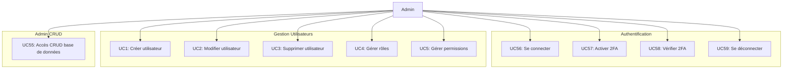

# Cas d'Utilisation - Authentification & Gestion Utilisateurs

## Diagramme

## Description des Cas d'Utilisation

### Authentification (UC56-UC59)
- **UC56** : Se connecter - Authentification avec email/password, support 2FA
- **UC57** : Activer 2FA - Configuration de l'authentification à deux facteurs
- **UC58** : Vérifier 2FA - Validation du code TOTP lors de la connexion
- **UC59** : Se déconnecter - Déconnexion et invalidation du token

### Gestion Utilisateurs (UC1-UC5)
- **UC1** : Créer utilisateur - Création d'un nouvel utilisateur avec email et mot de passe
- **UC2** : Modifier utilisateur - Modification des informations utilisateur
- **UC3** : Supprimer utilisateur - Suppression d'un utilisateur (avec vérifications)
- **UC4** : Gérer rôles - Attribution et retrait de rôles aux utilisateurs
- **UC5** : Gérer permissions - Gestion des permissions granulaires

### Admin CRUD (UC55)
- **UC55** : Accès CRUD base de données - Interface d'administration pour toutes les tables

---

**Voir aussi** : [Diagramme principal](01_use_case_diagram.md)
