# Cas d'Utilisation - Gestion Voyages

## Diagramme

```mermaid
graph TB
    Commercial[Commercial]
    Professeur[Professeur]
    Guest[Guest]
    
    subgraph Voyages["Voyages Scolaires"]
        UC19[UC19: Créer voyage scolaire]
        UC20[UC20: Modifier voyage]
        UC21[UC21: Valider voyage]
        UC22[UC22: Annuler voyage]
        UC23[UC23: Suivre voyage]
    end
    
    subgraph Linguistiques["Voyages Linguistiques"]
        UC24[UC24: Créer voyage linguistique]
        UC52[UC52: S'inscrire voyage linguistique]
        UC53[UC53: Payer en ligne]
        UC54[UC54: Consulter réservation]
    end
    
    subgraph Destinations["Destinations/Activités"]
        UC25[UC25: Créer destination]
        UC26[UC26: Modifier destination]
        UC27[UC27: Créer activité]
        UC28[UC28: Modifier activité]
        UC29[UC29: Créer programme préconstruit]
    end
    
    subgraph Plannings["Plannings"]
        UC30[UC30: Générer planning préconstruit]
        UC31[UC31: Modifier planning]
        UC32[UC32: Valider planning]
    end
    
    Commercial --> UC19
    Commercial --> UC20
    Commercial --> UC21
    Commercial --> UC22
    Commercial --> UC23
    Commercial --> UC24
    Commercial --> UC25
    Commercial --> UC26
    Commercial --> UC27
    Commercial --> UC28
    Commercial --> UC29
    Commercial --> UC30
    Commercial --> UC31
    Commercial --> UC32
    
    Guest --> UC52
    Guest --> UC53
    Guest --> UC54
```

## Description des Cas d'Utilisation

### Voyages Scolaires (UC19-UC23)
- **UC19** : Créer voyage scolaire - Création d'un nouveau voyage depuis le formulaire professeur
- **UC20** : Modifier voyage - Modification des informations d'un voyage
- **UC21** : Valider voyage - Validation du voyage par le commercial
- **UC22** : Annuler voyage - Annulation d'un voyage
- **UC23** : Suivre voyage - Suivi de l'avancement d'un voyage

### Voyages Linguistiques (UC24, UC52-UC54)
- **UC24** : Créer voyage linguistique - Création d'un voyage linguistique par le commercial
- **UC52** : S'inscrire voyage linguistique - Inscription en ligne par un guest
- **UC53** : Payer en ligne - Paiement via Stripe
- **UC54** : Consulter réservation - Consultation de la réservation confirmée

### Destinations/Activités (UC25-UC29)
- **UC25** : Créer destination - Création d'une nouvelle destination
- **UC26** : Modifier destination - Modification d'une destination
- **UC27** : Créer activité - Création d'une activité réutilisable
- **UC28** : Modifier activité - Modification d'une activité
- **UC29** : Créer programme préconstruit - Création d'un programme avec activités

### Plannings (UC30-UC32)
- **UC30** : Générer planning préconstruit - Génération automatique basée sur les destinations
- **UC31** : Modifier planning - Modification manuelle du planning
- **UC32** : Valider planning - Validation du planning pour utilisation dans le devis

---

**Voir aussi** : [Diagramme principal](01_use_case_diagram.md)
