# Cas d'Utilisation - Gestion Devis & Factures

## Diagramme

```mermaid
graph TB
    Commercial[Commercial]
    Comptable[Comptable]
    Professeur[Professeur]
    
    subgraph Devis["Gestion Devis"]
        UC33[UC33: Saisir prix transport]
        UC34[UC34: Générer devis]
        UC35[UC35: Modifier devis]
        UC36[UC36: Envoyer devis]
        UC37[UC37: Valider devis]
        UC38[UC38: Recalculer devis]
    end
    
    subgraph Factures["Gestion Factures"]
        UC39[UC39: Générer facture]
        UC40[UC40: Valider facture]
        UC41[UC41: Exporter facture XML/PDF]
        UC42[UC42: Stocker facture]
    end
    
    subgraph Formulaire["Formulaire Public"]
        UC43[UC43: Remplir formulaire professeur]
        UC44[UC44: Recevoir devis]
        UC45[UC45: Recevoir facture]
    end
    
    Commercial --> UC33
    Commercial --> UC34
    Commercial --> UC35
    Commercial --> UC36
    Commercial --> UC37
    Commercial --> UC38
    Commercial --> UC39
    Commercial --> UC40
    Commercial --> UC41
    Commercial --> UC42
    
    Comptable --> UC40
    Comptable --> UC41
    Comptable --> UC42
    
    Professeur --> UC43
    Professeur --> UC44
    Professeur --> UC45
    
    UC39 -.->|include| UC62[UC62: Créer facture Odoo]
```

## Description des Cas d'Utilisation

### Gestion Devis (UC33-UC38)
- **UC33** : Saisir prix transport - Saisie des prix de transport par destination et date
- **UC34** : Générer devis - Génération automatique avec calcul des prix
- **UC35** : Modifier devis - Modification d'un devis existant
- **UC36** : Envoyer devis - Envoi du devis par email au professeur
- **UC37** : Valider devis - Validation du devis accepté
- **UC38** : Recalculer devis - Recalcul si nombre de participants change

### Gestion Factures (UC39-UC42)
- **UC39** : Générer facture - Génération depuis un devis validé
- **UC40** : Valider facture - Validation par commercial ou comptable
- **UC41** : Exporter facture XML/PDF - Export au format Factur-X et PDF
- **UC42** : Stocker facture - Stockage des documents factures

### Formulaire Public (UC43-UC45)
- **UC43** : Remplir formulaire professeur - Formulaire public pour demande de voyage
- **UC44** : Recevoir devis - Réception et consultation du devis
- **UC45** : Recevoir facture - Réception et consultation de la facture

---

**Voir aussi** : [Diagramme principal](01_use_case_diagram.md)
