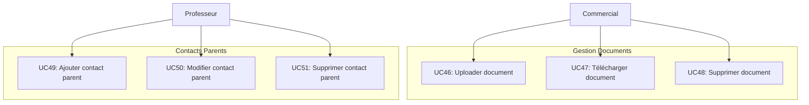

# Cas d'Utilisation - Documents & Contacts Parents

## Diagramme

## Description des Cas d'Utilisation

### Gestion Documents (UC46-UC48)
- **UC46** : Uploader document - Téléversement de documents (devis, factures, contrats)
- **UC47** : Télécharger document - Téléchargement de documents stockés
- **UC48** : Supprimer document - Suppression d'un document

### Gestion Contacts Parents (UC49-UC51)
- **UC49** : Ajouter contact parent - Ajout d'un contact parent pour un élève
- **UC50** : Modifier contact parent - Modification des informations d'un contact
- **UC51** : Supprimer contact parent - Suppression d'un contact parent

---

**Voir aussi** : [Diagramme principal](01_use_case_diagram.md)
