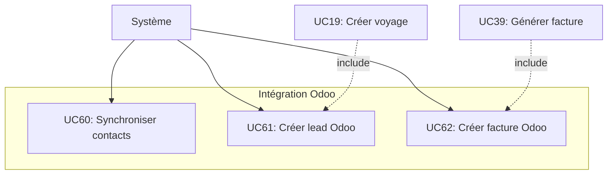

# Cas d'Utilisation - Intégration Odoo

## Diagramme

## Description des Cas d'Utilisation

### Synchronisation Contacts (UC60)
- **UC60** : Synchroniser contacts - Synchronisation automatique des contacts (Teacher, Guest) avec Odoo
  - Création de contact dans Odoo si nouveau
  - Mise à jour si modification
  - Récupération depuis Odoo si nécessaire

### Création Lead CRM (UC61)
- **UC61** : Créer lead Odoo - Création automatique d'un lead dans Odoo lors de la création d'un voyage scolaire
  - Déclenché par UC19 (Créer voyage scolaire)
  - Lead avec toutes les informations du voyage
  - Attribution au commercial responsable

### Création Facture Odoo (UC62)
- **UC62** : Créer facture Odoo - Création automatique d'une facture dans Odoo lors de la validation
  - Déclenché par UC39 (Générer facture)
  - Facture avec toutes les lignes
  - Lien avec le contact client
  - Synchronisation du numéro de facture

## Relations avec Autres Cas d'Utilisation

- **UC19** (Créer voyage scolaire) → **UC61** (Créer lead Odoo) : Relation `<<include>>`
- **UC39** (Générer facture) → **UC62** (Créer facture Odoo) : Relation `<<include>>`

---

**Voir aussi** : [Diagramme principal](01_use_case_diagram.md)
