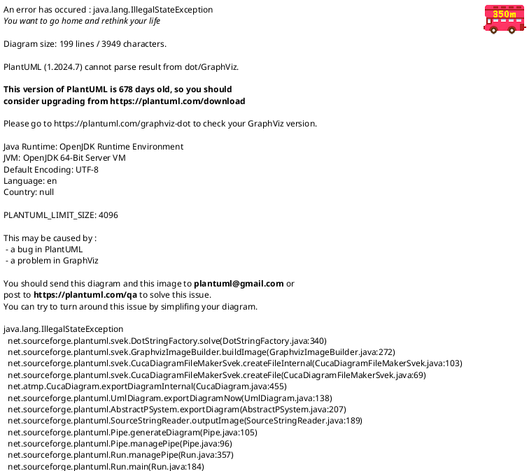
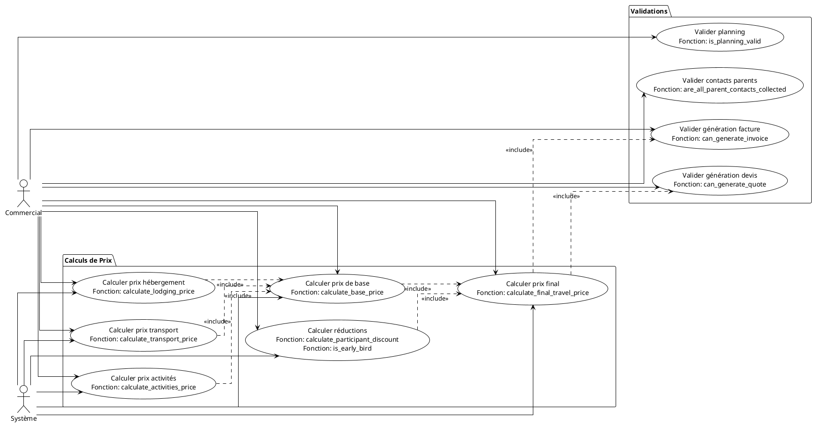

# Diagrammes de Cas d'Utilisation - Système Intégré de Gestion

## Vue d'Ensemble

Ce document présente les diagrammes de cas d'utilisation (Use Case) du système, incluant l'utilisation des fonctions SQL stockées dans les différents scénarios métier.

## Diagramme Principal - Vue Globale

```plantuml
@startuml UseCaseDiagram_Principal
!theme plain
skinparam linetype ortho

left to right direction

actor Admin
actor Commercial
actor Professeur
actor Comptable
actor "Guest Invité" as Guest
actor Système

package "Authentification & Autorisation" {
    usecase "Se connecter" as UC1
    usecase "Gérer utilisateurs" as UC2
    usecase "Gérer rôles/permissions" as UC3
    usecase "Configurer 2FA" as UC4
}

package "Gestion Voyages Scolaires" {
    usecase "Créer demande voyage" as UC5
    usecase "Générer planning" as UC6
    usecase "Valider planning" as UC7
    usecase "Générer devis" as UC8
    usecase "Valider devis" as UC9
    usecase "Collecter contacts parents" as UC10
    usecase "Générer facture" as UC11
    usecase "Valider facture" as UC12
}

package "Voyages Linguistiques" {
    usecase "Consulter catalogue" as UC13
    usecase "S'inscrire voyage" as UC14
    usecase "Payer en ligne" as UC15
}

package "Catalogue" {
    usecase "Gérer destinations" as UC16
    usecase "Gérer activités" as UC17
    usecase "Gérer programmes" as UC18
}

package "Communication" {
    usecase "Envoyer email marketing" as UC19
    usecase "Envoyer WhatsApp" as UC20
    usecase "Gérer consentements" as UC21
}

package "Rapports & Statistiques" {
    usecase "Consulter statistiques" as UC22
    usecase "Générer rapports" as UC23
}

package "Intégration Odoo" {
    usecase "Synchroniser contacts" as UC24
    usecase "Synchroniser factures" as UC25
    usecase "Synchroniser leads" as UC26
}

' Relations Admin
Admin --> UC2
Admin --> UC3
Admin --> UC22
Admin --> UC23
Admin --> UC1
Admin --> UC4

' Relations Commercial
Commercial --> UC6
Commercial --> UC7
Commercial --> UC8
Commercial --> UC9
Commercial --> UC11
Commercial --> UC12
Commercial --> UC16
Commercial --> UC17
Commercial --> UC18
Commercial --> UC22
Commercial --> UC1
Commercial --> UC4

' Relations Professeur
Professeur --> UC5
Professeur --> UC10
Professeur --> UC1
Professeur --> UC4

' Relations Comptable
Comptable --> UC12
Comptable --> UC23
Comptable --> UC1
Comptable --> UC4

' Relations Guest
Guest --> UC13
Guest --> UC14
Guest --> UC15

' Relations Système
Système --> UC19
Système --> UC20
Système --> UC24
Système --> UC25
Système --> UC26

@enduml
```

## Diagramme Détaillé - Gestion Voyages Scolaires

## Diagramme Détaillé - Calculs et Validations

## Cas d'Utilisation Détaillés avec Fonctions SQL

### UC1 : Créer Demande de Voyage (Professeur)

**Acteur** : Professeur

**Préconditions** : Aucune (formulaire public)

**Scénario principal** :
1. Professeur remplit le formulaire public
2. Système valide les données (`is_email_valid()`, `are_dates_valid()`)
3. Système génère un token unique (`generate_token()`)
4. Système crée un Travel en statut DRAFT
5. Système crée les TravelDestination
6. Système envoie un email de confirmation

**Fonctions SQL utilisées** :
- `generate_token()` : Génération du token unique
- `is_email_valid()` : Validation de l'email
- `are_dates_valid()` : Validation des dates

**Postconditions** : Travel créé en statut DRAFT

---

### UC2 : Générer Planning Préconstruit (Commercial)

**Acteur** : Commercial

**Préconditions** : Travel existe en statut DRAFT

**Scénario principal** :
1. Commercial demande la génération d'un planning
2. Système récupère les destinations du voyage
3. Système génère le planning préconstruit
4. Système crée les activités dans le planning
5. Commercial peut modifier le planning

**Fonctions SQL utilisées** :
- Aucune fonction SQL directe (logique applicative)

**Postconditions** : Planning créé et modifiable

---

### UC3 : Valider Planning (Commercial)

**Acteur** : Commercial

**Préconditions** : Planning existe

**Scénario principal** :
1. Commercial demande la validation du planning
2. Système appelle `is_planning_valid(travel_id)`
3. Système vérifie :
   - `has_valid_planning()` : Au moins une activité
   - `has_overlapping_activities()` : Pas de chevauchement
   - `planning_covers_travel_days()` : Couvre tous les jours
4. Si valide, planning est marqué comme validé

**Fonctions SQL utilisées** :
- `is_planning_valid(travel_id)` : Validation complète
- `has_valid_planning(travel_id)` : Vérifie présence d'activités
- `has_overlapping_activities(travel_id)` : Vérifie chevauchements
- `planning_covers_travel_days(travel_id)` : Vérifie couverture

**Postconditions** : Planning validé

---

### UC4 : Générer Devis (Commercial)

**Acteur** : Commercial

**Préconditions** : Travel existe, destinations renseignées, prix transport définis

**Scénario principal** :
1. Commercial demande la génération d'un devis
2. Système appelle `can_generate_quote(travel_id)`
3. Si validé, système appelle `sp_generate_quote_for_travel(travel_id, @quote_id)`
4. Procédure :
   - Génère le numéro (`generate_quote_number()`)
   - Calcule le prix (`calculate_final_travel_price()`)
   - Crée le Quote et les QuoteLines
   - Met à jour le statut du Travel
5. Système retourne le devis créé

**Fonctions SQL utilisées** :
- `can_generate_quote(travel_id)` : Validation préalable
- `sp_generate_quote_for_travel()` : Procédure de génération
- `generate_quote_number()` : Génération numéro unique
- `calculate_final_travel_price(travel_id)` : Calcul prix complet
- `calculate_transport_price()` : Calcul transport
- `calculate_activities_price()` : Calcul activités
- `calculate_lodging_price()` : Calcul hébergement
- `calculate_participant_discount()` : Calcul réduction participants
- `is_early_bird()` : Vérification early bird
- `calculate_total_discount()` : Calcul réduction totale

**Postconditions** : Quote créé, Travel en statut QUOTE_SENT

---

### UC5 : Envoyer Devis (Commercial)

**Acteur** : Commercial

**Préconditions** : Quote existe en statut DRAFT

**Scénario principal** :
1. Commercial demande l'envoi du devis
2. Système vérifie `can_send_quote(quote_id)`
3. Système envoie l'email au professeur
4. Système met à jour `sent_at` et statut à SENT

**Fonctions SQL utilisées** :
- `can_send_quote(quote_id)` : Vérification avant envoi

**Postconditions** : Quote envoyé, statut SENT

---

### UC6 : Valider Devis (Professeur/Commercial)

**Acteur** : Professeur (acceptation) + Commercial (validation)

**Préconditions** : Quote existe en statut SENT

**Scénario principal** :
1. Professeur accepte le devis via le lien email
2. Commercial valide le devis
3. Système appelle `can_validate_quote(quote_id)`
4. Système vérifie :
   - `is_quote_expired()` : Devis non expiré
   - Statut = SENT
5. Système met à jour le statut à VALIDATED
6. Système appelle `sp_update_travel_status()` pour mettre à jour le Travel

**Fonctions SQL utilisées** :
- `can_validate_quote(quote_id)` : Validation préalable
- `is_quote_expired(quote_id)` : Vérification expiration
- `days_until_quote_expiry(quote_id)` : Jours restants
- `sp_update_travel_status()` : Mise à jour avec historique

**Postconditions** : Quote validé, Travel en statut QUOTE_VALIDATED

---

### UC7 : Collecter Contacts Parents (Professeur)

**Acteur** : Professeur

**Préconditions** : Quote validé, Travel en statut QUOTE_VALIDATED

**Scénario principal** :
1. Professeur saisit les contacts parents
2. Système vérifie `are_all_parent_contacts_collected(travel_id)`
3. Système appelle `sp_collect_parent_contacts(travel_id)`
4. Système met à jour `parent_contacts_collected = TRUE`

**Fonctions SQL utilisées** :
- `are_all_parent_contacts_collected(travel_id)` : Vérification complétude
- `get_parent_contacts_count(travel_id)` : Nombre collecté
- `get_expected_parent_contacts_count(travel_id)` : Nombre attendu
- `get_missing_parent_contacts_count(travel_id)` : Nombre manquant
- `sp_collect_parent_contacts(travel_id)` : Procédure de collecte

**Postconditions** : Tous les contacts parents collectés

---

### UC8 : Générer Facture (Commercial)

**Acteur** : Commercial

**Préconditions** : Quote validé, contacts parents collectés

**Scénario principal** :
1. Commercial demande la génération d'une facture
2. Système appelle `can_generate_invoice(travel_id)`
3. Si validé, système appelle `sp_generate_invoice_from_quote(quote_id, @invoice_id)`
4. Procédure :
   - Génère le numéro (`generate_invoice_number()`)
   - Récupère le total du devis
   - Calcule la TVA (`calculate_tax_amount()`)
   - Crée l'Invoice et les InvoiceLines
5. Système retourne la facture créée

**Fonctions SQL utilisées** :
- `can_generate_invoice(travel_id)` : Validation préalable
- `sp_generate_invoice_from_quote()` : Procédure de génération
- `generate_invoice_number()` : Génération numéro unique
- `get_quote_total(quote_id)` : Total du devis
- `calculate_tax_amount()` : Calcul TVA
- `calculate_amount_ttc()` : Calcul TTC

**Postconditions** : Invoice créé en statut DRAFT

---

### UC9 : Valider Facture (Commercial/Comptable)

**Acteur** : Commercial ou Comptable

**Préconditions** : Invoice existe en statut DRAFT

**Scénario principal** :
1. Commercial/Comptable demande la validation
2. Système appelle `can_validate_invoice(invoice_id)`
3. Système met à jour le statut à VALIDATED
4. Système exporte Factur-X
5. Système synchronise avec Odoo

**Fonctions SQL utilisées** :
- `can_validate_invoice(invoice_id)` : Validation préalable
- `get_invoice_total_ht(invoice_id)` : Total HT
- `get_invoice_total_ttc(invoice_id)` : Total TTC
- `get_invoice_tax_amount(invoice_id)` : Montant TVA

**Postconditions** : Invoice validé, Factur-X exporté, synchronisé Odoo

---

### UC10 : S'inscrire Voyage Linguistique (Guest)

**Acteur** : Guest

**Préconditions** : Voyage linguistique publié

**Scénario principal** :
1. Guest consulte le catalogue
2. Guest sélectionne un voyage
3. Système vérifie `has_available_spots(linguistic_travel_id)`
4. Système vérifie `can_create_booking(linguistic_travel_id)`
5. Guest remplit le formulaire d'inscription
6. Système crée la Booking en statut PENDING
7. Système redirige vers Stripe Checkout

**Fonctions SQL utilisées** :
- `has_available_spots(linguistic_travel_id)` : Vérification places disponibles
- `can_create_booking(linguistic_travel_id)` : Validation création
- `generate_booking_number()` : Génération numéro réservation

**Postconditions** : Booking créé, paiement en attente

---

### UC11 : Gérer Consentements (Système)

**Acteur** : Système

**Préconditions** : Contact existe

**Scénario principal** :
1. Système vérifie `can_send_marketing_email(contact_id)`
2. Système vérifie `can_send_whatsapp(contact_id)`
3. Système envoie les communications selon les consentements
4. Système met à jour l'historique

**Fonctions SQL utilisées** :
- `can_send_marketing_email(contact_id)` : Vérification email
- `can_send_whatsapp(contact_id)` : Vérification WhatsApp
- `has_email_consent(contact_id)` : Vérification consentement email
- `has_whatsapp_consent(contact_id)` : Vérification consentement WhatsApp
- `is_contact_opted_out_email(contact_id)` : Vérification opt-out email
- `is_contact_opted_out_whatsapp(contact_id)` : Vérification opt-out WhatsApp

**Postconditions** : Communications envoyées selon consentements

---

### UC12 : Consulter Statistiques (Admin/Commercial)

**Acteur** : Admin ou Commercial

**Préconditions** : Aucune

**Scénario principal** :
1. Utilisateur demande des statistiques
2. Système appelle les fonctions de statistiques
3. Système affiche les résultats

**Fonctions SQL utilisées** :
- `get_travels_count_by_status()` : Nombre par statut
- `get_travels_count_by_type()` : Nombre par type
- `get_total_revenue_by_period()` : Chiffre d'affaires
- `get_average_travel_price()` : Prix moyen
- `get_travel_conversion_rate()` : Taux de conversion
- `get_total_participants_by_period()` : Nombre participants
- `get_total_quotes_amount_by_period()` : Montant devis
- `get_total_invoices_amount_by_period()` : Montant factures
- `get_pending_invoices_amount()` : Factures en attente
- `get_overdue_invoices_amount()` : Factures en retard

**Postconditions** : Statistiques affichées

---

## Relations entre Cas d'Utilisation

### Inclusion (Include)

- **UC4 (Générer devis)** inclut **UC7 (Valider génération devis)**
- **UC8 (Générer facture)** inclut **UC8 (Valider génération facture)**
- **UC6 (Valider devis)** inclut **UC6 (Vérifier expiration)**

### Extension (Extend)

- **UC5 (Envoyer devis)** peut être étendu par **UC6 (Valider devis)** si le professeur accepte
- **UC9 (Valider facture)** peut être étendu par **UC10 (Exporter Factur-X)** si nécessaire

### Généralisation

- **UC4 (Générer devis)** est généralisé par **UC4.1 (Génération automatique)** et **UC4.2 (Génération manuelle)**

## Matrice Fonctions SQL ↔ Cas d'Utilisation

| Fonction SQL | Cas d'Utilisation | Rôle |
|--------------|-------------------|------|
| `can_generate_quote()` | UC4 (Générer devis) | Validation préalable |
| `calculate_final_travel_price()` | UC4 (Générer devis) | Calcul prix |
| `sp_generate_quote_for_travel()` | UC4 (Générer devis) | Génération automatique |
| `can_validate_quote()` | UC6 (Valider devis) | Validation |
| `is_quote_expired()` | UC6 (Valider devis) | Vérification expiration |
| `are_all_parent_contacts_collected()` | UC7 (Collecter contacts) | Vérification complétude |
| `can_generate_invoice()` | UC8 (Générer facture) | Validation préalable |
| `sp_generate_invoice_from_quote()` | UC8 (Générer facture) | Génération automatique |
| `can_validate_invoice()` | UC9 (Valider facture) | Validation |
| `is_planning_valid()` | UC3 (Valider planning) | Validation planning |
| `has_available_spots()` | UC10 (S'inscrire voyage) | Vérification places |
| `can_send_marketing_email()` | UC11 (Gérer consentements) | Vérification consentement |
| `get_total_revenue_by_period()` | UC12 (Consulter statistiques) | Calcul statistiques |

---

**Version** : 2.0  
**Date** : 2025-01-20  
**Mise à jour** : Ajout des fonctions SQL dans les cas d'utilisation
