# Diagramme de Cas d'Utilisation - Système Intégré de Gestion

## Vue d'Ensemble

Ce diagramme présente les cas d'utilisation du système de gestion de voyages (scolaires et linguistiques) avec intégration Odoo.

## Acteurs

- **Admin** : Gestion complète du système
- **Commercial** : Gestion des voyages, devis, factures
- **Professeur** : Formulaire public, contacts parents
- **Comptable** : Validation des factures
- **Guest** : Inscription et paiement des voyages linguistiques

## Diagramme Mermaid

```mermaid
graph TB
    subgraph Actors["Acteurs"]
        Admin[Admin]
        Commercial[Commercial]
        Professeur[Professeur]
        Comptable[Comptable]
        Guest[Guest]
    end
    
    subgraph GestionUsers["Gestion Utilisateurs"]
        UC1[UC1: Créer utilisateur]
        UC2[UC2: Modifier utilisateur]
        UC3[UC3: Supprimer utilisateur]
        UC4[UC4: Gérer rôles]
        UC5[UC5: Gérer permissions]
    end
    
    subgraph GestionVoyages["Gestion Voyages"]
        UC19[UC19: Créer voyage scolaire]
        UC20[UC20: Modifier voyage]
        UC21[UC21: Valider voyage]
        UC22[UC22: Annuler voyage]
        UC23[UC23: Suivre voyage]
        UC24[UC24: Créer voyage linguistique]
    end
    
    subgraph GestionDestinations["Gestion Destinations/Activités"]
        UC25[UC25: Créer destination]
        UC26[UC26: Modifier destination]
        UC27[UC27: Créer activité]
        UC28[UC28: Modifier activité]
        UC29[UC29: Créer programme préconstruit]
    end
    
    subgraph GestionPlannings["Gestion Plannings"]
        UC30[UC30: Générer planning préconstruit]
        UC31[UC31: Modifier planning]
        UC32[UC32: Valider planning]
    end
    
    subgraph GestionDevis["Gestion Devis"]
        UC33[UC33: Saisir prix transport]
        UC34[UC34: Générer devis]
        UC35[UC35: Modifier devis]
        UC36[UC36: Envoyer devis]
        UC37[UC37: Valider devis]
        UC38[UC38: Recalculer devis]
    end
    
    subgraph GestionFactures["Gestion Factures"]
        UC39[UC39: Générer facture]
        UC40[UC40: Valider facture]
        UC41[UC41: Exporter facture XML/PDF]
        UC42[UC42: Stocker facture]
    end
    
    subgraph FormulairePublic["Formulaire Public"]
        UC43[UC43: Remplir formulaire professeur]
        UC44[UC44: Recevoir devis]
        UC45[UC45: Recevoir facture]
    end
    
    subgraph GestionDocuments["Gestion Documents"]
        UC46[UC46: Uploader document]
        UC47[UC47: Télécharger document]
        UC48[UC48: Supprimer document]
    end
    
    subgraph GestionContacts["Gestion Contacts Parents"]
        UC49[UC49: Ajouter contact parent]
        UC50[UC50: Modifier contact parent]
        UC51[UC51: Supprimer contact parent]
    end
    
    subgraph VoyagesLinguistiques["Voyages Linguistiques"]
        UC52[UC52: S'inscrire voyage linguistique]
        UC53[UC53: Payer en ligne]
        UC54[UC54: Consulter réservation]
    end
    
    subgraph AdminCRUD["Admin CRUD"]
        UC55[UC55: Accès CRUD base de données]
    end
    
    subgraph Authentification["Authentification"]
        UC56[UC56: Se connecter]
        UC57[UC57: Activer 2FA]
        UC58[UC58: Vérifier 2FA]
        UC59[UC59: Se déconnecter]
    end
    
    subgraph IntegrationOdoo["Intégration Odoo"]
        UC60[UC60: Synchroniser contacts]
        UC61[UC61: Créer lead Odoo]
        UC62[UC62: Créer facture Odoo]
    end
    
    %% Relations Admin
    Admin --> UC1
    Admin --> UC2
    Admin --> UC3
    Admin --> UC4
    Admin --> UC5
    Admin --> UC55
    Admin --> UC56
    Admin --> UC57
    Admin --> UC58
    Admin --> UC59
    
    %% Relations Commercial
    Commercial --> UC19
    Commercial --> UC20
    Commercial --> UC21
    Commercial --> UC22
    Commercial --> UC23
    Commercial --> UC24
    Commercial --> UC25
    Commercial --> UC26
    Commercial --> UC27
    Commercial --> UC28
    Commercial --> UC29
    Commercial --> UC30
    Commercial --> UC31
    Commercial --> UC32
    Commercial --> UC33
    Commercial --> UC34
    Commercial --> UC35
    Commercial --> UC36
    Commercial --> UC37
    Commercial --> UC38
    Commercial --> UC39
    Commercial --> UC40
    Commercial --> UC41
    Commercial --> UC42
    Commercial --> UC46
    Commercial --> UC47
    Commercial --> UC48
    Commercial --> UC56
    Commercial --> UC57
    Commercial --> UC58
    Commercial --> UC59
    
    %% Relations Professeur
    Professeur --> UC43
    Professeur --> UC44
    Professeur --> UC45
    Professeur --> UC49
    Professeur --> UC50
    Professeur --> UC51
    
    %% Relations Comptable
    Comptable --> UC40
    Comptable --> UC41
    Comptable --> UC42
    Comptable --> UC56
    Comptable --> UC57
    Comptable --> UC58
    Comptable --> UC59
    
    %% Relations Guest
    Guest --> UC52
    Guest --> UC53
    Guest --> UC54
    
    %% Relations Système (automatiques)
    UC39 -.->|include| UC62
    UC19 -.->|include| UC61
```

## Liste des Cas d'Utilisation

### Gestion Utilisateurs (UC1-UC5)
- UC1 : Créer utilisateur
- UC2 : Modifier utilisateur
- UC3 : Supprimer utilisateur
- UC4 : Gérer rôles
- UC5 : Gérer permissions

### Gestion Voyages (UC19-UC24)
- UC19 : Créer voyage scolaire
- UC20 : Modifier voyage
- UC21 : Valider voyage
- UC22 : Annuler voyage
- UC23 : Suivre voyage
- UC24 : Créer voyage linguistique

### Gestion Destinations/Activités (UC25-UC29)
- UC25 : Créer destination
- UC26 : Modifier destination
- UC27 : Créer activité
- UC28 : Modifier activité
- UC29 : Créer programme préconstruit

### Gestion Plannings (UC30-UC32)
- UC30 : Générer planning préconstruit
- UC31 : Modifier planning
- UC32 : Valider planning

### Gestion Devis (UC33-UC38)
- UC33 : Saisir prix transport
- UC34 : Générer devis
- UC35 : Modifier devis
- UC36 : Envoyer devis
- UC37 : Valider devis
- UC38 : Recalculer devis

### Gestion Factures (UC39-UC42)
- UC39 : Générer facture
- UC40 : Valider facture
- UC41 : Exporter facture (XML/PDF)
- UC42 : Stocker facture

### Formulaire Public (UC43-UC45)
- UC43 : Remplir formulaire professeur
- UC44 : Recevoir devis
- UC45 : Recevoir facture

### Gestion Documents (UC46-UC48)
- UC46 : Uploader document
- UC47 : Télécharger document
- UC48 : Supprimer document

### Gestion Contacts Parents (UC49-UC51)
- UC49 : Ajouter contact parent
- UC50 : Modifier contact parent
- UC51 : Supprimer contact parent

### Voyages Linguistiques (UC52-UC54)
- UC52 : S'inscrire voyage linguistique
- UC53 : Payer en ligne
- UC54 : Consulter réservation

### Admin CRUD (UC55)
- UC55 : Accès CRUD base de données

### Authentification (UC56-UC59)
- UC56 : Se connecter
- UC57 : Activer 2FA
- UC58 : Vérifier 2FA
- UC59 : Se déconnecter

### Intégration Odoo (UC60-UC62)
- UC60 : Synchroniser contacts
- UC61 : Créer lead Odoo
- UC62 : Créer facture Odoo

---

**Version** : 1.0  
**Date** : 2025-01-20
