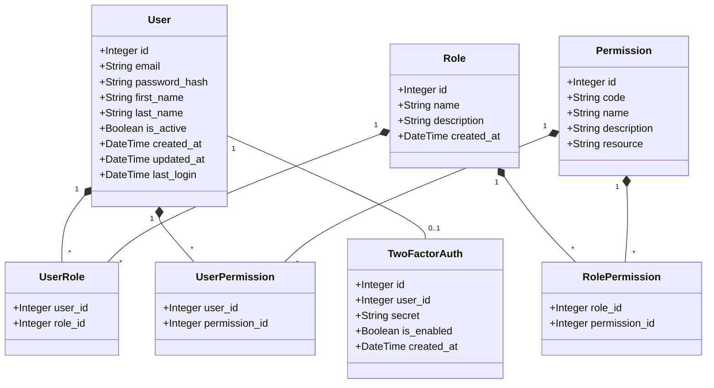

# Diagramme de Classes - Authentication & Authorization

```mermaid
classDiagram
    class User {
        +Integer id
        +String email
        +String password_hash
        +String first_name
        +String last_name
        +Boolean is_active
        +DateTime created_at
        +DateTime updated_at
        +DateTime last_login
    }
    
    class Role {
        +Integer id
        +String name
        +String description
        +DateTime created_at
    }
    
    class Permission {
        +Integer id
        +String code
        +String name
        +String description
        +String resource
    }
    
    class UserRole {
        +Integer user_id
        +Integer role_id
    }
    
    class UserPermission {
        +Integer user_id
        +Integer permission_id
    }
    
    class RolePermission {
        +Integer role_id
        +Integer permission_id
    }
    
    class TwoFactorAuth {
        +Integer id
        +Integer user_id
        +String secret
        +Boolean is_enabled
        +DateTime created_at
    }
    
    User "1" *-- "*" UserRole
    Role "1" *-- "*" UserRole
    User "1" *-- "*" UserPermission
    Permission "1" *-- "*" UserPermission
    Role "1" *-- "*" RolePermission
    Permission "1" *-- "*" RolePermission
    User "1" -- "0..1" TwoFactorAuth
```

---

**Version** : 1.0  
**Date** : 2025-01-20
