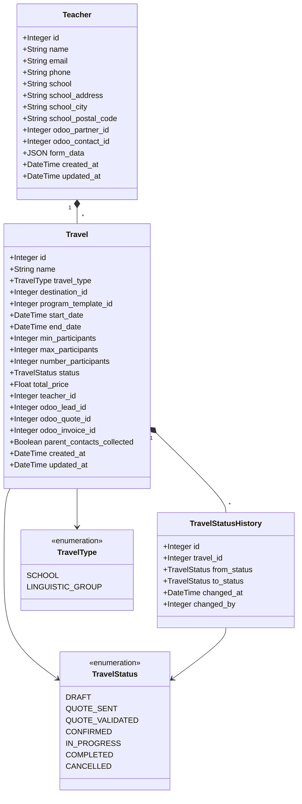

# Diagramme de Classes - Teachers & Travels

## Notes

**Workflow Travel Status** :
- DRAFT → QUOTE_SENT → QUOTE_VALIDATED → CONFIRMED → IN_PROGRESS → COMPLETED
- CANCELLED peut survenir à tout moment

---

**Version** : 1.0  
**Date** : 2025-01-20
