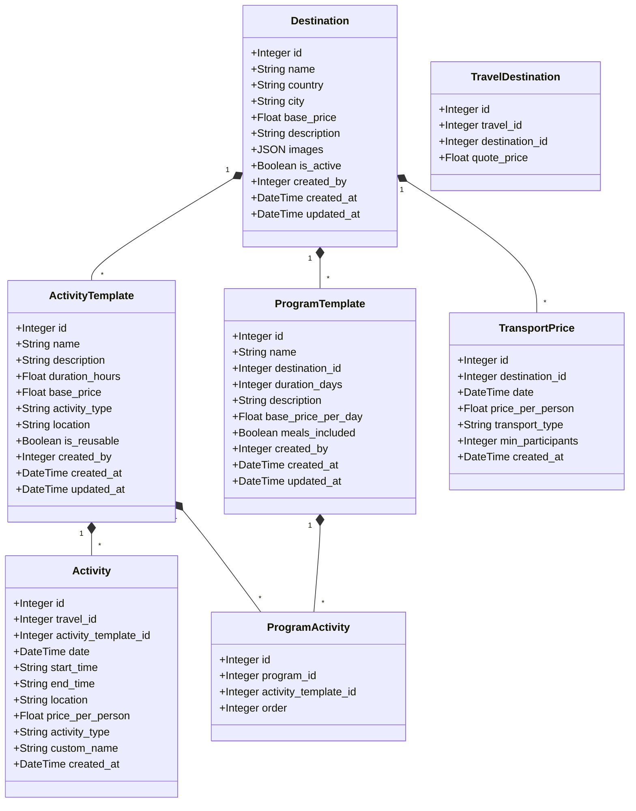

# Diagramme de Classes - Destinations, Activities & Programs

```mermaid
classDiagram
    class Destination {
        +Integer id
        +String name
        +String country
        +String city
        +Float base_price
        +String description
        +JSON images
        +Boolean is_active
        +Integer created_by
        +DateTime created_at
        +DateTime updated_at
    }
    
    class ActivityTemplate {
        +Integer id
        +String name
        +String description
        +Float duration_hours
        +Float base_price
        +String activity_type
        +String location
        +Boolean is_reusable
        +Integer created_by
        +DateTime created_at
        +DateTime updated_at
    }
    
    class Activity {
        +Integer id
        +Integer travel_id
        +Integer activity_template_id
        +DateTime date
        +String start_time
        +String end_time
        +String location
        +Float price_per_person
        +String activity_type
        +String custom_name
        +DateTime created_at
    }
    
    class TravelDestination {
        +Integer id
        +Integer travel_id
        +Integer destination_id
        +Float quote_price
    }
    
    class ProgramTemplate {
        +Integer id
        +String name
        +Integer destination_id
        +Integer duration_days
        +String description
        +Float base_price_per_day
        +Boolean meals_included
        +Integer created_by
        +DateTime created_at
        +DateTime updated_at
    }
    
    class ProgramActivity {
        +Integer id
        +Integer program_id
        +Integer activity_template_id
        +Integer order
    }
    
    class TransportPrice {
        +Integer id
        +Integer destination_id
        +DateTime date
        +Float price_per_person
        +String transport_type
        +Integer min_participants
        +DateTime created_at
    }
    
    Destination "1" *-- "*" ActivityTemplate
    Destination "1" *-- "*" TransportPrice
    Destination "1" *-- "*" ProgramTemplate
    ActivityTemplate "1" *-- "*" Activity
    ActivityTemplate "1" *-- "*" ProgramActivity
    ProgramTemplate "1" *-- "*" ProgramActivity
```

---

**Version** : 1.0  
**Date** : 2025-01-20
