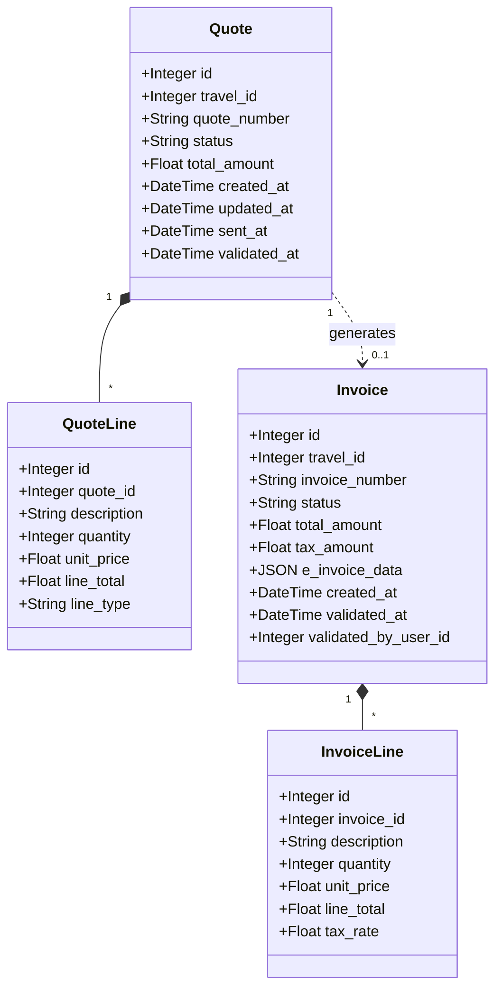

# Diagramme de Classes - Quotes & Invoices

## Notes

**Quote Status** : draft, sent, validated, rejected

**Invoice Status** : draft, validated, paid, cancelled  
**e_invoice_data** : Factur-X XML  
**Lien** : Invoice est liée à Travel uniquement

---

**Version** : 1.0  
**Date** : 2025-01-20
