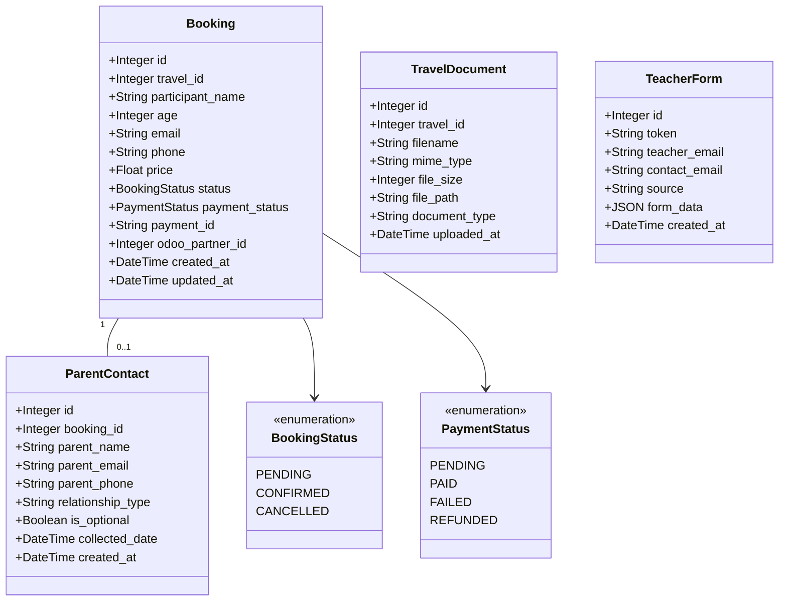

# Diagramme de Classes - Bookings, Contacts & Documents

```mermaid
classDiagram
    class Booking {
        +Integer id
        +Integer travel_id
        +String participant_name
        +Integer age
        +String email
        +String phone
        +Float price
        +BookingStatus status
        +PaymentStatus payment_status
        +String payment_id
        +Integer odoo_partner_id
        +DateTime created_at
        +DateTime updated_at
    }
    
    class ParentContact {
        +Integer id
        +Integer booking_id
        +String parent_name
        +String parent_email
        +String parent_phone
        +String relationship_type
        +Boolean is_optional
        +DateTime collected_date
        +DateTime created_at
    }
    
    class TravelDocument {
        +Integer id
        +Integer travel_id
        +String filename
        +String mime_type
        +Integer file_size
        +String file_path
        +String document_type
        +DateTime uploaded_at
    }
    
    class TeacherForm {
        +Integer id
        +String token
        +String teacher_email
        +String contact_email
        +String source
        +JSON form_data
        +DateTime created_at
    }
    
    class BookingStatus {
        <<enumeration>>
        PENDING
        CONFIRMED
        CANCELLED
    }
    
    class PaymentStatus {
        <<enumeration>>
        PENDING
        PAID
        FAILED
        REFUNDED
    }
    
    Booking "1" -- "0..1" ParentContact
    Booking --> BookingStatus
    Booking --> PaymentStatus
```

---

**Version** : 1.0  
**Date** : 2025-01-20
