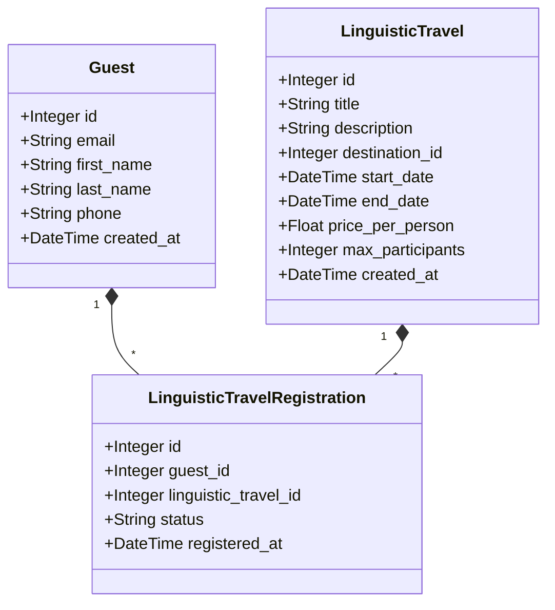

# Diagramme de Classes - Linguistic Travels

```mermaid
classDiagram
    class Guest {
        +Integer id
        +String email
        +String first_name
        +String last_name
        +String phone
        +DateTime created_at
    }
    
    class LinguisticTravel {
        +Integer id
        +String title
        +String description
        +Integer destination_id
        +DateTime start_date
        +DateTime end_date
        +Float price_per_person
        +Integer max_participants
        +DateTime created_at
    }
    
    class LinguisticTravelRegistration {
        +Integer id
        +Integer guest_id
        +Integer linguistic_travel_id
        +String status
        +DateTime registered_at
    }
    
    Guest "1" *-- "*" LinguisticTravelRegistration
    LinguisticTravel "1" *-- "*" LinguisticTravelRegistration
```

---

**Version** : 1.0  
**Date** : 2025-01-20
