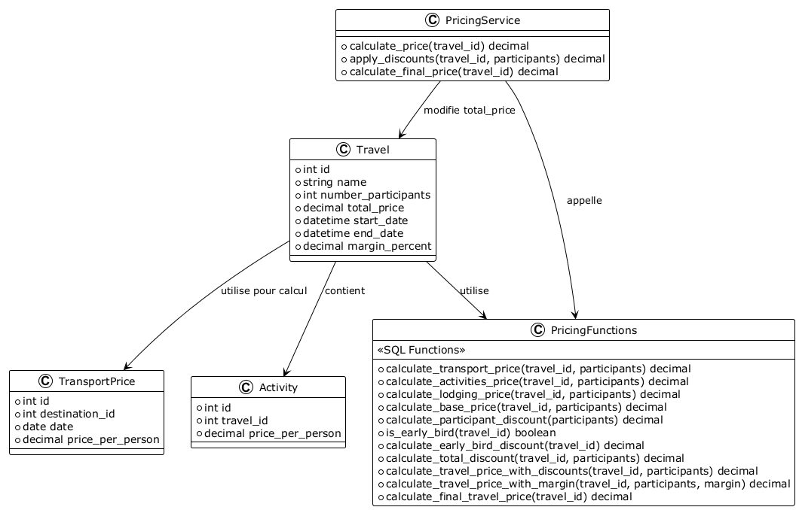

# Diagramme de Classes - Domaine Calculs de Prix

## Vue d'Ensemble

Ce diagramme présente les classes et fonctions SQL du domaine des calculs de prix.

## Diagramme de Classes



```plantuml
!theme plain

class Travel {
    +int id
    +string name
    +int number_participants
    +decimal total_price
    +datetime start_date
    +datetime end_date
    +decimal margin_percent
}
class TransportPrice {
    +int id
    +int destination_id
    +date date
    +decimal price_per_person
}
class Activity {
    +int id
    +int travel_id
    +decimal price_per_person
}
class PricingFunctions {
    <<SQL Functions>>
    +calculate_transport_price(travel_id, participants) decimal
    +calculate_activities_price(travel_id, participants) decimal
    +calculate_lodging_price(travel_id, participants) decimal
    +calculate_base_price(travel_id, participants) decimal
    +calculate_participant_discount(participants) decimal
    +is_early_bird(travel_id) boolean
    +calculate_early_bird_discount(travel_id) decimal
    +calculate_total_discount(travel_id, participants) decimal
    +calculate_travel_price_with_discounts(travel_id, participants) decimal
    +calculate_travel_price_with_margin(travel_id, participants, margin) decimal
    +calculate_final_travel_price(travel_id) decimal
}
class PricingService {
    +calculate_price(travel_id) decimal
    +apply_discounts(travel_id, participants) decimal
    +calculate_final_price(travel_id) decimal
}

Travel --> TransportPrice : utilise pour calcul
Travel --> Activity : contient
Travel --> PricingFunctions : utilise
PricingService --> PricingFunctions : appelle
PricingService --> Travel : modifie total_price
```

## Relations et Dépendances

### Hiérarchie des Fonctions


```plantuml
!theme plain

' NOTE: Diagramme Mermaid - conversion manuelle nécessaire
' graph TD
'     F1[calculate_final_travel_price] --> F2[calculate_travel_price_with_margin]
'     F2 --> F3[calculate_travel_price_with_discounts]
'     F3 --> F4[calculate_base_price]
'     F3 --> F5[calculate_total_discount]
'     
'     F4 --> F6[calculate_transport_price]
'     F4 --> F7[calculate_activities_price]
'     F4 --> F8[calculate_lodging_price]
'     
'     F5 --> F9[calculate_participant_discount]
'     F5 --> F10[calculate_early_bird_discount]
'     F10 --> F11[is_early_bird]
```

## Utilisation dans les Services

```python
class PricingService:
    def calculate_price(self, travel_id: int) -> Decimal:
        # Appel direct à la fonction SQL
        return db.execute(
            text("SELECT calculate_final_travel_price(:travel_id)"),
            {"travel_id": travel_id}
        ).scalar()
```

---

**Version** : 1.0  
**Date** : 2025-01-20
