# Diagrammes de Séquence - Système Intégré de Gestion

## 1. Formulaire Public → Devis


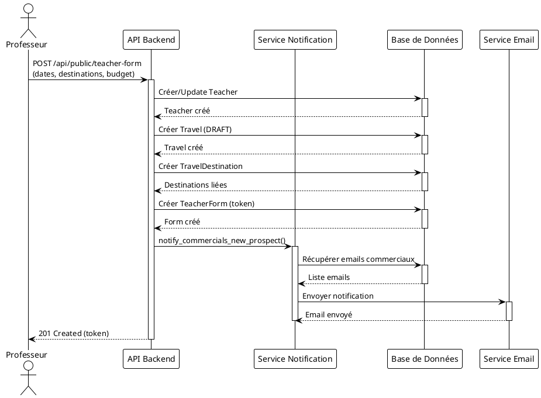

## 2. Génération Planning


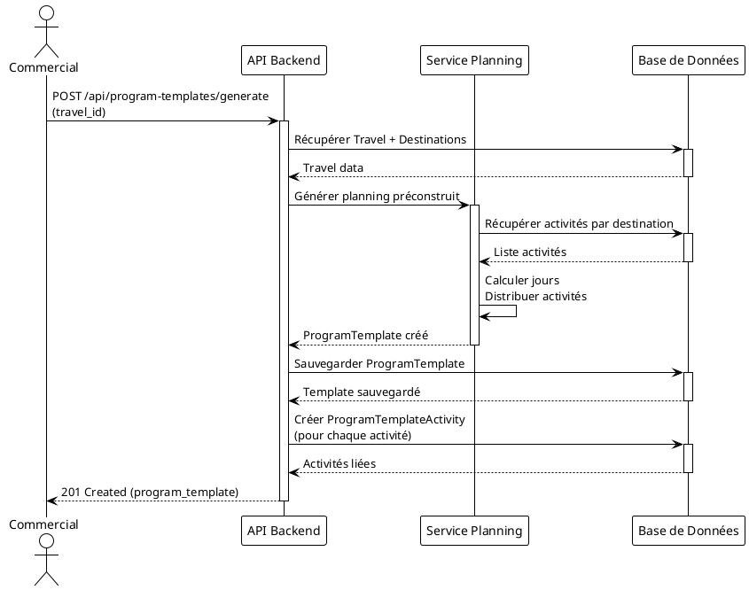
!theme plain

' NOTE: Diagramme Mermaid - conversion manuelle nécessaire
' sequenceDiagram
'     actor Commercial
'     participant API as API Backend
'     participant Planning as Service Planning
'     participant DB as Base de Données
'     
'     Commercial->>API: POST /api/program-templates/generate<br/>(travel_id)
'     activate API
'     
'     API->>DB: Récupérer Travel + Destinations
'     activate DB
'     DB-->>API: Travel data
'     deactivate DB
'     
'     API->>Planning: Générer planning préconstruit
'     activate Planning
'     Planning->>DB: Récupérer activités par destination
'     activate DB
'     DB-->>Planning: Liste activités
'     deactivate DB
'     Planning->>Planning: Calculer jours<br/>Distribuer activités
'     Planning-->>API: ProgramTemplate créé
'     deactivate Planning
'     
'     API->>DB: Sauvegarder ProgramTemplate
'     activate DB
'     DB-->>API: Template sauvegardé
'     deactivate DB
'     
'     API->>DB: Créer ProgramTemplateActivity<br/>(pour chaque activité)
'     activate DB
'     DB-->>API: Activités liées
'     deactivate DB
'     
'     API-->>Commercial: 201 Created (program_template)
'     deactivate API
```

## 3. Génération Devis Automatique (avec Fonctions SQL)


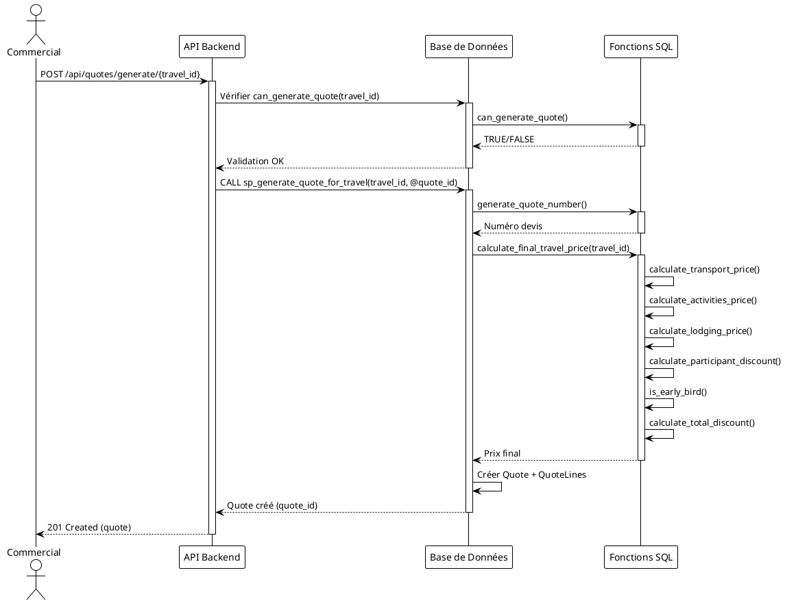

## 3.1 Génération Devis Automatique (Version Détaillée avec Fonctions)


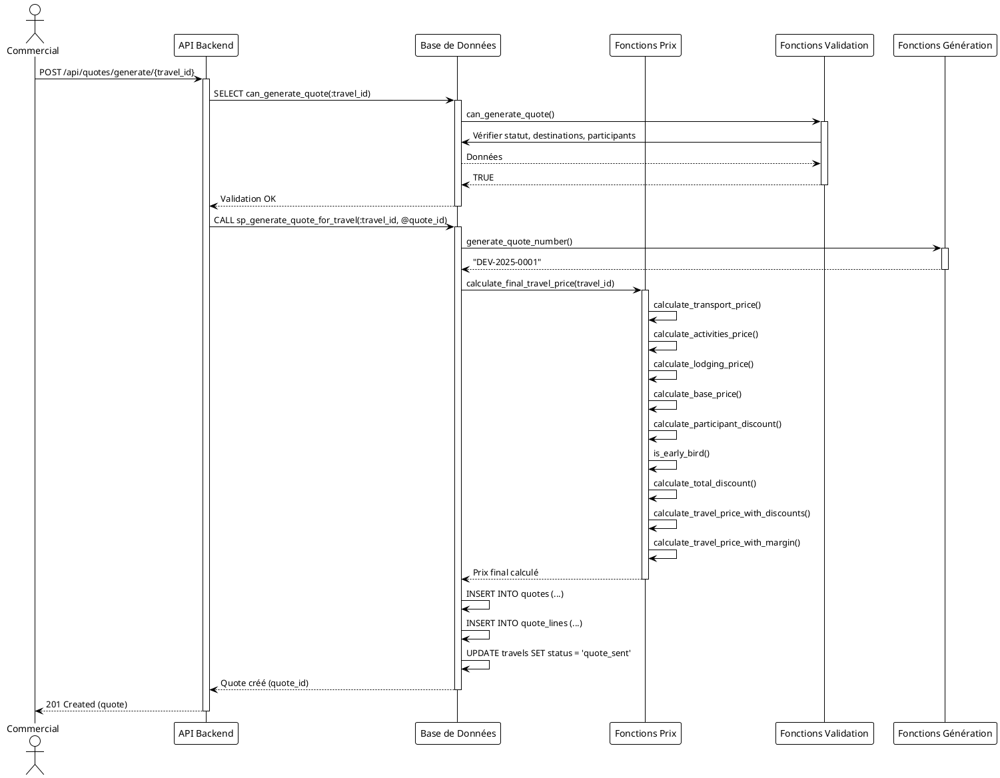


!theme plain

' NOTE: Diagramme Mermaid - conversion manuelle nécessaire
' sequenceDiagram
'     actor Commercial
'     participant API as API Backend
'     participant DB as Base de Données
'     participant PricingFuncs as Fonctions Prix
'     participant ValidationFuncs as Fonctions Validation
'     participant GenerationFuncs as Fonctions Génération
'     
'     Commercial->>API: POST /api/quotes/generate/{travel_id}
'     activate API
'     
'     API->>DB: SELECT can_generate_quote(:travel_id)
'     activate DB
'     DB->>ValidationFuncs: can_generate_quote()
'     activate ValidationFuncs
'     ValidationFuncs->>DB: Vérifier statut, destinations, participants
'     DB-->>ValidationFuncs: Données
'     ValidationFuncs-->>DB: TRUE
'     deactivate ValidationFuncs
'     DB-->>API: Validation OK
'     deactivate DB
'     
'     API->>DB: CALL sp_generate_quote_for_travel(:travel_id, @quote_id)
'     activate DB
'     
'     DB->>GenerationFuncs: generate_quote_number()
'     activate GenerationFuncs
'     GenerationFuncs-->>DB: "DEV-2025-0001"
'     deactivate GenerationFuncs
'     
'     DB->>PricingFuncs: calculate_final_travel_price(travel_id)
'     activate PricingFuncs
'     
'     PricingFuncs->>PricingFuncs: calculate_transport_price()
'     PricingFuncs->>PricingFuncs: calculate_activities_price()
'     PricingFuncs->>PricingFuncs: calculate_lodging_price()
'     PricingFuncs->>PricingFuncs: calculate_base_price()
'     
'     PricingFuncs->>PricingFuncs: calculate_participant_discount()
'     PricingFuncs->>PricingFuncs: is_early_bird()
'     PricingFuncs->>PricingFuncs: calculate_total_discount()
'     PricingFuncs->>PricingFuncs: calculate_travel_price_with_discounts()
'     PricingFuncs->>PricingFuncs: calculate_travel_price_with_margin()
'     
'     PricingFuncs-->>DB: Prix final calculé
'     deactivate PricingFuncs
'     
'     DB->>DB: INSERT INTO quotes (...)
'     DB->>DB: INSERT INTO quote_lines (...)
'     DB->>DB: UPDATE travels SET status = 'quote_sent'
'     DB-->>API: Quote créé (quote_id)
'     deactivate DB
'     
'     API-->>Commercial: 201 Created (quote)
'     deactivate API
```

## 4. Génération Facture depuis Devis (avec Fonctions SQL)


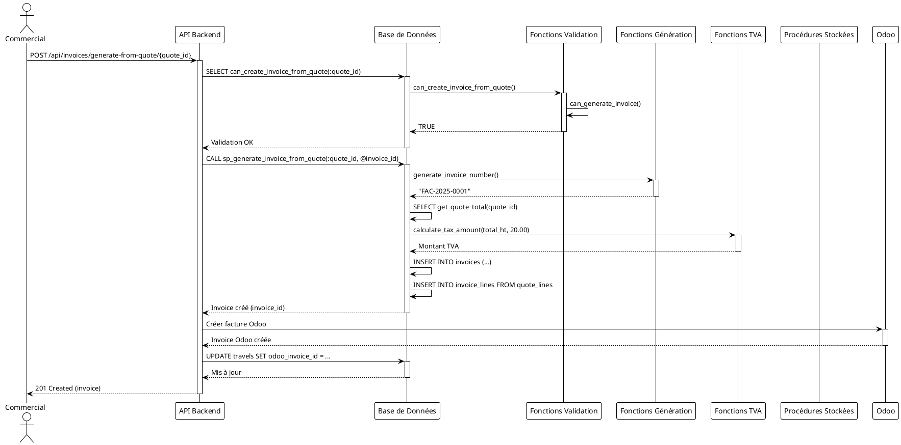


!theme plain

' NOTE: Diagramme Mermaid - conversion manuelle nécessaire
' sequenceDiagram
'     actor Commercial
'     participant API as API Backend
'     participant DB as Base de Données
'     participant ValidationFuncs as Fonctions Validation
'     participant GenerationFuncs as Fonctions Génération
'     participant TaxFuncs as Fonctions TVA
'     participant Procedures as Procédures Stockées
'     participant Odoo as Odoo
'     
'     Commercial->>API: POST /api/invoices/generate-from-quote/{quote_id}
'     activate API
'     
'     API->>DB: SELECT can_create_invoice_from_quote(:quote_id)
'     activate DB
'     DB->>ValidationFuncs: can_create_invoice_from_quote()
'     activate ValidationFuncs
'     ValidationFuncs->>ValidationFuncs: can_generate_invoice()
'     ValidationFuncs-->>DB: TRUE
'     deactivate ValidationFuncs
'     DB-->>API: Validation OK
'     deactivate DB
'     
'     API->>DB: CALL sp_generate_invoice_from_quote(:quote_id, @invoice_id)
'     activate DB
'     
'     DB->>GenerationFuncs: generate_invoice_number()
'     activate GenerationFuncs
'     GenerationFuncs-->>DB: "FAC-2025-0001"
'     deactivate GenerationFuncs
'     
'     DB->>DB: SELECT get_quote_total(quote_id)
'     DB->>TaxFuncs: calculate_tax_amount(total_ht, 20.00)
'     activate TaxFuncs
'     TaxFuncs-->>DB: Montant TVA
'     deactivate TaxFuncs
'     
'     DB->>DB: INSERT INTO invoices (...)
'     DB->>DB: INSERT INTO invoice_lines FROM quote_lines
'     DB-->>API: Invoice créé (invoice_id)
'     deactivate DB
'     
'     API->>Odoo: Créer facture Odoo
'     activate Odoo
'     Odoo-->>API: Invoice Odoo créée
'     deactivate Odoo
'     
'     API->>DB: UPDATE travels SET odoo_invoice_id = ...
'     activate DB
'     DB-->>API: Mis à jour
'     deactivate DB
'     
'     API-->>Commercial: 201 Created (invoice)
'     deactivate API
```

## 5. Authentification avec 2FA


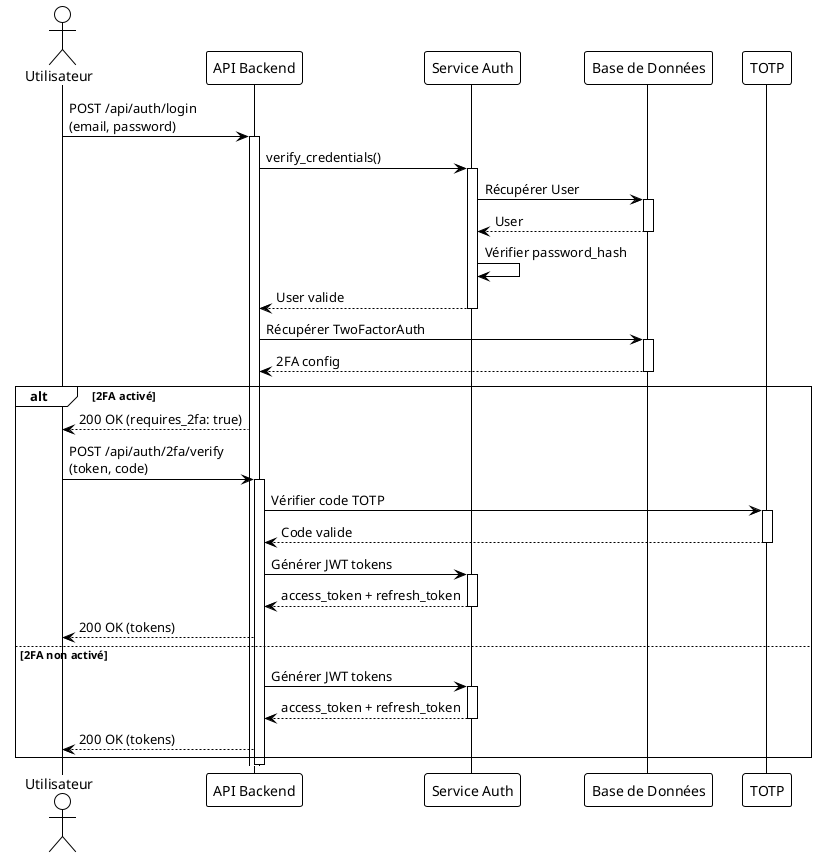


!theme plain

' NOTE: Diagramme Mermaid - conversion manuelle nécessaire
' sequenceDiagram
'     actor Utilisateur
'     participant API as API Backend
'     participant AuthService as Service Auth
'     participant DB as Base de Données
'     participant TOTP as TOTP
'     
'     Utilisateur->>API: POST /api/auth/login<br/>(email, password)
'     activate API
'     
'     API->>AuthService: verify_credentials()
'     activate AuthService
'     AuthService->>DB: Récupérer User
'     activate DB
'     DB-->>AuthService: User
'     deactivate DB
'     AuthService->>AuthService: Vérifier password_hash
'     AuthService-->>API: User valide
'     deactivate AuthService
'     
'     API->>DB: Récupérer TwoFactorAuth
'     activate DB
'     DB-->>API: 2FA config
'     deactivate DB
'     
'     alt 2FA activé
'         API-->>Utilisateur: 200 OK (requires_2fa: true)
'         Utilisateur->>API: POST /api/auth/2fa/verify<br/>(token, code)
'         activate API
'         API->>TOTP: Vérifier code TOTP
'         activate TOTP
'         TOTP-->>API: Code valide
'         deactivate TOTP
'         API->>AuthService: Générer JWT tokens
'         activate AuthService
'         AuthService-->>API: access_token + refresh_token
'         deactivate AuthService
'         API-->>Utilisateur: 200 OK (tokens)
'     else 2FA non activé
'         API->>AuthService: Générer JWT tokens
'         activate AuthService
'         AuthService-->>API: access_token + refresh_token
'         deactivate AuthService
'         API-->>Utilisateur: 200 OK (tokens)
'     end
'     
'     deactivate API
```

## 6. Paiement en Ligne Stripe (Voyage Linguistique)


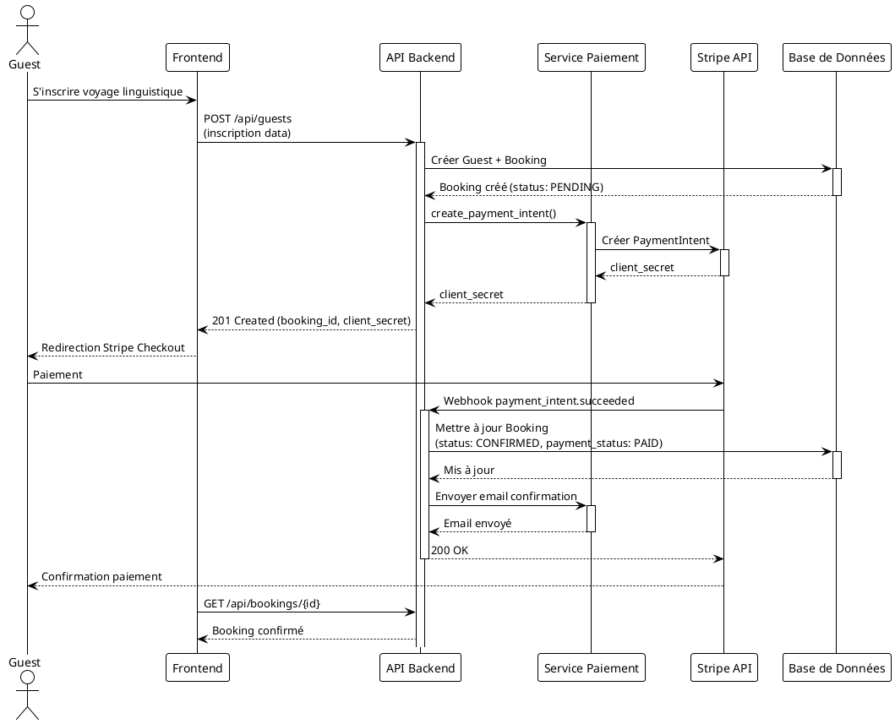


!theme plain

' NOTE: Diagramme Mermaid - conversion manuelle nécessaire
' sequenceDiagram
'     actor Guest
'     participant Frontend as Frontend
'     participant API as API Backend
'     participant PaymentService as Service Paiement
'     participant Stripe as Stripe API
'     participant DB as Base de Données
'     
'     Guest->>Frontend: S'inscrire voyage linguistique
'     Frontend->>API: POST /api/guests<br/>(inscription data)
'     activate API
'     
'     API->>DB: Créer Guest + Booking
'     activate DB
'     DB-->>API: Booking créé (status: PENDING)
'     deactivate DB
'     
'     API->>PaymentService: create_payment_intent()
'     activate PaymentService
'     PaymentService->>Stripe: Créer PaymentIntent
'     activate Stripe
'     Stripe-->>PaymentService: client_secret
'     deactivate Stripe
'     PaymentService-->>API: client_secret
'     deactivate PaymentService
'     
'     API-->>Frontend: 201 Created (booking_id, client_secret)
'     Frontend-->>Guest: Redirection Stripe Checkout
'     
'     Guest->>Stripe: Paiement
'     Stripe->>API: Webhook payment_intent.succeeded
'     activate API
'     
'     API->>DB: Mettre à jour Booking<br/>(status: CONFIRMED, payment_status: PAID)
'     activate DB
'     DB-->>API: Mis à jour
'     deactivate DB
'     
'     API->>PaymentService: Envoyer email confirmation
'     activate PaymentService
'     PaymentService-->>API: Email envoyé
'     deactivate PaymentService
'     
'     API-->>Stripe: 200 OK
'     deactivate API
'     
'     Stripe-->>Guest: Confirmation paiement
'     Frontend->>API: GET /api/bookings/{id}
'     API-->>Frontend: Booking confirmé
```

## 7. Synchronisation Odoo


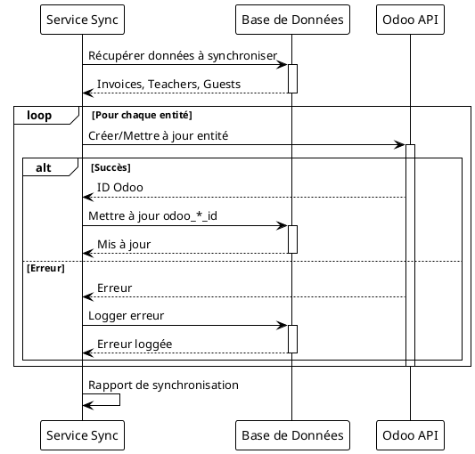


!theme plain

' NOTE: Diagramme Mermaid - conversion manuelle nécessaire
' sequenceDiagram
'     participant SyncService as Service Sync
'     participant DB as Base de Données
'     participant Odoo as Odoo API
'     
'     SyncService->>DB: Récupérer données à synchroniser
'     activate DB
'     DB-->>SyncService: Invoices, Teachers, Guests
'     deactivate DB
'     
'     loop Pour chaque entité
'         SyncService->>Odoo: Créer/Mettre à jour entité
'         activate Odoo
'         
'         alt Succès
'             Odoo-->>SyncService: ID Odoo
'             SyncService->>DB: Mettre à jour odoo_*_id
'             activate DB
'             DB-->>SyncService: Mis à jour
'             deactivate DB
'         else Erreur
'             Odoo-->>SyncService: Erreur
'             SyncService->>DB: Logger erreur
'             activate DB
'             DB-->>SyncService: Erreur loggée
'             deactivate DB
'         end
'         
'         deactivate Odoo
'     end
'     
'     SyncService->>SyncService: Rapport de synchronisation
```

## 8. Calcul de Prix avec Fonctions SQL


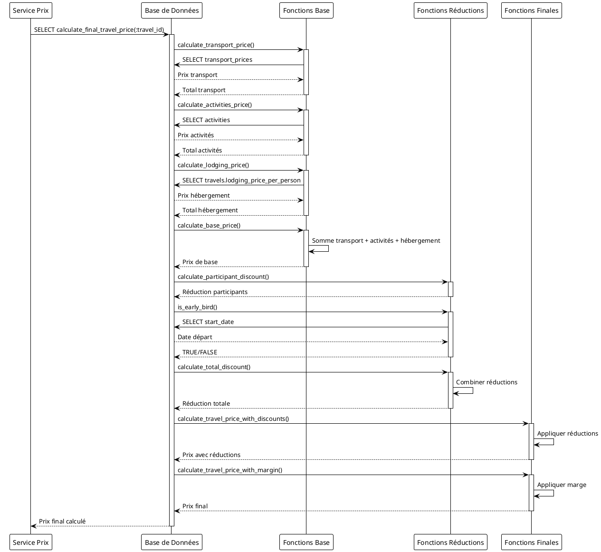


!theme plain

' NOTE: Diagramme Mermaid - conversion manuelle nécessaire
' sequenceDiagram
'     participant Service as Service Prix
'     participant DB as Base de Données
'     participant BaseFuncs as Fonctions Base
'     participant DiscountFuncs as Fonctions Réductions
'     participant FinalFuncs as Fonctions Finales
'     
'     Service->>DB: SELECT calculate_final_travel_price(:travel_id)
'     activate DB
'     
'     DB->>BaseFuncs: calculate_transport_price()
'     activate BaseFuncs
'     BaseFuncs->>DB: SELECT transport_prices
'     DB-->>BaseFuncs: Prix transport
'     BaseFuncs-->>DB: Total transport
'     deactivate BaseFuncs
'     
'     DB->>BaseFuncs: calculate_activities_price()
'     activate BaseFuncs
'     BaseFuncs->>DB: SELECT activities
'     DB-->>BaseFuncs: Prix activités
'     BaseFuncs-->>DB: Total activités
'     deactivate BaseFuncs
'     
'     DB->>BaseFuncs: calculate_lodging_price()
'     activate BaseFuncs
'     BaseFuncs->>DB: SELECT travels.lodging_price_per_person
'     DB-->>BaseFuncs: Prix hébergement
'     BaseFuncs-->>DB: Total hébergement
'     deactivate BaseFuncs
'     
'     DB->>BaseFuncs: calculate_base_price()
'     activate BaseFuncs
'     BaseFuncs->>BaseFuncs: Somme transport + activités + hébergement
'     BaseFuncs-->>DB: Prix de base
'     deactivate BaseFuncs
'     
'     DB->>DiscountFuncs: calculate_participant_discount()
'     activate DiscountFuncs
'     DiscountFuncs-->>DB: Réduction participants
'     deactivate DiscountFuncs
'     
'     DB->>DiscountFuncs: is_early_bird()
'     activate DiscountFuncs
'     DiscountFuncs->>DB: SELECT start_date
'     DB-->>DiscountFuncs: Date départ
'     DiscountFuncs-->>DB: TRUE/FALSE
'     deactivate DiscountFuncs
'     
'     DB->>DiscountFuncs: calculate_total_discount()
'     activate DiscountFuncs
'     DiscountFuncs->>DiscountFuncs: Combiner réductions
'     DiscountFuncs-->>DB: Réduction totale
'     deactivate DiscountFuncs
'     
'     DB->>FinalFuncs: calculate_travel_price_with_discounts()
'     activate FinalFuncs
'     FinalFuncs->>FinalFuncs: Appliquer réductions
'     FinalFuncs-->>DB: Prix avec réductions
'     deactivate FinalFuncs
'     
'     DB->>FinalFuncs: calculate_travel_price_with_margin()
'     activate FinalFuncs
'     FinalFuncs->>FinalFuncs: Appliquer marge
'     FinalFuncs-->>DB: Prix final
'     deactivate FinalFuncs
'     
'     DB-->>Service: Prix final calculé
'     deactivate DB
```

## 9. Validation Métier avec Fonctions SQL


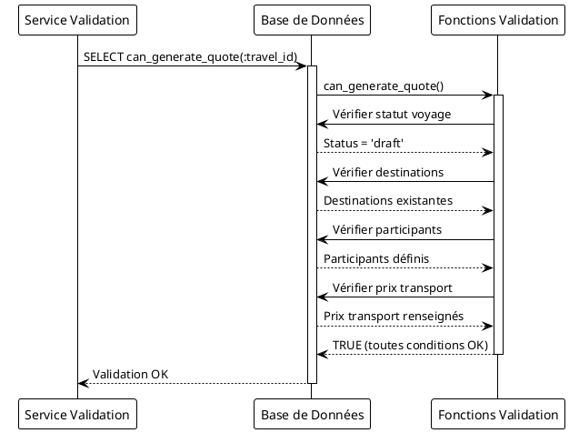


!theme plain

' NOTE: Diagramme Mermaid - conversion manuelle nécessaire
' sequenceDiagram
'     participant Service as Service Validation
'     participant DB as Base de Données
'     participant ValidationFuncs as Fonctions Validation
'     
'     Service->>DB: SELECT can_generate_quote(:travel_id)
'     activate DB
'     
'     DB->>ValidationFuncs: can_generate_quote()
'     activate ValidationFuncs
'     
'     ValidationFuncs->>DB: Vérifier statut voyage
'     DB-->>ValidationFuncs: Status = 'draft'
'     
'     ValidationFuncs->>DB: Vérifier destinations
'     DB-->>ValidationFuncs: Destinations existantes
'     
'     ValidationFuncs->>DB: Vérifier participants
'     DB-->>ValidationFuncs: Participants définis
'     
'     ValidationFuncs->>DB: Vérifier prix transport
'     DB-->>ValidationFuncs: Prix transport renseignés
'     
'     ValidationFuncs-->>DB: TRUE (toutes conditions OK)
'     deactivate ValidationFuncs
'     
'     DB-->>Service: Validation OK
'     deactivate DB
```

## 10. Génération Automatique avec Procédures Stockées


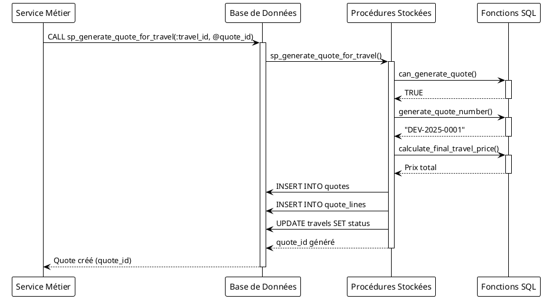


!theme plain

' NOTE: Diagramme Mermaid - conversion manuelle nécessaire
' sequenceDiagram
'     participant Service as Service Métier
'     participant DB as Base de Données
'     participant Procedures as Procédures Stockées
'     participant Functions as Fonctions SQL
'     
'     Service->>DB: CALL sp_generate_quote_for_travel(:travel_id, @quote_id)
'     activate DB
'     
'     DB->>Procedures: sp_generate_quote_for_travel()
'     activate Procedures
'     
'     Procedures->>Functions: can_generate_quote()
'     activate Functions
'     Functions-->>Procedures: TRUE
'     deactivate Functions
'     
'     Procedures->>Functions: generate_quote_number()
'     activate Functions
'     Functions-->>Procedures: "DEV-2025-0001"
'     deactivate Functions
'     
'     Procedures->>Functions: calculate_final_travel_price()
'     activate Functions
'     Functions-->>Procedures: Prix total
'     deactivate Functions
'     
'     Procedures->>DB: INSERT INTO quotes
'     Procedures->>DB: INSERT INTO quote_lines
'     Procedures->>DB: UPDATE travels SET status
'     
'     Procedures-->>DB: quote_id généré
'     deactivate Procedures
'     
'     DB-->>Service: Quote créé (quote_id)
'     deactivate DB
```

---

**Version** : 2.0  
**Date** : 2025-01-20  
**Mise à jour** : Ajout des séquences avec fonctions SQL
