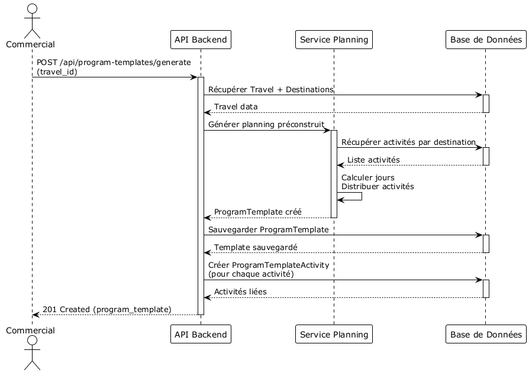
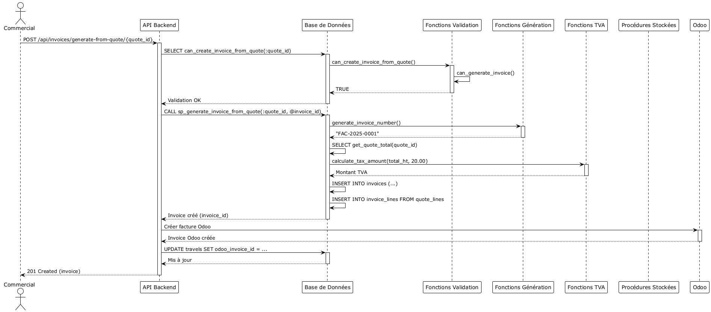
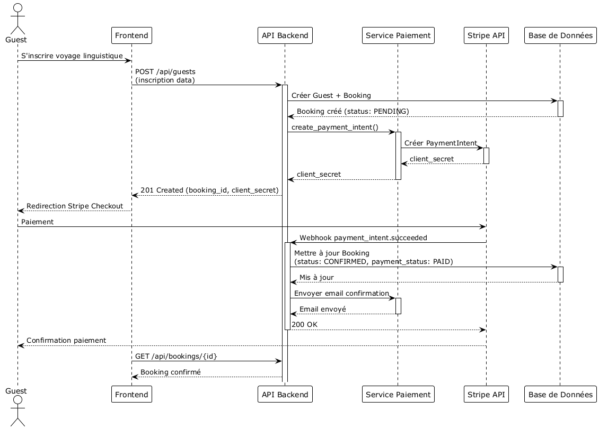

# Diagrammes de Séquence - Système Intégré de Gestion

## 1. Formulaire Public → Devis

## 2. Génération Planning

## 3. Génération Devis Automatique (avec Fonctions SQL)

## 3.1 Génération Devis Automatique (Version Détaillée avec Fonctions)

## 4. Génération Facture depuis Devis (avec Fonctions SQL)

## 5. Authentification avec 2FA

## 6. Paiement en Ligne Stripe (Voyage Linguistique)

## 7. Synchronisation Odoo

## 8. Calcul de Prix avec Fonctions SQL

## 9. Validation Métier avec Fonctions SQL

## 10. Génération Automatique avec Procédures Stockées

