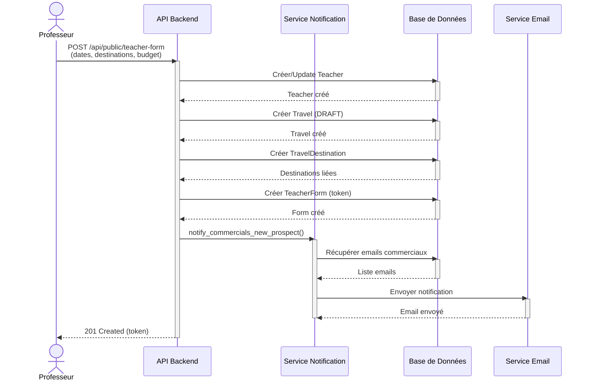
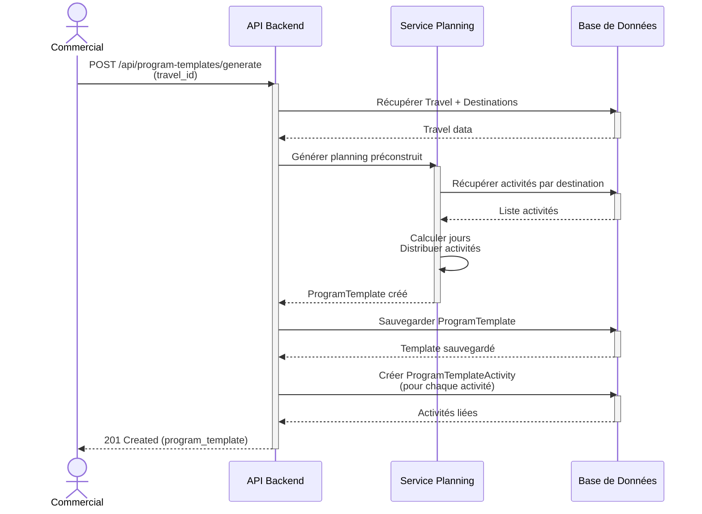
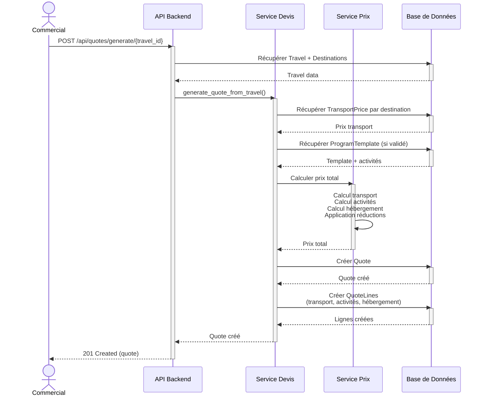
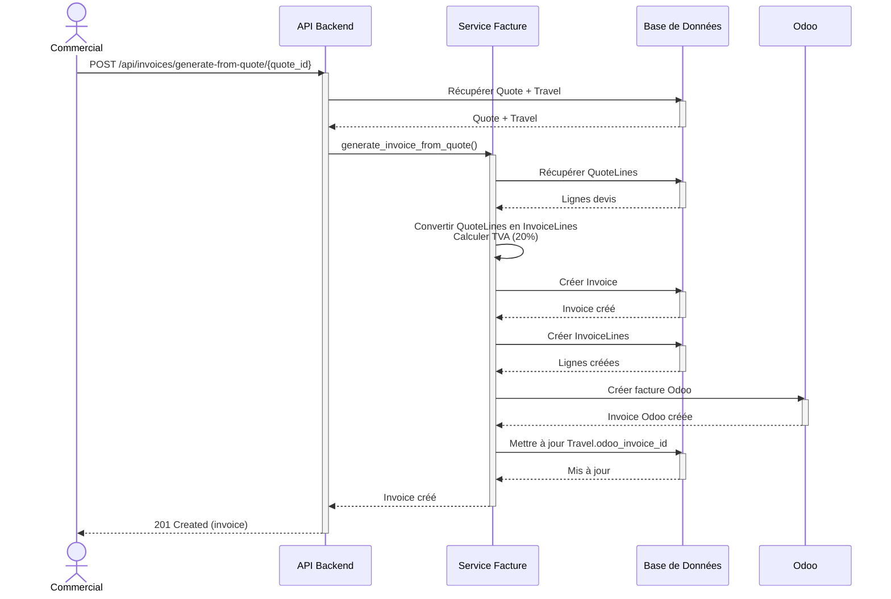
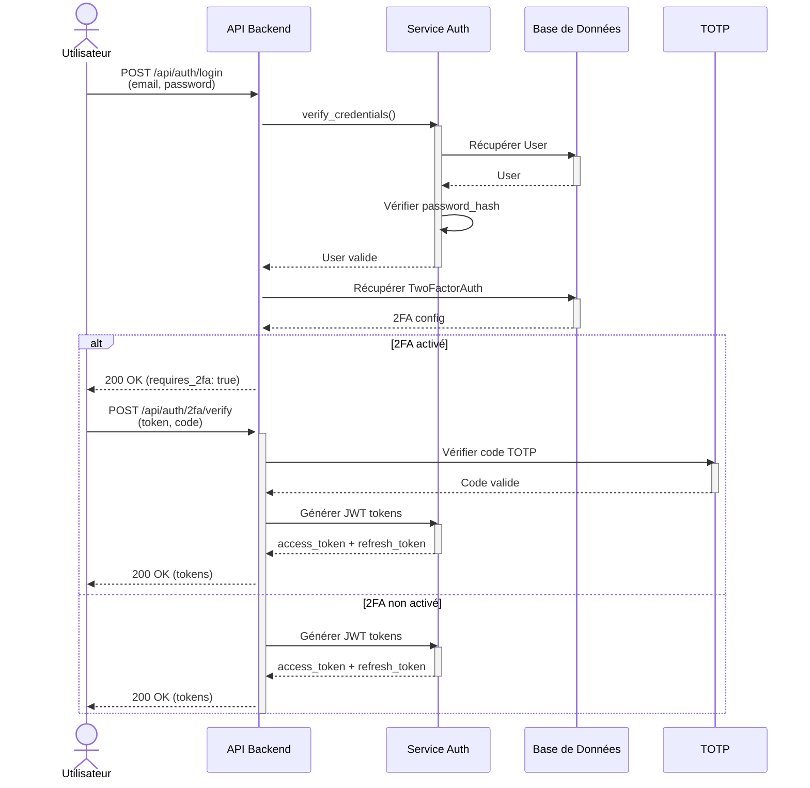
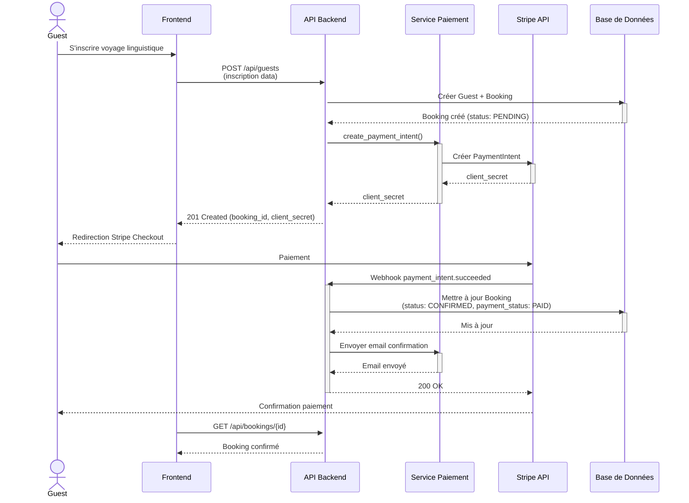
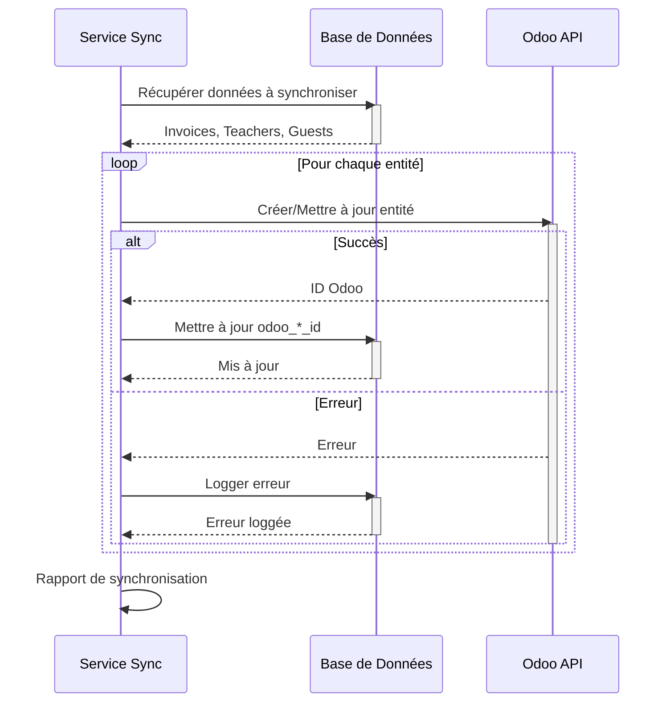

# Diagrammes de Séquence - Système Intégré de Gestion

## 1. Formulaire Public → Devis

## 2. Génération Planning

## 3. Génération Devis Automatique

## 4. Génération Facture depuis Devis

## 5. Authentification avec 2FA

## 6. Paiement en Ligne Stripe (Voyage Linguistique)

## 7. Synchronisation Odoo

---

**Version** : 1.0  
**Date** : 2025-01-20
