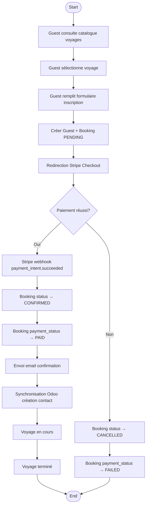
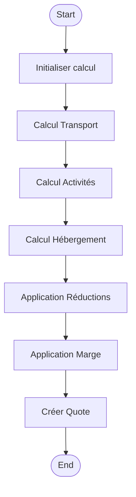
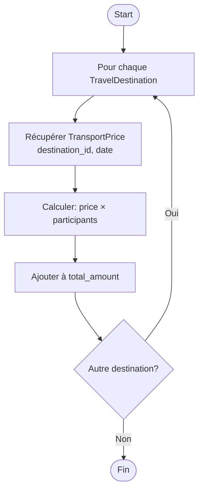
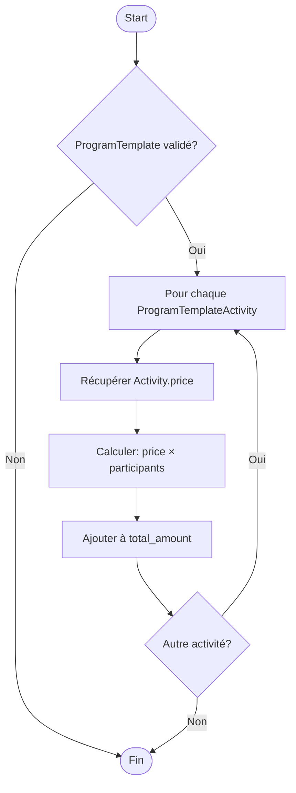
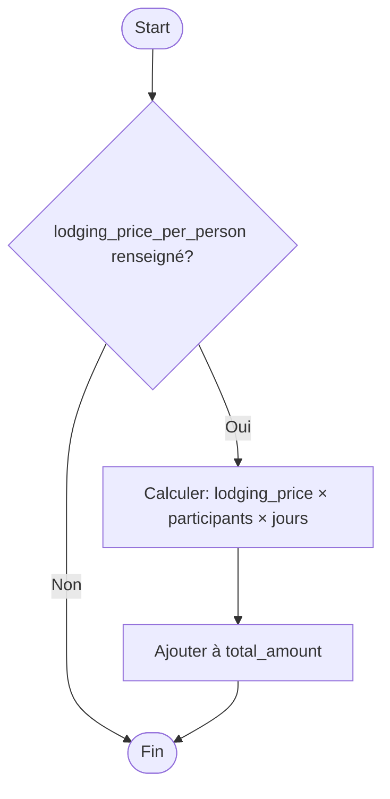
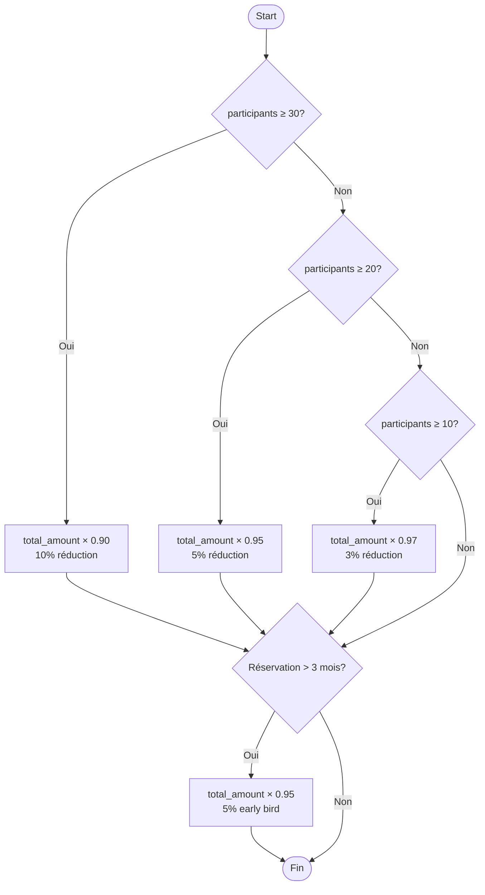
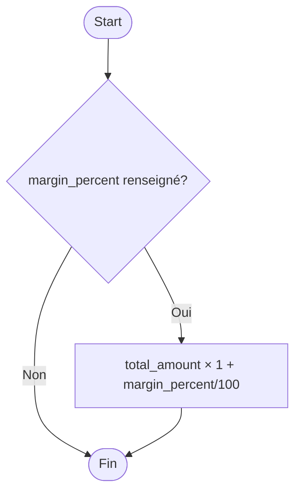
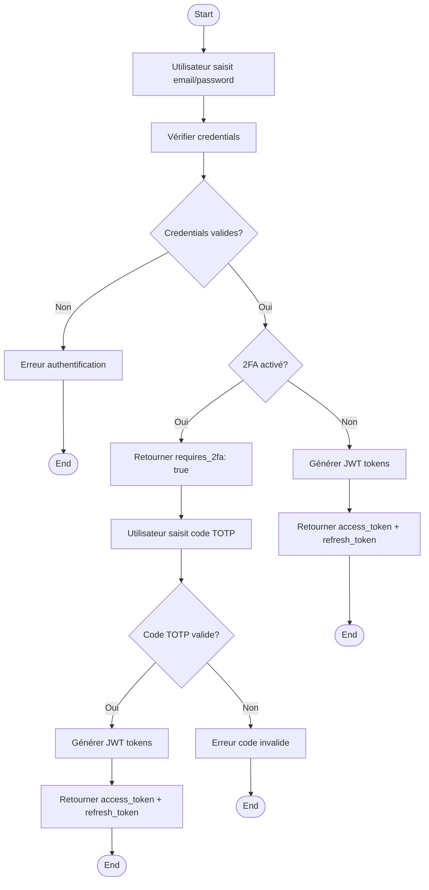
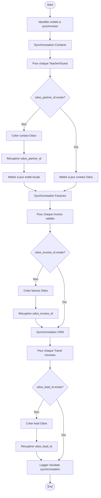

# Diagrammes d'Activité - Système Intégré de Gestion

## 1. Workflow Voyage Scolaire

```mermaid
flowchart TD
    Start([Start]) --> FillForm[Professeur remplit formulaire public]
    FillForm --> CreateTravel[Créer Teacher + Travel DRAFT]
    CreateTravel --> Notify[Commercial reçoit notification]
    Notify --> GeneratePlanning[Commercial génère planning préconstruit]
    GeneratePlanning --> ModifyPlanning[Commercial modifie/valide planning]
    ModifyPlanning --> EnterTransport[Commercial saisit prix transport<br/>par destination/date]
    EnterTransport --> GenerateQuote[Commercial génère devis]
    
    GenerateQuote --> Note1[Calcul automatique:<br/>- Transport × participants<br/>- Activités si planning validé<br/>- Hébergement si renseigné<br/>- Marge si renseignée<br/>- Réductions selon participants]
    
    Note1 --> SendQuote[Commercial envoie devis au professeur]
    SendQuote --> Status1[Travel status → QUOTE_SENT]
    Status1 --> Decision1{Professeur accepte devis?}
    
    Decision1 -->|Oui| ValidateQuote[Commercial valide devis]
    ValidateQuote --> Status2[Travel status → QUOTE_VALIDATED]
    Status2 --> SendContacts[Professeur envoie contacts parents]
    SendContacts --> ConfirmParticipants[Professeur confirme nombre exact participants]
    ConfirmParticipants --> Decision2{Nombre participants changé?}
    
    Decision2 -->|Oui| Recalculate[Commercial recalcule devis transport]
    Recalculate --> ValidateDossier
    Decision2 -->|Non| ValidateDossier[Commercial valide dossier]
    
    ValidateDossier --> DossierValidated[Travel dossier_validated = True]
    DossierValidated --> GenerateInvoice[Commercial génère facture depuis devis]
    
    GenerateInvoice --> Note2[Conditions:<br/>- Quote status = validated<br/>- Travel dossier_validated = True]
    
    Note2 --> ValidateInvoice[Commercial valide facture]
    ValidateInvoice --> SendInvoice[Envoi facture au professeur]
    SendInvoice --> SyncOdoo[Synchronisation Odoo]
    SyncOdoo --> Status3[Travel status → CONFIRMED]
    Status3 --> InProgress[Voyage en cours]
    InProgress --> Status4[Travel status → IN_PROGRESS]
    Status4 --> Completed[Voyage terminé]
    Completed --> Status5[Travel status → COMPLETED]
    Status5 --> End([End])
    
    Decision1 -->|Non| Cancel[Commercial annule commande]
    Cancel --> Status6[Travel status → CANCELLED]
    Status6 --> End
```

## 2. Workflow Voyage Linguistique

## 3. Génération Devis Automatique

### Vue d'Ensemble

### Détails du Calcul

#### 3.1 Calcul Transport

#### 3.2 Calcul Activités

#### 3.3 Calcul Hébergement

#### 3.4 Application Réductions

#### 3.5 Application Marge

## 4. Validation Dossier → Facture

## 5. Authentification 2FA

## 6. Synchronisation Odoo

---

**Version** : 1.0  
**Date** : 2025-01-20
