# Diagrammes d'Activité - Système Intégré de Gestion

## 1. Workflow Voyage Scolaire

## 2. Workflow Voyage Linguistique

## 3. Génération Devis Automatique

```mermaid
flowchart TD
    Start([Start]) --> Receive[Recevoir travel_id]
    Receive --> GetTravel[Récupérer Travel + Destinations]
    GetTravel --> GetTemplate[Récupérer ProgramTemplate si validé]
    GetTemplate --> Init[Initialiser total_amount = 0]
    
    Init --> TransportCalc[Calcul Transport]
    TransportCalc --> TransportLoop[Pour chaque TravelDestination]
    TransportLoop --> GetPrice[Récupérer TransportPrice<br/>destination_id, date]
    GetPrice --> CalcTransport[Calculer: price × participants]
    CalcTransport --> AddTransport[Ajouter à total_amount]
    
    AddTransport --> ActivityCalc[Calcul Activités]
    ActivityCalc --> Decision1{ProgramTemplate validé?}
    Decision1 -->|Oui| ActivityLoop[Pour chaque ProgramTemplateActivity]
    ActivityLoop --> GetActivityPrice[Récupérer Activity.price]
    GetActivityPrice --> CalcActivity[Calculer: price × participants]
    CalcActivity --> AddActivity[Ajouter à total_amount]
    AddActivity --> LodgingCalc
    Decision1 -->|Non| LodgingCalc[Calcul Hébergement]
    
    AddActivity --> LodgingCalc
    LodgingCalc --> Decision2{lodging_price_per_person renseigné?}
    Decision2 -->|Oui| CalcLodging[Calculer: lodging_price × participants × jours]
    CalcLodging --> AddLodging[Ajouter à total_amount]
    AddLodging --> Reductions
    Decision2 -->|Non| Reductions[Application Réductions]
    
    Reductions --> Decision3{participants ≥ 30?}
    Decision3 -->|Oui| Reduce10[total_amount × 0.90 10% réduction]
    Decision3 -->|Non| Decision4{participants ≥ 20?}
    Decision4 -->|Oui| Reduce5[total_amount × 0.95 5% réduction]
    Decision4 -->|Non| Decision5{participants ≥ 10?}
    Decision5 -->|Oui| Reduce3[total_amount × 0.97 3% réduction]
    Decision5 -->|Non| EarlyBird
    
    Reduce10 --> EarlyBird
    Reduce5 --> EarlyBird
    Reduce3 --> EarlyBird
    
    EarlyBird --> Decision6{Réservation > 3 mois?}
    Decision6 -->|Oui| EarlyBird5[total_amount × 0.95 5% early bird]
    EarlyBird5 --> Margin
    Decision6 -->|Non| Margin[Application Marge]
    
    Margin --> Decision7{margin_percent renseigné?}
    Decision7 -->|Oui| ApplyMargin[total_amount × 1 + margin_percent/100]
    ApplyMargin --> CreateQuote
    Decision7 -->|Non| CreateQuote[Créer Quote avec total_amount]
    
    CreateQuote --> CreateLines[Créer QuoteLines détaillées]
    CreateLines --> End([End])
```

## 4. Validation Dossier → Facture

```mermaid
flowchart TD
    Start([Start]) --> QuoteValidated[Devis validé]
    QuoteValidated --> Status[Travel status = QUOTE_VALIDATED]
    Status --> SendContacts[Professeur envoie contacts parents]
    SendContacts --> Confirm[Professeur confirme nombre exact participants]
    Confirm --> Decision{Nombre participants changé?}
    
    Decision -->|Oui| Recalculate[Recalculer devis transport]
    Recalculate --> Validate
    Decision -->|Non| Validate[Commercial valide dossier]
    
    Validate --> DossierValidated[Travel dossier_validated = True]
    DossierValidated --> GenerateInvoice[Commercial génère facture depuis devis]
    
    GenerateInvoice --> Conversion[Conversion Devis → Facture]
    Conversion --> GetLines[Récupérer QuoteLines]
    GetLines --> Convert[Convertir en InvoiceLines]
    Convert --> CalcTVA[Calculer TVA 20%]
    CalcTVA --> CreateInvoice[Créer Invoice]
    
    CreateInvoice --> ValidateInvoice[Commercial valide facture]
    ValidateInvoice --> InvoiceStatus[Invoice status → validated]
    InvoiceStatus --> Export[Export Factur-X XML]
    Export --> Store[Stockage document]
    Store --> SyncOdoo[Synchronisation Odoo]
    SyncOdoo --> CreateOdoo[Création facture Odoo]
    CreateOdoo --> SendInvoice[Envoi facture au professeur]
    SendInvoice --> Confirmed[Travel status → CONFIRMED]
    Confirmed --> End([End])
```

## 5. Authentification 2FA

## 6. Synchronisation Odoo

---

**Version** : 1.0  
**Date** : 2025-01-20
