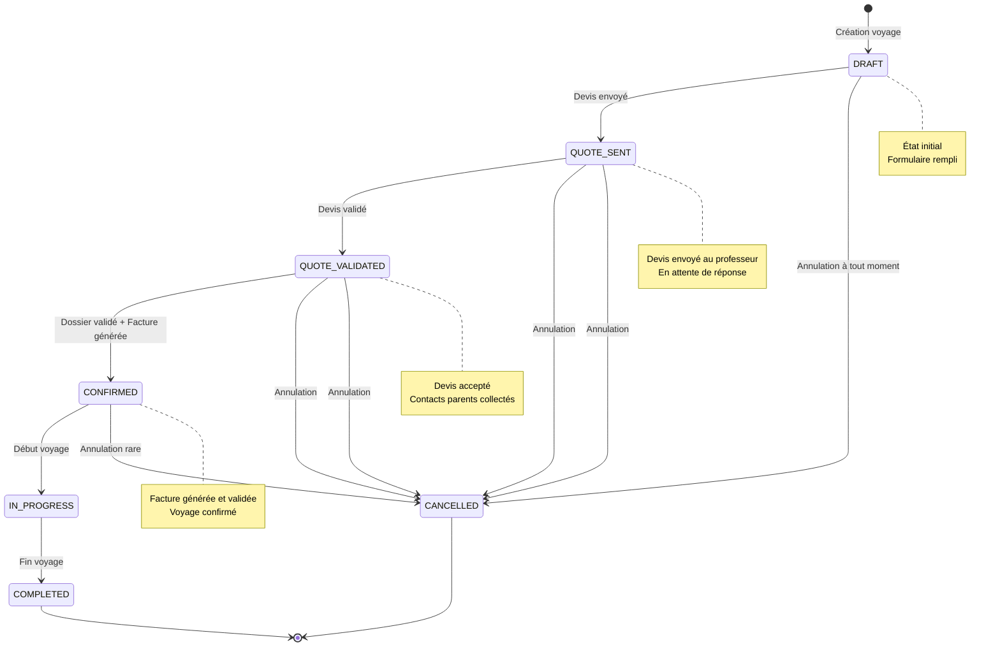
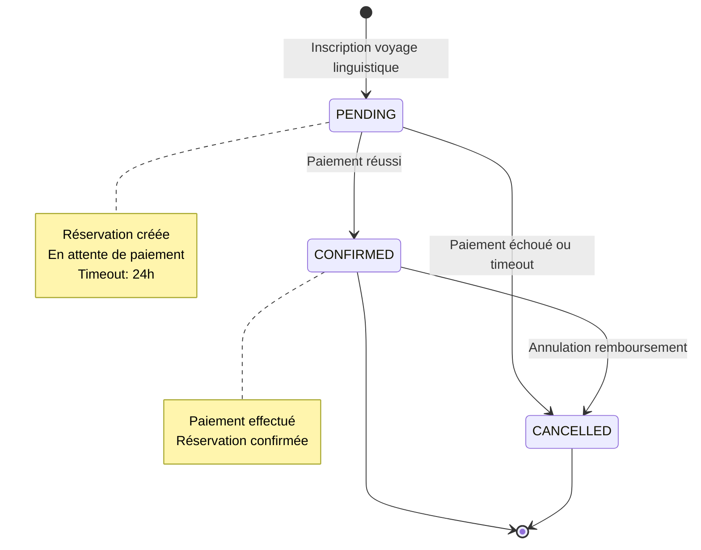
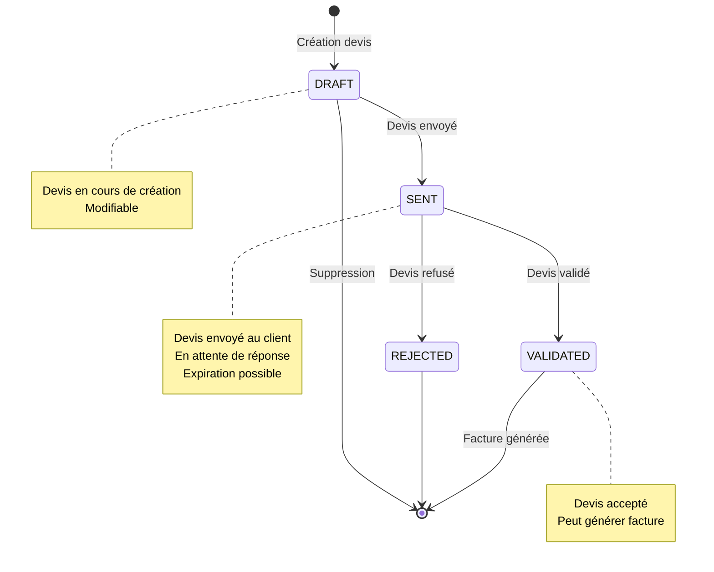
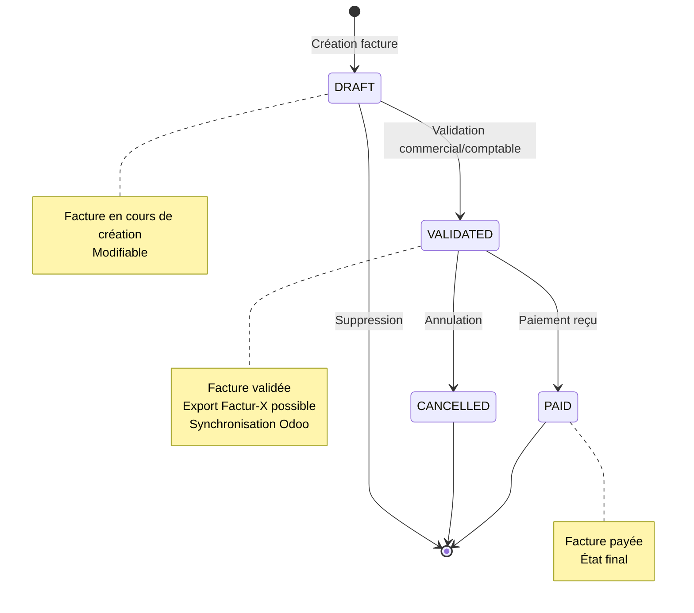

# Diagrammes d'État - Système Intégré de Gestion

## 1. Travel Status

```mermaid
stateDiagram-v2
    [*] --> DRAFT: Création voyage
    
    DRAFT --> QUOTE_SENT: Devis envoyé
    QUOTE_SENT --> QUOTE_VALIDATED: Devis validé
    QUOTE_SENT --> CANCELLED: Annulation
    
    QUOTE_VALIDATED --> CONFIRMED: Dossier validé + Facture générée
    QUOTE_VALIDATED --> CANCELLED: Annulation
    
    CONFIRMED --> IN_PROGRESS: Début voyage
    IN_PROGRESS --> COMPLETED: Fin voyage
    
    DRAFT --> CANCELLED: Annulation à tout moment
    QUOTE_SENT --> CANCELLED: Annulation
    QUOTE_VALIDATED --> CANCELLED: Annulation
    CONFIRMED --> CANCELLED: Annulation rare
    
    COMPLETED --> [*]
    CANCELLED --> [*]
    
    note right of DRAFT
        État initial
        Formulaire rempli
    end note
    
    note right of QUOTE_SENT
        Devis envoyé au professeur
        En attente de réponse
    end note
    
    note right of QUOTE_VALIDATED
        Devis accepté
        Contacts parents collectés
    end note
    
    note right of CONFIRMED
        Facture générée et validée
        Voyage confirmé
    end note
```

## 2. Booking Status

```mermaid
stateDiagram-v2
    [*] --> PENDING: Inscription voyage linguistique
    
    PENDING --> CONFIRMED: Paiement réussi
    PENDING --> CANCELLED: Paiement échoué ou timeout
    
    CONFIRMED --> CANCELLED: Annulation remboursement
    
    CONFIRMED --> [*]
    CANCELLED --> [*]
    
    note right of PENDING
        Réservation créée
        En attente de paiement
        Timeout: 24h
    end note
    
    note right of CONFIRMED
        Paiement effectué
        Réservation confirmée
    end note
```

## 3. Quote Status

```mermaid
stateDiagram-v2
    [*] --> DRAFT: Création devis
    
    DRAFT --> SENT: Devis envoyé
    SENT --> VALIDATED: Devis validé
    SENT --> REJECTED: Devis refusé
    
    VALIDATED --> [*]: Facture générée
    REJECTED --> [*]
    DRAFT --> [*]: Suppression
    
    note right of DRAFT
        Devis en cours de création
        Modifiable
    end note
    
    note right of SENT
        Devis envoyé au client
        En attente de réponse
        Expiration possible
    end note
    
    note right of VALIDATED
        Devis accepté
        Peut générer facture
    end note
```

## 4. Invoice Status

```mermaid
stateDiagram-v2
    [*] --> DRAFT: Création facture
    
    DRAFT --> VALIDATED: Validation commercial/comptable
    VALIDATED --> PAID: Paiement reçu
    VALIDATED --> CANCELLED: Annulation
    
    PAID --> [*]
    CANCELLED --> [*]
    DRAFT --> [*]: Suppression
    
    note right of DRAFT
        Facture en cours de création
        Modifiable
    end note
    
    note right of VALIDATED
        Facture validée
        Export Factur-X possible
        Synchronisation Odoo
    end note
    
    note right of PAID
        Facture payée
        État final
    end note
```

---

**Version** : 1.0  
**Date** : 2025-01-20
