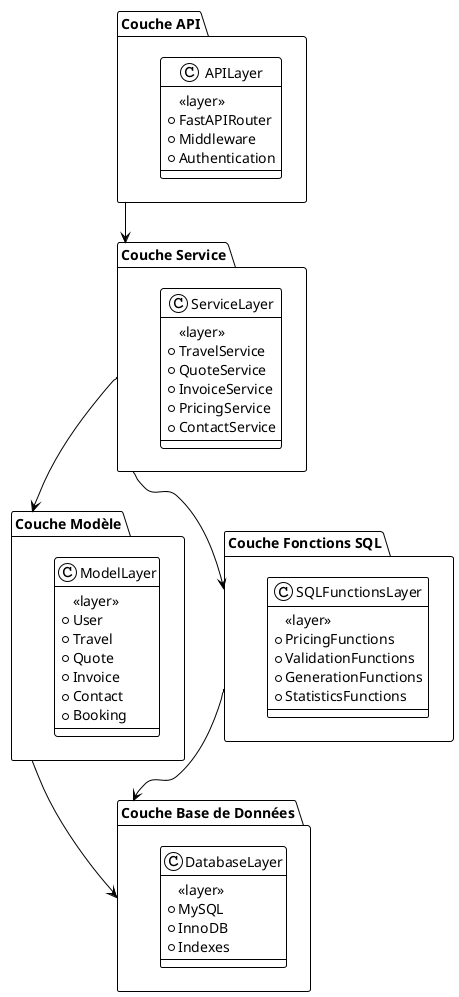
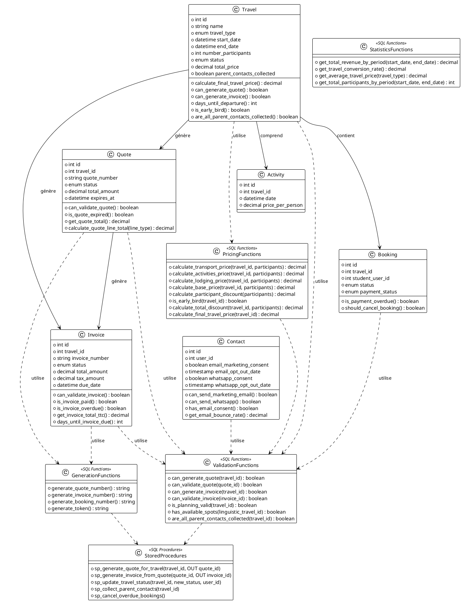
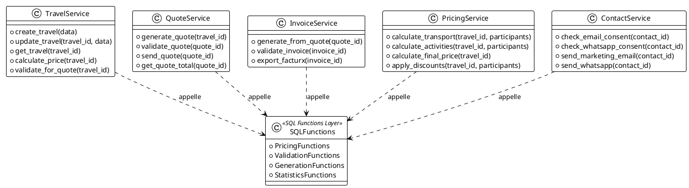
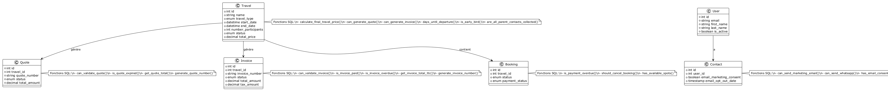
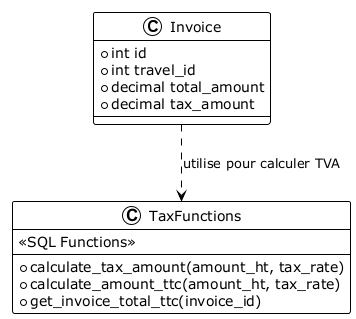
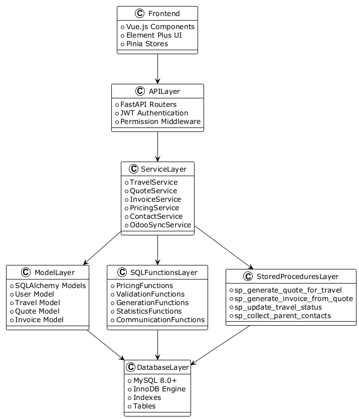

# Diagramme de Classes avec Fonctions SQL - Système Intégré de Gestion

## Vue d'Ensemble

Ce diagramme de classes présente l'architecture orientée objet du système, incluant les entités du modèle de données, les services applicatifs, et les fonctions SQL stockées qui encapsulent la logique métier.

## Diagramme Principal - Architecture en Couches




## Diagramme Détaillé - Entités et Fonctions SQL




## Diagramme - Services et Fonctions SQL




## Diagramme - Modèle de Données avec Fonctions



```plantuml
!theme plain

class User {
    +int id
    +string email
    +string first_name
    +string last_name
    +boolean is_active
}
class Travel {
    +int id
    +string name
    +enum travel_type
    +datetime start_date
    +datetime end_date
    +int number_participants
    +enum status
    +decimal total_price
}
class Quote {
    +int id
    +int travel_id
    +string quote_number
    +enum status
    +decimal total_amount
}
class Invoice {
    +int id
    +int travel_id
    +string invoice_number
    +enum status
    +decimal total_amount
    +decimal tax_amount
}
class Contact {
    +int id
    +int user_id
    +boolean email_marketing_consent
    +timestamp email_opt_out_date
}
class Booking {
    +int id
    +int travel_id
    +enum status
    +enum payment_status
}
note right of Travel
Fonctions SQL:\n- calculate_final_travel_price()\n- can_generate_quote()\n- can_generate_invoice()\n- days_until_departure()\n- is_early_bird()\n- are_all_parent_contacts_collected()
end note
note right of Quote
Fonctions SQL:\n- can_validate_quote()\n- is_quote_expired()\n- get_quote_total()\n- generate_quote_number()
end note
note right of Invoice
Fonctions SQL:\n- can_validate_invoice()\n- is_invoice_paid()\n- is_invoice_overdue()\n- get_invoice_total_ttc()\n- generate_invoice_number()
end note
note right of Contact
Fonctions SQL:\n- can_send_marketing_email()\n- can_send_whatsapp()\n- has_email_consent()\n- get_email_bounce_rate()
end note
note right of Booking
Fonctions SQL:\n- is_payment_overdue()\n- should_cancel_booking()\n- has_available_spots()
end note

User --> Contact : a
Travel --> Quote : génère
Travel --> Invoice : génère
Travel --> Booking : contient
```

## Relations entre Classes et Fonctions SQL

### Travel et Fonctions de Prix


```plantuml
!theme plain

class Travel {
    +int id
    +string name
    +int number_participants
    +decimal total_price
}
class PricingFunctions {
    <<SQL Functions>>
    +calculate_transport_price(travel_id, participants)
    +calculate_activities_price(travel_id, participants)
    +calculate_lodging_price(travel_id, participants)
    +calculate_base_price(travel_id, participants)
    +calculate_participant_discount(participants)
    +is_early_bird(travel_id)
    +calculate_final_travel_price(travel_id)
}

Travel ..> PricingFunctions : utilise pour calculer total_price
PricingFunctions --> Travel : met à jour total_price
```

### Quote et Fonctions de Validation


```plantuml
!theme plain

class Quote {
    +int id
    +int travel_id
    +enum status
    +decimal total_amount
}
class ValidationFunctions {
    <<SQL Functions>>
    +can_generate_quote(travel_id)
    +can_validate_quote(quote_id)
    +is_quote_expired(quote_id)
}
class GenerationFunctions {
    <<SQL Functions>>
    +generate_quote_number()
}

Quote ..> ValidationFunctions : utilise pour valider
Quote ..> GenerationFunctions : utilise pour générer numéro
```

### Invoice et Fonctions de Calcul



```plantuml
!theme plain

class Invoice {
    +int id
    +int travel_id
    +decimal total_amount
    +decimal tax_amount
}
class TaxFunctions {
    <<SQL Functions>>
    +calculate_tax_amount(amount_ht, tax_rate)
    +calculate_amount_ttc(amount_ht, tax_rate)
    +get_invoice_total_ttc(invoice_id)
}

Invoice ..> TaxFunctions : utilise pour calculer TVA
```

## Architecture Complète avec Toutes les Couches



```plantuml
!theme plain

class Frontend {
    +Vue.js Components
    +Element Plus UI
    +Pinia Stores
}
class APILayer {
    +FastAPI Routers
    +JWT Authentication
    +Permission Middleware
}
class ServiceLayer {
    +TravelService
    +QuoteService
    +InvoiceService
    +PricingService
    +ContactService
    +OdooSyncService
}
class ModelLayer {
    +SQLAlchemy Models
    +User Model
    +Travel Model
    +Quote Model
    +Invoice Model
}
class SQLFunctionsLayer {
    +PricingFunctions
    +ValidationFunctions
    +GenerationFunctions
    +StatisticsFunctions
    +CommunicationFunctions
}
class StoredProceduresLayer {
    +sp_generate_quote_for_travel
    +sp_generate_invoice_from_quote
    +sp_update_travel_status
    +sp_collect_parent_contacts
}
class DatabaseLayer {
    +MySQL 8.0+
    +InnoDB Engine
    +Indexes
    +Tables
}

Frontend --> APILayer
APILayer --> ServiceLayer
ServiceLayer --> ModelLayer
ServiceLayer --> SQLFunctionsLayer
ServiceLayer --> StoredProceduresLayer
SQLFunctionsLayer --> DatabaseLayer
StoredProceduresLayer --> DatabaseLayer
ModelLayer --> DatabaseLayer
```

## Détail des Fonctions SQL par Classe

### Classe Travel

**Fonctions de calcul** :
- `calculate_final_travel_price(travel_id)` : Prix final complet
- `calculate_transport_price(travel_id, participants)` : Prix transport
- `calculate_activities_price(travel_id, participants)` : Prix activités
- `calculate_lodging_price(travel_id, participants)` : Prix hébergement

**Fonctions de validation** :
- `can_generate_quote(travel_id)` : Peut générer un devis
- `can_generate_invoice(travel_id)` : Peut générer une facture
- `is_travel_valid_for_confirmation(travel_id)` : Peut être confirmé

**Fonctions temporelles** :
- `days_until_departure(travel_id)` : Jours avant départ
- `is_early_bird(travel_id)` : Éligible early bird
- `is_travel_in_past(travel_id)` : Voyage terminé
- `is_travel_in_progress(travel_id)` : Voyage en cours

**Fonctions de participants** :
- `get_travel_participant_count(travel_id)` : Nombre participants
- `get_available_spots(travel_id)` : Places disponibles
- `are_all_parent_contacts_collected(travel_id)` : Contacts collectés

### Classe Quote

**Fonctions de validation** :
- `can_validate_quote(quote_id)` : Peut être validé
- `is_quote_expired(quote_id)` : Est expiré
- `can_send_quote(quote_id)` : Peut être envoyé

**Fonctions de calcul** :
- `get_quote_total(quote_id)` : Total du devis
- `calculate_quote_line_total(quote_id, line_type)` : Total par type
- `get_quote_final_amount(quote_id)` : Montant final

**Fonctions de génération** :
- `generate_quote_number()` : Génère numéro unique

### Classe Invoice

**Fonctions de validation** :
- `can_validate_invoice(invoice_id)` : Peut être validé
- `is_invoice_paid(invoice_id)` : Est payée
- `is_invoice_overdue(invoice_id)` : Est en retard

**Fonctions de calcul** :
- `get_invoice_total_ht(invoice_id)` : Total HT
- `get_invoice_total_ttc(invoice_id)` : Total TTC
- `get_invoice_tax_amount(invoice_id)` : Montant TVA

**Fonctions de génération** :
- `generate_invoice_number()` : Génère numéro unique

### Classe Contact

**Fonctions de consentement** :
- `can_send_marketing_email(contact_id)` : Peut envoyer email
- `can_send_whatsapp(contact_id)` : Peut envoyer WhatsApp
- `has_email_consent(contact_id)` : A consentement email
- `has_whatsapp_consent(contact_id)` : A consentement WhatsApp

**Fonctions de statistiques** :
- `get_email_bounce_rate(contact_id)` : Taux de bounce
- `get_contact_engagement_score(contact_id)` : Score engagement

### Classe Booking

**Fonctions de validation** :
- `has_available_spots(linguistic_travel_id)` : Places disponibles
- `can_create_booking(linguistic_travel_id)` : Peut créer réservation
- `is_payment_overdue(booking_id)` : Paiement en retard
- `should_cancel_booking(booking_id)` : Doit être annulé

## Intégration Services ↔ Fonctions SQL

### Exemple : TravelService


```plantuml
!theme plain

class TravelService {
    +create_travel(data)
    +calculate_price(travel_id)
    +validate_for_quote(travel_id)
    +update_status(travel_id, status)
}
class SQLFunctions {
    +calculate_final_travel_price(travel_id)
    +can_generate_quote(travel_id)
    +sp_update_travel_status(travel_id, status, user_id)
}

TravelService --> SQLFunctions : appelle
```

### Exemple : QuoteService


```plantuml
!theme plain

class QuoteService {
    +generate_quote(travel_id)
    +validate_quote(quote_id)
    +send_quote(quote_id)
}
class SQLFunctions {
    +can_generate_quote(travel_id)
    +sp_generate_quote_for_travel(travel_id, OUT quote_id)
    +can_validate_quote(quote_id)
    +is_quote_expired(quote_id)
}

QuoteService --> SQLFunctions : appelle
```

## Avantages de l'Architecture avec Fonctions SQL

1. **Séparation des responsabilités** : Logique métier dans la base de données, logique applicative dans les services
2. **Performance** : Exécution côté serveur, réduction de la charge réseau
3. **Cohérence** : Calculs centralisés, mêmes résultats partout
4. **Réutilisabilité** : Fonctions utilisables depuis plusieurs services
5. **Maintenance** : Modifications de logique en un seul endroit

---

**Version** : 1.0  
**Date** : 2025-01-20  
**Architecture** : Orientée Objet avec Fonctions SQL
