# Modèle Conceptuel de Données (MCD) - Système Intégré de Gestion

## Vue d'Ensemble

Ce MCD représente le modèle conceptuel de données du système de gestion de voyages (scolaires et linguistiques) avec intégration Odoo.

## Diagramme Mermaid

```mermaid
erDiagram
    %% Authentification & Autorisation
    USER ||--o{ USER_ROLE : "a"
    ROLE ||--o{ USER_ROLE : "a"
    USER ||--o{ USER_PERMISSION : "a"
    PERMISSION ||--o{ USER_PERMISSION : "a"
    ROLE ||--o{ ROLE_PERMISSION : "a"
    PERMISSION ||--o{ ROLE_PERMISSION : "a"
    USER ||--|| TWO_FACTOR_AUTH : "a"
    
    %% Établissements Scolaires
    SCHOOL ||--o{ USER : "a"
    SCHOOL ||--o{ SCHOOL_USER : "lie"
    USER ||--o{ SCHOOL_USER : "lie"
    USER ||--|| CONTACT : "a"
    CONTACT ||--o{ CONTACT_HISTORY : "a"
    
    %% Voyages
    USER ||--o{ TRAVEL : "crée"
    TRAVEL ||--o{ TRAVEL_STATUS_HISTORY : "a"
    
    %% Destinations & Activités
    DESTINATION ||--o{ ACTIVITY_TEMPLATE : "contient"
    DESTINATION ||--o{ TRAVEL_DESTINATION : "dans"
    TRAVEL ||--o{ TRAVEL_DESTINATION : "visite"
    TRAVEL ||--o{ ACTIVITY : "comprend"
    ACTIVITY_TEMPLATE ||--o{ ACTIVITY : "instancie"
    
    %% Plannings
    TRAVEL ||--o| PROGRAM_TEMPLATE : "utilise"
    PROGRAM_TEMPLATE ||--o{ PROGRAM_ACTIVITY : "contient"
    PROGRAM_ACTIVITY }o--|| ACTIVITY_TEMPLATE : "référence"
    DESTINATION ||--o{ PROGRAM_TEMPLATE : "pour"
    
    %% Transport & Prix
    DESTINATION ||--o{ TRANSPORT_PRICE : "a"
    
    %% Devis
    TRAVEL ||--o{ QUOTE : "génère"
    QUOTE ||--o{ QUOTE_LINE : "contient"
    
    %% Factures
    TRAVEL ||--o{ INVOICE : "génère"
    INVOICE ||--o{ INVOICE_LINE : "contient"
    QUOTE ||--o| INVOICE : "génère"
    
    %% Réservations & Contacts
    TRAVEL ||--o{ BOOKING : "a"
    USER ||--o{ BOOKING : "est"
    BOOKING ||--|| PARENT_CONTACT : "a"
    
    %% Documents
    TRAVEL ||--o{ TRAVEL_DOCUMENT : "a"
    
    %% Voyages Linguistiques
    USER ||--o{ LINGUISTIC_TRAVEL_REGISTRATION : "s'inscrit"
    LINGUISTIC_TRAVEL ||--o{ LINGUISTIC_TRAVEL_REGISTRATION : "reçoit"
    DESTINATION ||--o{ LINGUISTIC_TRAVEL : "pour"
    
    USER {
        INTEGER id PK
        VARCHAR email UK
        VARCHAR password_hash
        VARCHAR first_name
        VARCHAR last_name
        VARCHAR phone
        INTEGER school_id FK
        DATE date_of_birth
        BOOLEAN is_active
        TIMESTAMP created_at
        TIMESTAMP updated_at
        TIMESTAMP last_login
    }
    
    SCHOOL_USER {
        INTEGER school_id FK
        INTEGER user_id FK
        VARCHAR role_at_school
        BOOLEAN is_primary
        TIMESTAMP created_at
    }
    
    ROLE {
        INTEGER id PK
        VARCHAR name UK
        TEXT description
        TIMESTAMP created_at
    }
    
    PERMISSION {
        INTEGER id PK
        VARCHAR code UK
        VARCHAR name
        TEXT description
        VARCHAR resource
    }
    
    USER_ROLE {
        INTEGER user_id FK
        INTEGER role_id FK
    }
    
    USER_PERMISSION {
        INTEGER user_id FK
        INTEGER permission_id FK
    }
    
    ROLE_PERMISSION {
        INTEGER role_id FK
        INTEGER permission_id FK
    }
    
    TWO_FACTOR_AUTH {
        INTEGER id PK
        INTEGER user_id FK
        VARCHAR secret
        BOOLEAN is_enabled
        TIMESTAMP created_at
    }
    
    SCHOOL {
        INTEGER id PK
        VARCHAR name
        ENUM school_type
        VARCHAR address
        VARCHAR city
        VARCHAR postal_code
        VARCHAR country
        VARCHAR phone
        VARCHAR website
        INTEGER odoo_partner_id
        INTEGER odoo_contact_id
        BOOLEAN is_active
        TIMESTAMP created_at
        TIMESTAMP updated_at
    }
    
    CONTACT {
        INTEGER id PK
        INTEGER user_id FK
        VARCHAR email_primary
        VARCHAR email_secondary
        BOOLEAN email_marketing_consent
        TIMESTAMP email_consent_date
        TIMESTAMP email_opt_in_date
        TIMESTAMP email_opt_out_date
        JSON email_preferences
        INTEGER email_bounce_count
        TIMESTAMP email_last_sent
        VARCHAR whatsapp_phone_primary
        VARCHAR whatsapp_phone_secondary
        BOOLEAN whatsapp_consent
        TIMESTAMP whatsapp_consent_date
        TIMESTAMP whatsapp_opt_in_date
        TIMESTAMP whatsapp_opt_out_date
        BOOLEAN whatsapp_verified
        TIMESTAMP whatsapp_verification_date
        JSON whatsapp_template_preferences
        TIMESTAMP whatsapp_last_contact
        INTEGER odoo_partner_id
        INTEGER odoo_contact_id
        BOOLEAN is_active
        BOOLEAN is_primary
        TIMESTAMP created_at
        TIMESTAMP updated_at
    }
    
    CONTACT_HISTORY {
        INTEGER id PK
        INTEGER contact_id FK
        ENUM contact_type
        ENUM action
        JSON details
        TIMESTAMP created_at
    }
    
    TRAVEL {
        INTEGER id PK
        VARCHAR name
        ENUM travel_type
        INTEGER destination_id FK
        INTEGER program_template_id FK
        TIMESTAMP start_date
        TIMESTAMP end_date
        INTEGER min_participants
        INTEGER max_participants
        INTEGER number_participants
        ENUM status
        DECIMAL total_price
        INTEGER teacher_user_id FK
        INTEGER odoo_lead_id
        INTEGER odoo_quote_id
        INTEGER odoo_invoice_id
        BOOLEAN parent_contacts_collected
        INTEGER created_by_user_id FK
        TIMESTAMP created_at
        TIMESTAMP updated_at
    }
    
    TRAVEL_STATUS_HISTORY {
        INTEGER id PK
        INTEGER travel_id FK
        ENUM from_status
        ENUM to_status
        TIMESTAMP changed_at
        INTEGER changed_by
    }
    
    TEACHER_FORM {
        INTEGER id PK
        VARCHAR token UK
        VARCHAR teacher_email
        VARCHAR contact_email
        VARCHAR source
        JSON form_data
        TIMESTAMP created_at
    }
    
    DESTINATION {
        INTEGER id PK
        VARCHAR name
        VARCHAR country
        VARCHAR city
        DECIMAL base_price
        TEXT description
        JSON images
        BOOLEAN is_active
        INTEGER created_by
        TIMESTAMP created_at
        TIMESTAMP updated_at
    }
    
    ACTIVITY_TEMPLATE {
        INTEGER id PK
        VARCHAR name
        TEXT description
        FLOAT duration_hours
        DECIMAL base_price
        VARCHAR activity_type
        VARCHAR location
        BOOLEAN is_reusable
        INTEGER created_by
        TIMESTAMP created_at
        TIMESTAMP updated_at
    }
    
    ACTIVITY {
        INTEGER id PK
        INTEGER travel_id FK
        INTEGER activity_template_id FK
        TIMESTAMP date
        VARCHAR start_time
        VARCHAR end_time
        VARCHAR location
        DECIMAL price_per_person
        VARCHAR activity_type
        VARCHAR custom_name
        TIMESTAMP created_at
    }
    
    TRAVEL_DESTINATION {
        INTEGER id PK
        INTEGER travel_id FK
        INTEGER destination_id FK
        DECIMAL quote_price
    }
    
    PROGRAM_TEMPLATE {
        INTEGER id PK
        VARCHAR name
        INTEGER destination_id FK
        INTEGER duration_days
        TEXT description
        DECIMAL base_price_per_day
        BOOLEAN meals_included
        INTEGER created_by
        TIMESTAMP created_at
        TIMESTAMP updated_at
    }
    
    PROGRAM_ACTIVITY {
        INTEGER id PK
        INTEGER program_id FK
        INTEGER activity_template_id FK
        INTEGER order
    }
    
    TRANSPORT_PRICE {
        INTEGER id PK
        INTEGER destination_id FK
        DATE date
        DECIMAL price_per_person
        VARCHAR transport_type
        INTEGER min_participants
        TIMESTAMP created_at
    }
    
    QUOTE {
        INTEGER id PK
        INTEGER travel_id FK
        VARCHAR quote_number UK
        VARCHAR status
        DECIMAL total_amount
        INTEGER created_by_user_id FK
        INTEGER validated_by_user_id FK
        TIMESTAMP sent_at
        TIMESTAMP validated_at
        TIMESTAMP expires_at
        TIMESTAMP created_at
    }
    
    QUOTE_LINE {
        INTEGER id PK
        INTEGER quote_id FK
        VARCHAR description
        INTEGER quantity
        DECIMAL unit_price
        DECIMAL line_total
        VARCHAR line_type
    }
    
    INVOICE {
        INTEGER id PK
        INTEGER travel_id FK
        VARCHAR invoice_number UK
        VARCHAR status
        DECIMAL total_amount
        DECIMAL tax_amount
        JSON e_invoice_data
        INTEGER validated_by_user_id FK
        TIMESTAMP validated_at
        TIMESTAMP issued_at
        TIMESTAMP due_date
        TIMESTAMP created_at
    }
    
    INVOICE_LINE {
        INTEGER id PK
        INTEGER invoice_id FK
        VARCHAR description
        INTEGER quantity
        DECIMAL unit_price
        DECIMAL line_total
        DECIMAL tax_rate
    }
    
    BOOKING {
        INTEGER id PK
        INTEGER travel_id FK
        INTEGER student_user_id FK
        DECIMAL price
        ENUM status
        ENUM payment_status
        VARCHAR payment_id
        INTEGER odoo_partner_id
        TIMESTAMP created_at
        TIMESTAMP updated_at
    }
    
    PARENT_CONTACT {
        INTEGER id PK
        INTEGER booking_id FK
        VARCHAR parent_name
        VARCHAR parent_email
        VARCHAR parent_phone
        VARCHAR relationship_type
        BOOLEAN is_optional
        TIMESTAMP collected_date
        TIMESTAMP created_at
    }
    
    TRAVEL_DOCUMENT {
        INTEGER id PK
        INTEGER travel_id FK
        VARCHAR filename
        VARCHAR mime_type
        INTEGER file_size
        VARCHAR file_path
        VARCHAR document_type
        TIMESTAMP uploaded_at
    }
    
    LINGUISTIC_TRAVEL {
        INTEGER id PK
        VARCHAR title
        TEXT description
        INTEGER destination_id FK
        TIMESTAMP start_date
        TIMESTAMP end_date
        DECIMAL price_per_person
        INTEGER max_participants
        TIMESTAMP created_at
    }
    
    LINGUISTIC_TRAVEL_REGISTRATION {
        INTEGER id PK
        INTEGER guest_user_id FK
        INTEGER linguistic_travel_id FK
        VARCHAR status
        TIMESTAMP registered_at
    }
```

## Légende

- **PK** : Primary Key (Clé Primaire)
- **FK** : Foreign Key (Clé Étrangère)
- **UK** : Unique Key (Clé Unique)
- **\*** : Attribut obligatoire

## Notes sur les Contraintes

- `TWO_FACTOR_AUTH.user_id` : Clé étrangère vers `USER.id` et contrainte unique (un utilisateur ne peut avoir qu'un seul enregistrement 2FA)

## Packages

1. **Authentification & Autorisation** : Gestion des utilisateurs, rôles et permissions
2. **Établissements Scolaires** : Gestion des établissements avec mailing et WhatsApp
3. **Professeurs & Voyages** : Gestion des professeurs et des voyages scolaires
4. **Destinations & Activités** : Catalogue des destinations et activités
5. **Plannings** : Programmes préconstruits
6. **Transport & Prix** : Tarification du transport
7. **Devis** : Gestion des devis
8. **Factures** : Gestion des factures (liées uniquement aux voyages)
9. **Réservations & Contacts** : Réservations et contacts parents
10. **Documents** : Documents liés aux voyages
11. **Voyages Linguistiques** : Gestion des voyages linguistiques

## Fonctions et Procédures Stockées

Le modèle conceptuel inclut également des fonctions SQL stockées et des procédures stockées qui encapsulent la logique métier au niveau de la base de données. Ces fonctions sont organisées par domaine fonctionnel et sont liées aux entités du modèle.

### Diagramme des Relations Fonctions ↔ Entités

```mermaid
graph TB
    subgraph Pricing["Domaine: Calculs de Prix"]
        F1[calculate_transport_price]
        F2[calculate_activities_price]
        F3[calculate_lodging_price]
        F4[calculate_final_travel_price]
        F5[calculate_participant_discount]
        F6[is_early_bird]
    end
    
    subgraph Validation["Domaine: Validations Métier"]
        F7[can_generate_quote]
        F8[can_validate_quote]
        F9[can_generate_invoice]
        F10[is_planning_valid]
        F11[has_available_spots]
    end
    
    subgraph Generation["Domaine: Génération"]
        F12[generate_quote_number]
        F13[generate_invoice_number]
        F14[generate_token]
    end
    
    subgraph Communication["Domaine: Communication"]
        F15[can_send_marketing_email]
        F16[can_send_whatsapp]
        F17[has_email_consent]
    end
    
    subgraph Travel["Domaine: Voyages"]
        F18[days_until_departure]
        F19[get_travel_participant_count]
        F20[are_all_parent_contacts_collected]
    end
    
    subgraph Stats["Domaine: Statistiques"]
        F21[get_total_revenue_by_period]
        F22[get_travel_conversion_rate]
        F23[get_average_travel_price]
    end
    
    subgraph Procedures["Procédures Stockées"]
        P1[sp_generate_quote_for_travel]
        P2[sp_generate_invoice_from_quote]
        P3[sp_update_travel_status]
        P4[sp_cancel_overdue_bookings]
    end
    
    TRAVEL --> F1
    TRAVEL --> F2
    TRAVEL --> F3
    TRAVEL --> F4
    TRAVEL --> F5
    TRAVEL --> F6
    TRAVEL --> F7
    TRAVEL --> F18
    TRAVEL --> F19
    TRAVEL --> F20
    
    QUOTE --> F8
    QUOTE --> F12
    QUOTE --> P1
    
    INVOICE --> F9
    INVOICE --> F13
    INVOICE --> P2
    
    CONTACT --> F15
    CONTACT --> F16
    CONTACT --> F17
    
    BOOKING --> F11
    BOOKING --> P4
    
    TRAVEL --> P3
```

### Organisation des Fonctions par Domaine

#### Domaine 1 : Calculs de Prix (15 fonctions)
- **Fonctions de base** : `calculate_transport_price`, `calculate_activities_price`, `calculate_lodging_price`, `calculate_base_price`
- **Réductions** : `calculate_participant_discount`, `is_early_bird`, `calculate_early_bird_discount`, `calculate_total_discount`
- **Prix finaux** : `calculate_travel_price_with_discounts`, `calculate_travel_price_with_margin`, `calculate_final_travel_price`
- **TVA** : `calculate_tax_amount`, `calculate_amount_ttc`, `calculate_invoice_total_with_tax`

**Entités concernées** : `TRAVEL`, `TRANSPORT_PRICE`, `ACTIVITY`, `QUOTE`, `INVOICE`

#### Domaine 2 : Validations Métier (20 fonctions)
- **Voyages** : `can_generate_quote`, `can_validate_quote`, `can_generate_invoice`, `can_validate_invoice`, `is_travel_valid_for_confirmation`
- **Plannings** : `has_valid_planning`, `has_overlapping_activities`, `planning_covers_travel_days`, `is_planning_valid`
- **Réservations** : `has_available_spots`, `can_create_booking`, `is_payment_overdue`, `should_cancel_booking`
- **Données** : `is_email_valid`, `are_dates_valid`, `is_participant_count_valid`

**Entités concernées** : `TRAVEL`, `QUOTE`, `INVOICE`, `ACTIVITY`, `BOOKING`, `LINGUISTIC_TRAVEL`

#### Domaine 3 : Génération de Numéros (5 fonctions)
- `generate_quote_number`, `generate_invoice_number`, `generate_travel_reference`, `generate_booking_number`, `generate_token`

**Entités concernées** : `QUOTE`, `INVOICE`, `TRAVEL`, `BOOKING`, `TEACHER_FORM`

#### Domaine 4 : Gestion des Contacts (10 fonctions)
- **Consentements** : `can_send_marketing_email`, `can_send_whatsapp`, `has_email_consent`, `has_whatsapp_consent`, `is_contact_opted_out_email`, `is_contact_opted_out_whatsapp`
- **Statistiques** : `get_email_bounce_rate`, `days_since_last_email`, `days_since_last_whatsapp`, `get_contact_engagement_score`

**Entités concernées** : `CONTACT`, `CONTACT_HISTORY`

#### Domaine 5 : Gestion des Voyages (15 fonctions)
- **Temporel** : `days_until_departure`, `days_until_return`, `travel_duration_days`, `travel_duration_nights`, `is_travel_in_past`, `is_travel_in_progress`, `is_travel_upcoming`
- **Participants** : `get_travel_participant_count`, `get_available_spots`, `is_travel_full`, `get_participant_fill_rate`
- **Contacts parents** : `get_parent_contacts_count`, `get_expected_parent_contacts_count`, `are_all_parent_contacts_collected`, `get_missing_parent_contacts_count`

**Entités concernées** : `TRAVEL`, `BOOKING`, `PARENT_CONTACT`

#### Domaine 6 : Gestion des Devis (8 fonctions)
- **Statuts** : `is_quote_expired`, `days_until_quote_expiry`, `get_quote_status`, `can_send_quote`
- **Calculs** : `get_quote_total`, `calculate_quote_line_total`, `get_quote_discount_amount`, `get_quote_final_amount`

**Entités concernées** : `QUOTE`, `QUOTE_LINE`

#### Domaine 7 : Gestion des Factures (10 fonctions)
- **Statuts** : `is_invoice_paid`, `is_invoice_overdue`, `days_until_invoice_due`
- **Calculs** : `get_invoice_total_ht`, `get_invoice_total_ttc`, `get_invoice_tax_amount`
- **Génération** : `can_create_invoice_from_quote`, `get_quote_for_invoice`

**Entités concernées** : `INVOICE`, `INVOICE_LINE`, `QUOTE`

#### Domaine 8 : Statistiques et Rapports (12 fonctions)
- **Voyages** : `get_travels_count_by_status`, `get_travels_count_by_type`, `get_total_revenue_by_period`, `get_average_travel_price`, `get_travel_conversion_rate`
- **Participants** : `get_total_participants_by_period`, `get_average_participants_per_travel`, `get_most_popular_destination`
- **Financières** : `get_total_quotes_amount_by_period`, `get_total_invoices_amount_by_period`, `get_pending_invoices_amount`, `get_overdue_invoices_amount`, `get_paid_invoices_amount_by_period`

**Entités concernées** : `TRAVEL`, `QUOTE`, `INVOICE`, `BOOKING`, `DESTINATION`

#### Domaine 9 : Intégration Odoo (5 fonctions)
- `needs_odoo_sync_contact`, `needs_odoo_sync_travel`, `needs_odoo_sync_invoice`, `has_odoo_lead`, `has_odoo_partner`

**Entités concernées** : `USER`, `CONTACT`, `TRAVEL`, `INVOICE`

#### Domaine 10 : Utilitaires (8 fonctions)
- **Dates** : `get_current_fiscal_year`, `get_fiscal_year_for_date`, `is_weekend`, `is_business_day`
- **Formatage** : `format_price`, `format_percentage`, `format_date_fr`
- **Recherche** : Fonctions de recherche et filtrage

#### Domaine 11 : Procédures Stockées (8 procédures)
- **Génération** : `sp_generate_quote_for_travel`, `sp_generate_invoice_from_quote`, `sp_update_travel_status`, `sp_collect_parent_contacts`
- **Maintenance** : `sp_cancel_overdue_bookings`, `sp_expire_old_quotes`, `sp_archive_completed_travels`, `sp_update_travel_totals`
- **Synchronisation** : `sp_sync_contact_to_odoo`, `sp_sync_travel_lead_to_odoo`, `sp_sync_invoice_to_odoo`

**Entités concernées** : Toutes les entités principales du modèle

### Relations Fonctions ↔ Entités

Les fonctions SQL stockées sont liées aux entités du modèle conceptuel de la manière suivante :

1. **Fonctions de calcul** : Utilisent les données des entités `TRAVEL`, `TRANSPORT_PRICE`, `ACTIVITY`, `QUOTE`, `INVOICE` pour effectuer des calculs
2. **Fonctions de validation** : Vérifient les règles métier sur les entités `TRAVEL`, `QUOTE`, `INVOICE`, `BOOKING`
3. **Fonctions de génération** : Créent des identifiants uniques pour les entités `QUOTE`, `INVOICE`, `BOOKING`
4. **Fonctions de communication** : Gèrent les consentements et statistiques pour l'entité `CONTACT`
5. **Procédures stockées** : Modifient l'état de plusieurs entités en une seule transaction

### Avantages de l'Intégration Fonctions dans le MCD

1. **Cohérence** : La logique métier est centralisée au niveau de la base de données
2. **Performance** : Exécution côté serveur, réduction de la charge réseau
3. **Réutilisabilité** : Les fonctions peuvent être utilisées dans plusieurs contextes
4. **Maintenance** : Modifications de logique en un seul endroit
5. **Traçabilité** : Les fonctions font partie intégrante du modèle de données

---

**Version** : 2.0  
**Date** : 2025-01-20  
**Mise à jour** : Ajout des fonctions et procédures stockées
