# Modèle Conceptuel de Données (MCD) - Système Intégré de Gestion

## Vue d'Ensemble

Ce MCD représente le modèle conceptuel de données du système de gestion de voyages (scolaires et linguistiques) avec intégration Odoo.

## Diagramme Mermaid

```mermaid
erDiagram
    %% Authentification & Autorisation
    USER ||--o{ USER_ROLE : "a"
    ROLE ||--o{ USER_ROLE : "a"
    USER ||--o{ USER_PERMISSION : "a"
    PERMISSION ||--o{ USER_PERMISSION : "a"
    ROLE ||--o{ ROLE_PERMISSION : "a"
    PERMISSION ||--o{ ROLE_PERMISSION : "a"
    USER ||--|| TWO_FACTOR_AUTH : "a"
    
    %% Établissements Scolaires
    SCHOOL ||--o{ TEACHER : "emploie"
    SCHOOL ||--o{ BOOKING : "a"
    SCHOOL ||--o{ SCHOOL_CONTACT_HISTORY : "a"
    
    %% Professeurs & Voyages
    TEACHER ||--o{ TRAVEL : "crée"
    TRAVEL ||--o{ TRAVEL_STATUS_HISTORY : "a"
    
    %% Destinations & Activités
    DESTINATION ||--o{ ACTIVITY_TEMPLATE : "contient"
    DESTINATION ||--o{ TRAVEL_DESTINATION : "dans"
    TRAVEL ||--o{ TRAVEL_DESTINATION : "visite"
    TRAVEL ||--o{ ACTIVITY : "comprend"
    ACTIVITY_TEMPLATE ||--o{ ACTIVITY : "instancie"
    
    %% Plannings
    TRAVEL ||--o| PROGRAM_TEMPLATE : "utilise"
    PROGRAM_TEMPLATE ||--o{ PROGRAM_ACTIVITY : "contient"
    PROGRAM_ACTIVITY }o--|| ACTIVITY_TEMPLATE : "référence"
    DESTINATION ||--o{ PROGRAM_TEMPLATE : "pour"
    
    %% Transport & Prix
    DESTINATION ||--o{ TRANSPORT_PRICE : "a"
    
    %% Devis
    TRAVEL ||--o{ QUOTE : "génère"
    QUOTE ||--o{ QUOTE_LINE : "contient"
    
    %% Factures
    TRAVEL ||--o{ INVOICE : "génère"
    INVOICE ||--o{ INVOICE_LINE : "contient"
    QUOTE ||--o| INVOICE : "génère"
    
    %% Réservations & Contacts
    TRAVEL ||--o{ BOOKING : "a"
    BOOKING ||--|| PARENT_CONTACT : "a"
    
    %% Documents
    TRAVEL ||--o{ TRAVEL_DOCUMENT : "a"
    
    %% Voyages Linguistiques
    GUEST ||--o{ LINGUISTIC_TRAVEL_REGISTRATION : "s'inscrit"
    LINGUISTIC_TRAVEL ||--o{ LINGUISTIC_TRAVEL_REGISTRATION : "reçoit"
    DESTINATION ||--o{ LINGUISTIC_TRAVEL : "pour"
    
    USER {
        INTEGER id PK
        VARCHAR email UK
        VARCHAR password_hash
        VARCHAR first_name
        VARCHAR last_name
        BOOLEAN is_active
        TIMESTAMP created_at
        TIMESTAMP updated_at
        TIMESTAMP last_login
    }
    
    ROLE {
        INTEGER id PK
        VARCHAR name UK
        TEXT description
        TIMESTAMP created_at
    }
    
    PERMISSION {
        INTEGER id PK
        VARCHAR code UK
        VARCHAR name
        TEXT description
        VARCHAR resource
    }
    
    USER_ROLE {
        INTEGER user_id FK
        INTEGER role_id FK
    }
    
    USER_PERMISSION {
        INTEGER user_id FK
        INTEGER permission_id FK
    }
    
    ROLE_PERMISSION {
        INTEGER role_id FK
        INTEGER permission_id FK
    }
    
    TWO_FACTOR_AUTH {
        INTEGER id PK
        INTEGER user_id FK
        VARCHAR secret
        BOOLEAN is_enabled
        TIMESTAMP created_at
    }
    
    SCHOOL {
        INTEGER id PK
        VARCHAR name
        ENUM school_type
        VARCHAR address
        VARCHAR city
        VARCHAR postal_code
        VARCHAR country
        VARCHAR phone
        VARCHAR website
        VARCHAR email_primary
        VARCHAR email_secondary
        BOOLEAN email_marketing_consent
        TIMESTAMP email_consent_date
        TIMESTAMP email_opt_in_date
        TIMESTAMP email_opt_out_date
        JSON email_preferences
        INTEGER email_bounce_count
        TIMESTAMP email_last_sent
        VARCHAR whatsapp_phone_primary
        VARCHAR whatsapp_phone_secondary
        BOOLEAN whatsapp_consent
        TIMESTAMP whatsapp_consent_date
        TIMESTAMP whatsapp_opt_in_date
        TIMESTAMP whatsapp_opt_out_date
        BOOLEAN whatsapp_verified
        TIMESTAMP whatsapp_verification_date
        JSON whatsapp_template_preferences
        TIMESTAMP whatsapp_last_contact
        INTEGER odoo_partner_id
        INTEGER odoo_contact_id
        BOOLEAN is_active
        TIMESTAMP created_at
        TIMESTAMP updated_at
    }
    
    SCHOOL_CONTACT_HISTORY {
        INTEGER id PK
        INTEGER school_id FK
        ENUM contact_type
        ENUM action
        JSON details
        TIMESTAMP created_at
    }
    
    TEACHER {
        INTEGER id PK
        VARCHAR name
        VARCHAR email UK
        VARCHAR phone
        INTEGER school_id FK
        INTEGER odoo_partner_id
        INTEGER odoo_contact_id
        JSON form_data
        TIMESTAMP created_at
        TIMESTAMP updated_at
    }
    
    TRAVEL {
        INTEGER id PK
        VARCHAR name
        ENUM travel_type
        INTEGER destination_id FK
        INTEGER program_template_id FK
        TIMESTAMP start_date
        TIMESTAMP end_date
        INTEGER min_participants
        INTEGER max_participants
        INTEGER number_participants
        ENUM status
        DECIMAL total_price
        INTEGER teacher_id FK
        INTEGER odoo_lead_id
        INTEGER odoo_quote_id
        INTEGER odoo_invoice_id
        BOOLEAN parent_contacts_collected
        INTEGER created_by_user_id FK
        TIMESTAMP created_at
        TIMESTAMP updated_at
    }
    
    TRAVEL_STATUS_HISTORY {
        INTEGER id PK
        INTEGER travel_id FK
        ENUM from_status
        ENUM to_status
        TIMESTAMP changed_at
        INTEGER changed_by
    }
    
    TEACHER_FORM {
        INTEGER id PK
        VARCHAR token UK
        VARCHAR teacher_email
        VARCHAR contact_email
        VARCHAR source
        JSON form_data
        TIMESTAMP created_at
    }
    
    DESTINATION {
        INTEGER id PK
        VARCHAR name
        VARCHAR country
        VARCHAR city
        DECIMAL base_price
        TEXT description
        JSON images
        BOOLEAN is_active
        INTEGER created_by
        TIMESTAMP created_at
        TIMESTAMP updated_at
    }
    
    ACTIVITY_TEMPLATE {
        INTEGER id PK
        VARCHAR name
        TEXT description
        FLOAT duration_hours
        DECIMAL base_price
        VARCHAR activity_type
        VARCHAR location
        BOOLEAN is_reusable
        INTEGER created_by
        TIMESTAMP created_at
        TIMESTAMP updated_at
    }
    
    ACTIVITY {
        INTEGER id PK
        INTEGER travel_id FK
        INTEGER activity_template_id FK
        TIMESTAMP date
        VARCHAR start_time
        VARCHAR end_time
        VARCHAR location
        DECIMAL price_per_person
        VARCHAR activity_type
        VARCHAR custom_name
        TIMESTAMP created_at
    }
    
    TRAVEL_DESTINATION {
        INTEGER id PK
        INTEGER travel_id FK
        INTEGER destination_id FK
        DECIMAL quote_price
    }
    
    PROGRAM_TEMPLATE {
        INTEGER id PK
        VARCHAR name
        INTEGER destination_id FK
        INTEGER duration_days
        TEXT description
        DECIMAL base_price_per_day
        BOOLEAN meals_included
        INTEGER created_by
        TIMESTAMP created_at
        TIMESTAMP updated_at
    }
    
    PROGRAM_ACTIVITY {
        INTEGER id PK
        INTEGER program_id FK
        INTEGER activity_template_id FK
        INTEGER order
    }
    
    TRANSPORT_PRICE {
        INTEGER id PK
        INTEGER destination_id FK
        DATE date
        DECIMAL price_per_person
        VARCHAR transport_type
        INTEGER min_participants
        TIMESTAMP created_at
    }
    
    QUOTE {
        INTEGER id PK
        INTEGER travel_id FK
        VARCHAR quote_number UK
        VARCHAR status
        DECIMAL total_amount
        INTEGER created_by_user_id FK
        INTEGER validated_by_user_id FK
        TIMESTAMP sent_at
        TIMESTAMP validated_at
        TIMESTAMP expires_at
        TIMESTAMP created_at
    }
    
    QUOTE_LINE {
        INTEGER id PK
        INTEGER quote_id FK
        VARCHAR description
        INTEGER quantity
        DECIMAL unit_price
        DECIMAL line_total
        VARCHAR line_type
    }
    
    INVOICE {
        INTEGER id PK
        INTEGER travel_id FK
        VARCHAR invoice_number UK
        VARCHAR status
        DECIMAL total_amount
        DECIMAL tax_amount
        JSON e_invoice_data
        INTEGER validated_by_user_id FK
        TIMESTAMP validated_at
        TIMESTAMP issued_at
        TIMESTAMP due_date
        TIMESTAMP created_at
    }
    
    INVOICE_LINE {
        INTEGER id PK
        INTEGER invoice_id FK
        VARCHAR description
        INTEGER quantity
        DECIMAL unit_price
        DECIMAL line_total
        DECIMAL tax_rate
    }
    
    BOOKING {
        INTEGER id PK
        INTEGER travel_id FK
        INTEGER school_id FK
        VARCHAR participant_name
        INTEGER age
        VARCHAR email
        VARCHAR phone
        DECIMAL price
        ENUM status
        ENUM payment_status
        VARCHAR payment_id
        INTEGER odoo_partner_id
        TIMESTAMP created_at
        TIMESTAMP updated_at
    }
    
    PARENT_CONTACT {
        INTEGER id PK
        INTEGER booking_id FK
        VARCHAR parent_name
        VARCHAR parent_email
        VARCHAR parent_phone
        VARCHAR relationship_type
        BOOLEAN is_optional
        TIMESTAMP collected_date
        TIMESTAMP created_at
    }
    
    TRAVEL_DOCUMENT {
        INTEGER id PK
        INTEGER travel_id FK
        VARCHAR filename
        VARCHAR mime_type
        INTEGER file_size
        VARCHAR file_path
        VARCHAR document_type
        TIMESTAMP uploaded_at
    }
    
    GUEST {
        INTEGER id PK
        VARCHAR email UK
        VARCHAR first_name
        VARCHAR last_name
        VARCHAR phone
        TIMESTAMP created_at
    }
    
    LINGUISTIC_TRAVEL {
        INTEGER id PK
        VARCHAR title
        TEXT description
        INTEGER destination_id FK
        TIMESTAMP start_date
        TIMESTAMP end_date
        DECIMAL price_per_person
        INTEGER max_participants
        TIMESTAMP created_at
    }
    
    LINGUISTIC_TRAVEL_REGISTRATION {
        INTEGER id PK
        INTEGER guest_id FK
        INTEGER linguistic_travel_id FK
        VARCHAR status
        TIMESTAMP registered_at
    }
```

## Légende

- **PK** : Primary Key (Clé Primaire)
- **FK** : Foreign Key (Clé Étrangère)
- **UK** : Unique Key (Clé Unique)
- **\*** : Attribut obligatoire

## Notes sur les Contraintes

- `TWO_FACTOR_AUTH.user_id` : Clé étrangère vers `USER.id` et contrainte unique (un utilisateur ne peut avoir qu'un seul enregistrement 2FA)

## Packages

1. **Authentification & Autorisation** : Gestion des utilisateurs, rôles et permissions
2. **Établissements Scolaires** : Gestion des établissements avec mailing et WhatsApp
3. **Professeurs & Voyages** : Gestion des professeurs et des voyages scolaires
4. **Destinations & Activités** : Catalogue des destinations et activités
5. **Plannings** : Programmes préconstruits
6. **Transport & Prix** : Tarification du transport
7. **Devis** : Gestion des devis
8. **Factures** : Gestion des factures (liées uniquement aux voyages)
9. **Réservations & Contacts** : Réservations et contacts parents
10. **Documents** : Documents liés aux voyages
11. **Voyages Linguistiques** : Gestion des voyages linguistiques

---

**Version** : 1.0  
**Date** : 2025-01-20
