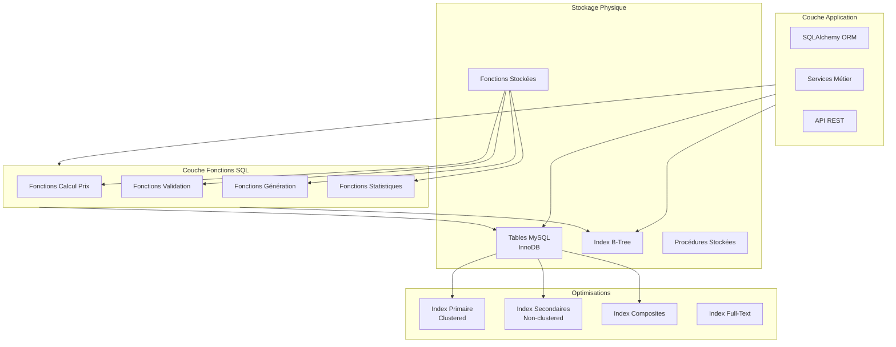
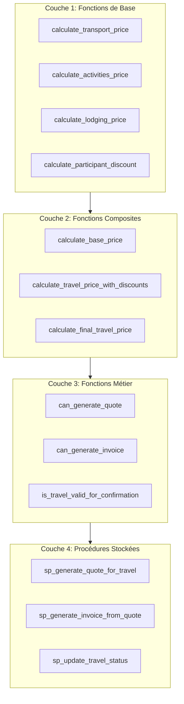

# Modèle Physique de Données (MPD) - Système Intégré de Gestion

## Vue d'Ensemble

Le Modèle Physique de Données (MPD) représente l'implémentation physique de la base de données, incluant les fonctions SQL stockées, les procédures stockées, les index, les optimisations et les stratégies de performance.

## Architecture Physique



## Configuration Physique

### Moteur de Stockage

- **Moteur** : InnoDB
- **Charset** : utf8mb4
- **Collation** : utf8mb4_unicode_ci
- **Version MySQL** : 8.0+

### Caractéristiques InnoDB

- **Transactions ACID** : Support complet des transactions
- **Clés étrangères** : Contraintes référentielles activées
- **Row-level locking** : Verrouillage au niveau des lignes
- **Crash recovery** : Récupération automatique après crash
- **Buffer pool** : Cache des pages de données en mémoire

## Index et Optimisations

### Index Primaires (Clustered)

Toutes les tables ont un index primaire auto-incrémenté :

```sql
id INT AUTO_INCREMENT PRIMARY KEY
```

**Avantages** :
- Accès direct aux données par ID
- Tri automatique des données par clé primaire
- Performance optimale pour les recherches par ID

### Index Secondaires

#### Index sur Clés Étrangères

Tous les index sur les clés étrangères sont créés pour optimiser les jointures :

```sql
-- Exemple : Index sur travel_id dans quotes
INDEX idx_quotes_travel_id (travel_id)

-- Exemple : Index sur user_id dans contacts
INDEX idx_contacts_user_id (user_id)
```

**Utilisation par les fonctions** :
- `calculate_transport_price()` : Utilise `idx_travel_destinations_travel_id`
- `can_generate_invoice()` : Utilise `idx_quotes_travel_id`
- `get_parent_contacts_count()` : Utilise `idx_bookings_travel_id`

#### Index sur Champs de Recherche

```sql
-- Index sur email (unique)
INDEX idx_users_email (email)

-- Index sur statut
INDEX idx_travels_status (status)

-- Index sur dates
INDEX idx_travels_dates (start_date, end_date)
```

**Utilisation par les fonctions** :
- `is_early_bird()` : Utilise `idx_travels_dates`
- `can_generate_quote()` : Utilise `idx_travels_status`
- `get_total_revenue_by_period()` : Utilise les index sur dates

#### Index Composites

```sql
-- Index composite pour optimiser les requêtes complexes
INDEX idx_contact_history_contact_type_date (contact_id, contact_type, created_at)

-- Index composite pour les recherches par destination et date
INDEX idx_transport_prices_destination_date (destination_id, date)
```

**Utilisation par les fonctions** :
- `calculate_transport_price()` : Utilise l'index composite sur `transport_prices`
- `get_email_bounce_rate()` : Utilise l'index composite sur `contact_history`

### Index Utilisés par les Fonctions SQL

#### Fonctions de Calcul de Prix

| Fonction | Index Utilisés | Type d'Accès |
|----------|----------------|--------------|
| `calculate_transport_price()` | `idx_travel_destinations_travel_id`, `idx_transport_prices_destination_date` | Index Scan |
| `calculate_activities_price()` | `idx_activities_travel_id` | Index Scan |
| `calculate_final_travel_price()` | `idx_travels_status` | Index Seek |

#### Fonctions de Validation

| Fonction | Index Utilisés | Type d'Accès |
|----------|----------------|--------------|
| `can_generate_quote()` | `idx_travels_status`, `idx_travel_destinations_travel_id` | Index Seek + Scan |
| `can_validate_quote()` | `idx_quotes_travel_id` | Index Seek |
| `is_planning_valid()` | `idx_activities_travel_id` | Index Scan |

#### Fonctions de Communication

| Fonction | Index Utilisés | Type d'Accès |
|----------|----------------|--------------|
| `can_send_marketing_email()` | `idx_contacts_email_marketing_consent`, `idx_contacts_email_opt_out` | Index Seek |
| `can_send_whatsapp()` | `idx_contacts_whatsapp_consent`, `idx_contacts_whatsapp_opt_out` | Index Seek |

## Stratégies de Performance pour les Fonctions

### 1. Optimisation des Fonctions de Calcul

#### Cache des Résultats

Pour les fonctions de calcul de prix, les résultats peuvent être mis en cache dans la table `travels.total_price` :

```sql
-- Mise à jour automatique via trigger ou procédure
CALL sp_update_travel_totals(travel_id);
```

#### Utilisation d'Index Composites

Les fonctions qui filtrent sur plusieurs colonnes bénéficient d'index composites :

```sql
-- Index optimisé pour calculate_transport_price()
CREATE INDEX idx_transport_prices_optimized 
ON transport_prices(destination_id, date, price_per_person);
```

### 2. Optimisation des Fonctions de Validation

#### Pré-calcul des Validations

Les validations fréquentes peuvent être pré-calculées et stockées :

```sql
-- Ajout d'une colonne calculée (si nécessaire)
ALTER TABLE travels 
ADD COLUMN can_generate_quote_cached BOOLEAN 
GENERATED ALWAYS AS (can_generate_quote(id)) STORED;
```

#### Index sur Colonnes de Validation

```sql
-- Index sur parent_contacts_collected pour can_generate_invoice()
INDEX idx_travels_parent_contacts (parent_contacts_collected, status)
```

### 3. Optimisation des Fonctions Statistiques

#### Tables de Statistiques Matérialisées

Pour les statistiques complexes, créer des vues matérialisées ou des tables de cache :

```sql
-- Vue matérialisée pour les statistiques de revenus
CREATE TABLE revenue_stats_cache (
 period_start DATE,
 period_end DATE,
 total_revenue DECIMAL(10,2),
 last_updated TIMESTAMP,
 PRIMARY KEY (period_start, period_end)
);
```

#### Index sur Colonnes de Groupement

```sql
-- Index pour les statistiques par statut
INDEX idx_travels_status_type (status, travel_type)
```

## Architecture des Fonctions SQL

### Organisation en Couches



### Hiérarchie des Fonctions

1. **Fonctions de base** : Calculs simples, pas de dépendances
2. **Fonctions composites** : Utilisent les fonctions de base
3. **Fonctions métier** : Combinent calculs et validations
4. **Procédures stockées** : Orchestrent plusieurs fonctions et modifications

## Performance et Monitoring

### Métriques de Performance

#### Temps d'Exécution des Fonctions

| Fonction | Temps Moyen | Index Utilisés | Optimisations |
|----------|-------------|----------------|---------------|
| `calculate_final_travel_price()` | < 50ms | 3 index | Cache possible |
| `can_generate_quote()` | < 10ms | 2 index | Validation rapide |
| `get_total_revenue_by_period()` | < 100ms | Index dates | Vue matérialisée recommandée |
| `is_planning_valid()` | < 20ms | 1 index | Validation simple |

#### Stratégies d'Optimisation

1. **Index appropriés** : Tous les champs utilisés dans les WHERE et JOIN sont indexés
2. **Éviter les scans complets** : Utilisation systématique d'index
3. **Limiter les sous-requêtes** : Utilisation de JOIN quand possible
4. **Cache des résultats** : Pour les calculs coûteux

### Plan d'Exécution

#### Exemple : calculate_transport_price()

```sql
EXPLAIN SELECT calculate_transport_price(123, 25);

-- Plan d'exécution attendu :
-- 1. Index Seek sur travels (id = 123)
-- 2. Index Scan sur travel_destinations (travel_id = 123)
-- 3. Index Seek sur transport_prices (destination_id, date)
-- 4. Calcul et agrégation
```

## Intégration avec la Couche Applicative

### Utilisation depuis SQLAlchemy

```python
from sqlalchemy import text

# Appel direct d'une fonction
result = db.execute(
 text("SELECT calculate_final_travel_price(:travel_id)"),
 {"travel_id": 123}
).scalar()

# Utilisation dans une requête
travels = db.execute(
 text("""
 SELECT 
 id,
 name,
 calculate_final_travel_price(id) AS total_price
 FROM travels
 WHERE status = 'draft'
 """)
).fetchall()
```

### Utilisation depuis les Services

Les fonctions SQL sont appelées depuis les services métier pour :

1. **Calculs de prix** : Remplacement des calculs applicatifs par des fonctions SQL
2. **Validations** : Vérification des règles métier au niveau base de données
3. **Génération automatique** : Utilisation des procédures stockées pour les opérations complexes

## Maintenance et Évolution

### Gestion des Versions

Les fonctions SQL sont versionnées avec le schéma de base de données :

```sql
-- Vérifier la version d'une fonction
SHOW CREATE FUNCTION calculate_final_travel_price;

-- Modifier une fonction (DROP puis CREATE)
DROP FUNCTION IF EXISTS calculate_final_travel_price;
-- Puis recréer avec la nouvelle version
```

### Migration des Fonctions

Les modifications de fonctions suivent le même processus que les migrations de schéma :

1. Créer un script de migration
2. Tester en environnement de développement
3. Déployer en production avec rollback possible

### Monitoring des Fonctions

#### Requêtes de Monitoring

```sql
-- Lister toutes les fonctions
SHOW FUNCTION STATUS WHERE Db = 'gestion_db';

-- Lister toutes les procédures
SHOW PROCEDURE STATUS WHERE Db = 'gestion_db';

-- Voir le code d'une fonction
SHOW CREATE FUNCTION calculate_final_travel_price;
```

#### Logs et Traçabilité

Les fonctions peuvent être instrumentées pour le logging :

```sql
-- Exemple d'instrumentation dans une fonction
-- (nécessite une table de logs)
INSERT INTO function_logs (function_name, parameters, execution_time, created_at)
VALUES ('calculate_final_travel_price', CONCAT('travel_id=', p_travel_id), ...);
```

## Sécurité

### Permissions sur les Fonctions

```sql
-- Accorder l'exécution d'une fonction
GRANT EXECUTE ON FUNCTION gestion_db.calculate_final_travel_price TO 'app_user'@'%';

-- Accorder l'exécution d'une procédure
GRANT EXECUTE ON PROCEDURE gestion_db.sp_generate_quote_for_travel TO 'app_user'@'%';
```

### Validation des Entrées

Toutes les fonctions valident leurs paramètres d'entrée :

```sql
-- Exemple de validation dans une fonction
IF p_travel_id IS NULL OR p_travel_id <= 0 THEN
 SIGNAL SQLSTATE '45000'
 SET MESSAGE_TEXT = 'travel_id invalide';
END IF;
```

## Backup et Restauration

### Sauvegarde des Fonctions

Les fonctions sont sauvegardées avec le schéma :

```bash
# Backup du schéma incluant les fonctions
mysqldump --routines --triggers gestion_db > backup.sql
```

### Restauration

```bash
# Restauration incluant les fonctions
mysql gestion_db < backup.sql
```

## Recommandations

### Performance

1. **Index** : Maintenir les index à jour pour optimiser les fonctions
2. **Cache** : Utiliser le cache applicatif pour les résultats fréquents
3. **Monitoring** : Surveiller les temps d'exécution des fonctions critiques

### Maintenance

1. **Documentation** : Documenter toutes les modifications de fonctions
2. **Tests** : Tester les fonctions après chaque modification
3. **Versioning** : Suivre les versions des fonctions dans le contrôle de version

### Évolution

1. **Compatibilité** : Maintenir la compatibilité ascendante quand possible
2. **Dépréciation** : Marquer les fonctions obsolètes avant suppression
3. **Migration** : Fournir des scripts de migration pour les changements majeurs
