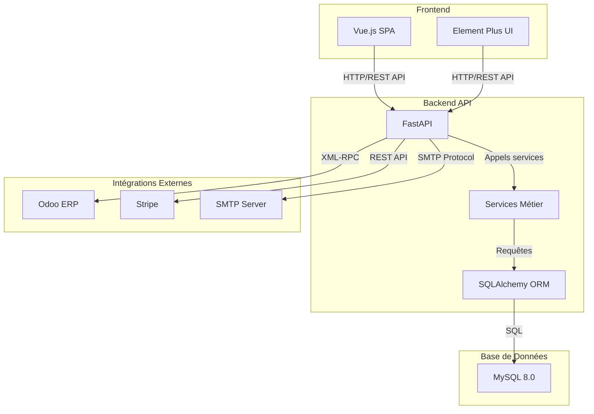

# Architecture Système - Vue Globale

## Notes

**Frontend** :
- Vue.js 3 + Vite
- Element Plus
- Responsive Design

**Backend** :
- FastAPI
- JWT Authentication
- 2FA Support

**MySQL** :
- InnoDB Engine
- utf8mb4 Charset
- Réplication possible
