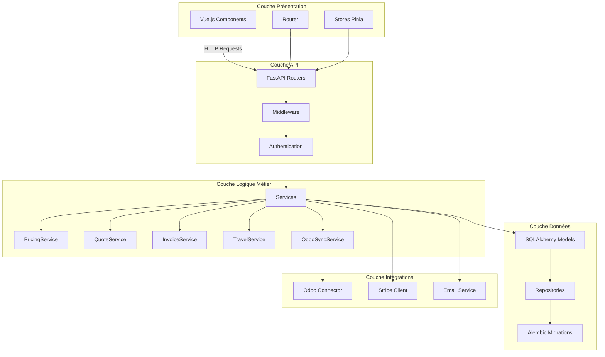

# Architecture Application - Couches

## Notes

**Services Métier** :
- Calculs de prix
- Génération devis/factures
- Gestion voyages
- Synchronisation Odoo

**Modèles** :
- Modèles SQLAlchemy
- Relations ORM
- Validations
