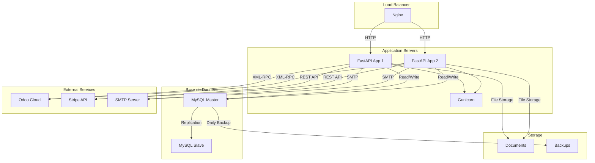

# Architecture Déploiement

## Notes

**Load Balancer (Nginx)** :
- SSL Termination
- Static Files
- Reverse Proxy

**MySQL Master** :
- Primary Database
- Write Operations

**MySQL Slave** :
- Read Replica
- Backup Source
