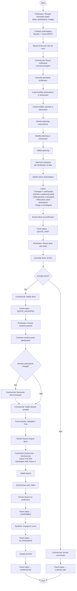

# Workflow - Voyages Scolaires Complet

```mermaid
flowchart TD
    Start([Start]) --> FillForm[Professeur: Remplit formulaire public<br/>dates, destinations, budget]
    FillForm --> Create[Création automatique<br/>Teacher + Travel DRAFT]
    Create --> Email[Reçoit email avec lien de suivi]
    
    Email --> Notify[Commercial: Reçoit notification<br/>nouveau prospect]
    Notify --> Consult[Consulte demande professeur]
    Consult --> CreateDest[Créer/modifier destinations si nécessaire]
    CreateDest --> CreateAct[Créer/modifier activités si nécessaire]
    CreateAct --> GeneratePlanning[Génère planning préconstruit]
    GeneratePlanning --> ModifyPlanning[Modifie planning si nécessaire]
    ModifyPlanning --> ValidatePlanning[Valide planning]
    ValidatePlanning --> EnterTransport[Saisit prix transport<br/>par destination et date]
    EnterTransport --> GenerateQuote[Génère devis automatique]
    
    GenerateQuote --> Note1[Calcul:<br/>- Transport × participants<br/>- Activités si planning validé<br/>- Hébergement si renseigné<br/>- Réductions selon participants<br/>- Marge si renseignée]
    
    Note1 --> SendQuote[Envoie devis au professeur]
    SendQuote --> Status1[Travel status → QUOTE_SENT]
    
    Status1 --> ReceiveQuote[Professeur: Reçoit devis par email]
    ReceiveQuote --> ViewQuote[Consulte devis via lien]
    ViewQuote --> Decision{Accepte devis?}
    
    Decision -->|Oui| ValidateQuote[Commercial: Valide devis]
    ValidateQuote --> Status2[Travel status → QUOTE_VALIDATED]
    Status2 --> SendContacts[Professeur: Envoie contacts parents]
    SendContacts --> Confirm[Confirme nombre exact participants]
    Confirm --> Decision2{Nombre participants changé?}
    
    Decision2 -->|Oui| Recalculate[Commercial: Recalcule devis transport]
    Recalculate --> ValidateDossier
    Decision2 -->|Non| ValidateDossier[Commercial: Valide dossier complet]
    
    ValidateDossier --> DossierValidated[Travel dossier_validated = True]
    DossierValidated --> GenerateInvoice[Génère facture depuis devis]
    
    GenerateInvoice --> Note2[Conversion QuoteLines → InvoiceLines<br/>Calcul TVA 20%<br/>Génération XML Factur-X]
    
    Note2 --> ValidateInvoice[Valide facture]
    ValidateInvoice --> SyncOdoo[Synchronise avec Odoo]
    SyncOdoo --> SendInvoice[Envoie facture au professeur]
    SendInvoice --> Status3[Travel status → CONFIRMED]
    Status3 --> InProgress[Système: Voyage en cours]
    InProgress --> Status4[Travel status → IN_PROGRESS]
    Status4 --> Completed[Voyage terminé]
    Completed --> Status5[Travel status → COMPLETED]
    Status5 --> End([End])
    
    Decision -->|Non| Cancel[Commercial: Annule commande]
    Cancel --> Status6[Travel status → CANCELLED]
    Status6 --> End
```

---

**Version** : 1.0  
**Date** : 2025-01-20
