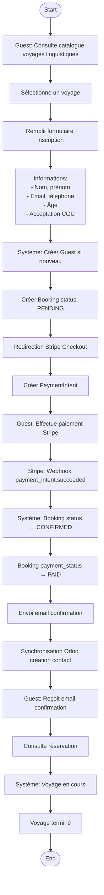
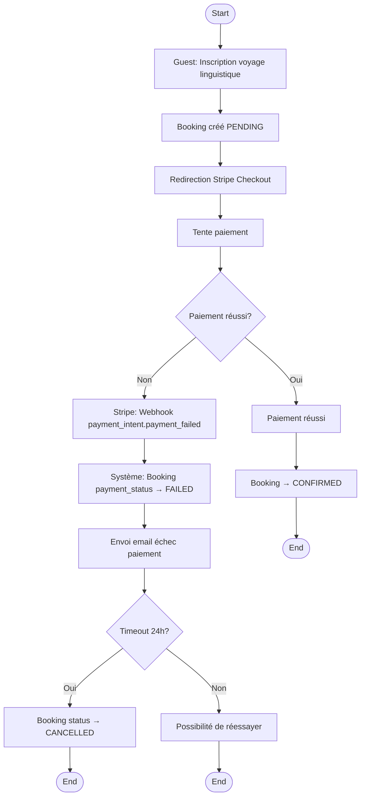

# Workflow - Voyages Linguistiques

## 1. Workflow Principal

```mermaid
flowchart TD
 Start([Start]) --> Consult[Guest: Consulte catalogue voyages linguistiques]
 Consult --> Select[Sélectionne un voyage]
 Select --> FillForm[Remplit formulaire inscription]
 
 FillForm --> Note1[Informations:<br/>- Nom, prénom<br/>- Email, téléphone<br/>- Âge<br/>- Acceptation CGU]
 
 Note1 --> CreateGuest[Système: Créer Guest si nouveau]
 CreateGuest --> CreateBooking[Créer Booking status: PENDING]
 CreateBooking --> Redirect[Redirection Stripe Checkout]
 Redirect --> CreateIntent[Créer PaymentIntent]
 CreateIntent --> Payment[Guest: Effectue paiement Stripe]
 
 Payment --> Webhook[Stripe: Webhook payment_intent.succeeded]
 Webhook --> Status1[Système: Booking status → CONFIRMED]
 Status1 --> PaymentStatus[Booking payment_status → PAID]
 PaymentStatus --> Email[Envoi email confirmation]
 Email --> Sync[Synchronisation Odoo création contact]
 Sync --> ReceiveEmail[Guest: Reçoit email confirmation]
 ReceiveEmail --> View[Consulte réservation]
 View --> TravelInProgress[Système: Voyage en cours]
 TravelInProgress --> TravelEnd[Voyage terminé]
 TravelEnd --> End([End])
```

## 2. Workflow Paiement Échoué

```mermaid
flowchart TD
 Start([Start]) --> Register[Guest: Inscription voyage linguistique]
 Register --> CreateBooking[Booking créé PENDING]
 CreateBooking --> Redirect[Redirection Stripe Checkout]
 Redirect --> TryPayment[Tente paiement]
 TryPayment --> Decision{Paiement réussi?}
 
 Decision -->|Non| Webhook[Stripe: Webhook payment_intent.payment_failed]
 Webhook --> Status1[Système: Booking payment_status → FAILED]
 Status1 --> EmailFail[Envoi email échec paiement]
 EmailFail --> Timeout{Timeout 24h?}
 
 Timeout -->|Oui| Cancel[Booking status → CANCELLED]
 Cancel --> End1([End])
 
 Timeout -->|Non| Retry[Possibilité de réessayer]
 Retry --> End2([End])
 
 Decision -->|Oui| Success[Paiement réussi]
 Success --> Confirmed[Booking → CONFIRMED]
 Confirmed --> End3([End])
```
