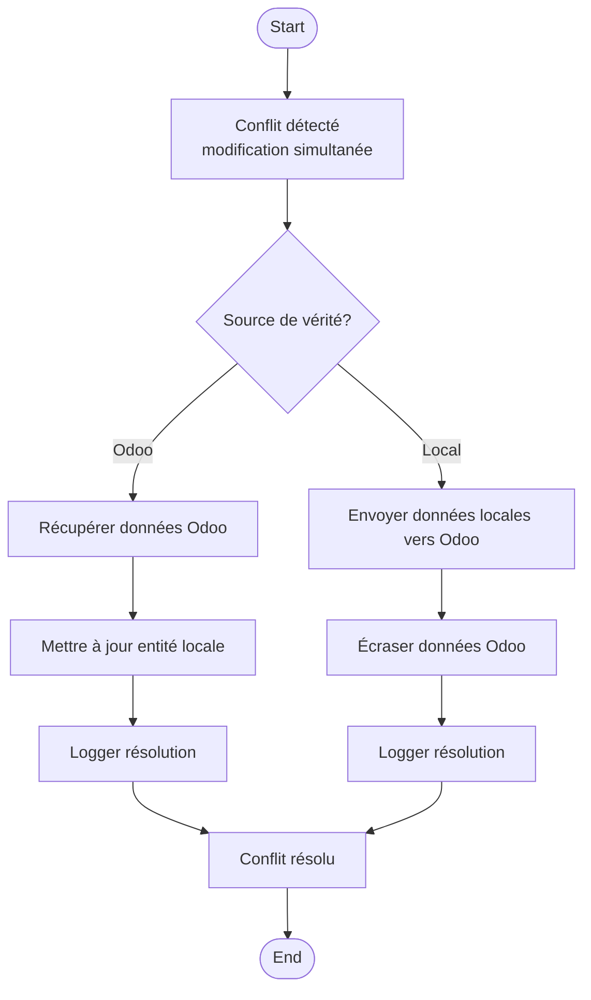

# Workflow - Intégration Odoo

## 1. Workflow Principal

```mermaid
flowchart TD
    Start([Start]) --> SyncContacts[Synchronisation Contacts]
    
    SyncContacts --> ContactLoop[Pour chaque Teacher/Guest]
    ContactLoop --> Decision1{odoo_partner_id existe?}
    Decision1 -->|Non| CreateContact[Créer contact Odoo]
    CreateContact --> GetPartnerId[Récupérer odoo_partner_id]
    GetPartnerId --> UpdateLocal[Mettre à jour entité locale]
    UpdateLocal --> SyncCRM
    Decision1 -->|Oui| UpdateContact[Mettre à jour contact Odoo]
    UpdateContact --> SyncCRM[Synchronisation CRM]
    
    SyncCRM --> CRMLoop[Pour chaque Travel nouveau]
    CRMLoop --> Decision2{odoo_lead_id existe?}
    Decision2 -->|Non| CreateLead[Créer lead Odoo]
    CreateLead --> GetLeadId[Récupérer odoo_lead_id]
    GetLeadId --> UpdateTravel[Mettre à jour Travel]
    UpdateTravel --> Decision3{Devis validé?}
    Decision2 -->|Oui| Decision3
    
    Decision3 -->|Oui| UpdateLead[Mettre à jour lead Odoo<br/>Statut → Qualifié]
    UpdateLead --> Decision4{Facture générée?}
    Decision3 -->|Non| Decision4
    
    Decision4 -->|Oui| ConvertLead[Convertir lead en opportunité<br/>Marquer comme gagné]
    ConvertLead --> SyncInvoices
    Decision4 -->|Non| SyncInvoices[Synchronisation Factures]
    
    SyncInvoices --> InvoiceLoop[Pour chaque Invoice validée]
    InvoiceLoop --> Decision5{odoo_invoice_id existe?}
    Decision5 -->|Non| CreateInvoice[Créer facture Odoo]
    CreateInvoice --> CreateLines[Créer lignes de facture]
    CreateLines --> LinkContact[Lier au contact client]
    LinkContact --> GetInvoiceId[Récupérer odoo_invoice_id]
    GetInvoiceId --> UpdateInvoice[Mettre à jour Invoice]
    UpdateInvoice --> ErrorHandling
    Decision5 -->|Oui| ErrorHandling[Gestion Erreurs]
    
    ErrorHandling --> Decision6{Erreur synchronisation?}
    Decision6 -->|Oui| LogError[Logger erreur]
    LogError --> CreateLog[Créer entrée dans sync_logs]
    CreateLog --> Notify[Notification admin optionnel]
    Notify --> Report
    Decision6 -->|Non| Report[Rapport de synchronisation]
    
    Report --> End([End])
```

## 2. Résolution Conflits Odoo

```mermaid
flowchart TD
    Start([Start]) --> Detect[Conflit détecté<br/>modification simultanée]
    Detect --> Decision{Source de vérité?}
    
    Decision -->|Odoo| GetOdoo[Récupérer données Odoo]
    GetOdoo --> UpdateLocal[Mettre à jour entité locale]
    UpdateLocal --> Log1[Logger résolution]
    Log1 --> Resolved
    
    Decision -->|Local| SendLocal[Envoyer données locales vers Odoo]
    SendLocal --> Overwrite[Écraser données Odoo]
    Overwrite --> Log2[Logger résolution]
    Log2 --> Resolved[Conflit résolu]
    
    Resolved --> End([End])
```
