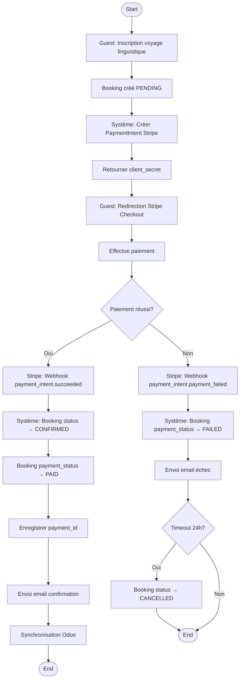
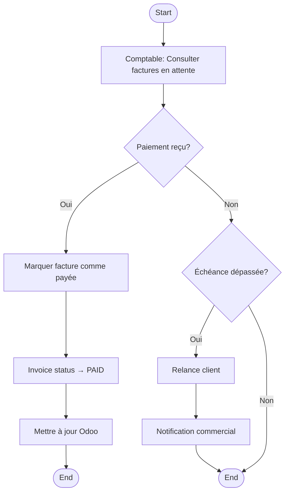

# Workflow - Paiements en Ligne (Stripe)

## 1. Workflow Principal

```mermaid
flowchart TD
 Start([Start]) --> Register[Guest: Inscription voyage linguistique]
 Register --> CreateBooking[Booking créé PENDING]
 CreateBooking --> CreateIntent[Système: Créer PaymentIntent Stripe]
 CreateIntent --> ReturnSecret[Retourner client_secret]
 ReturnSecret --> Redirect[Guest: Redirection Stripe Checkout]
 Redirect --> Payment[Effectue paiement]
 Payment --> Decision{Paiement réussi?}
 
 Decision -->|Oui| WebhookSuccess[Stripe: Webhook payment_intent.succeeded]
 WebhookSuccess --> Status1[Système: Booking status → CONFIRMED]
 Status1 --> PaymentStatus[Booking payment_status → PAID]
 PaymentStatus --> SaveId[Enregistrer payment_id]
 SaveId --> Email[Envoi email confirmation]
 Email --> Sync[Synchronisation Odoo]
 Sync --> End1([End])
 
 Decision -->|Non| WebhookFail[Stripe: Webhook payment_intent.payment_failed]
 WebhookFail --> Status2[Système: Booking payment_status → FAILED]
 Status2 --> EmailFail[Envoi email échec]
 EmailFail --> Timeout{Timeout 24h?}
 
 Timeout -->|Oui| Cancel[Booking status → CANCELLED]
 Cancel --> End2([End])
 
 Timeout -->|Non| End2
```

## 2. Suivi Paiements

```mermaid
flowchart TD
 Start([Start]) --> Consult[Comptable: Consulter factures en attente]
 Consult --> Decision{Paiement reçu?}
 
 Decision -->|Oui| MarkPaid[Marquer facture comme payée]
 MarkPaid --> Status[Invoice status → PAID]
 Status --> UpdateOdoo[Mettre à jour Odoo]
 UpdateOdoo --> End1([End])
 
 Decision -->|Non| Overdue{Échéance dépassée?}
 Overdue -->|Oui| Reminder[Relance client]
 Reminder --> Notify[Notification commercial]
 Notify --> End2([End])
 
 Overdue -->|Non| End2
```
