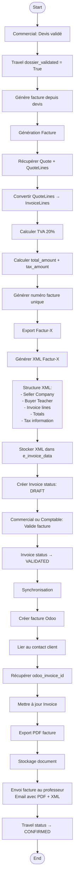

# Workflow - Facturation Complète

```mermaid
flowchart TD
    Start([Start]) --> QuoteValidated[Commercial: Devis validé]
    QuoteValidated --> DossierValidated[Travel dossier_validated = True]
    DossierValidated --> GenerateInvoice[Génère facture depuis devis]
    
    GenerateInvoice --> Generation[Génération Facture]
    Generation --> GetQuote[Récupérer Quote + QuoteLines]
    GetQuote --> Convert[Convertir QuoteLines → InvoiceLines]
    Convert --> CalcTVA[Calculer TVA 20%]
    CalcTVA --> CalcTotal[Calculer total_amount + tax_amount]
    CalcTotal --> GenerateNumber[Générer numéro facture unique]
    
    GenerateNumber --> Export[Export Factur-X]
    Export --> GenerateXML[Générer XML Factur-X]
    
    GenerateXML --> Note1[Structure XML:<br/>- Seller Company<br/>- Buyer Teacher<br/>- Invoice lines<br/>- Totals<br/>- Tax information]
    
    Note1 --> StoreXML[Stocker XML dans e_invoice_data]
    StoreXML --> CreateInvoice[Créer Invoice status: DRAFT]
    
    CreateInvoice --> Validate[Commercial ou Comptable: Valide facture]
    Validate --> InvoiceStatus[Invoice status → VALIDATED]
    
    InvoiceStatus --> Sync[Synchronisation]
    Sync --> CreateOdoo[Créer facture Odoo]
    CreateOdoo --> LinkContact[Lier au contact client]
    LinkContact --> GetOdooId[Récupérer odoo_invoice_id]
    GetOdooId --> UpdateInvoice[Mettre à jour Invoice]
    
    UpdateInvoice --> ExportPDF[Export PDF facture]
    ExportPDF --> Store[Stockage document]
    Store --> SendInvoice[Envoi facture au professeur<br/>Email avec PDF + XML]
    SendInvoice --> TravelStatus[Travel status → CONFIRMED]
    TravelStatus --> End([End])
```

---

**Version** : 1.0  
**Date** : 2025-01-20
