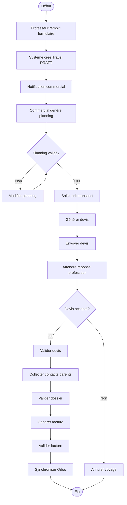

# Processus BPMN - Voyage Scolaire

## Vue d'Ensemble

Ce diagramme BPMN représente le processus complet de gestion d'un voyage scolaire, depuis la demande initiale du professeur jusqu'à la facturation finale.

## Diagramme Mermaid (Simplifié)

## Étapes du Processus

1. **Soumission** : Le professeur remplit le formulaire public
2. **Création** : Le système crée automatiquement le voyage en statut DRAFT
3. **Traitement** : Le commercial génère le planning et saisit les prix
4. **Devis** : Génération et envoi du devis au professeur
5. **Validation** : Acceptation du devis par le professeur
6. **Finalisation** : Collecte des contacts, validation du dossier
7. **Facturation** : Génération et validation de la facture
8. **Synchronisation** : Export vers Odoo

## Acteurs

- **Professeur** : Initie le processus
- **Système** : Automatise certaines étapes
- **Commercial** : Traite la demande
- **Comptable** : Valide la facture (optionnel)

---

**Note** : Un diagramme BPMN complet au format XML sera créé avec un outil dédié (Camunda Modeler, bpmn.io).
