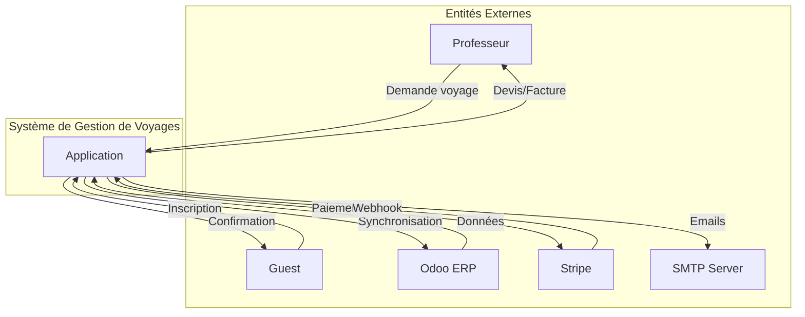

# Diagramme de Flux de Données - Niveau 0 (Contexte)

## Vue d'Ensemble

Ce diagramme représente le système dans son contexte global et ses interactions avec les entités externes.

## Diagramme Mermaid

## Flux Principaux

### Flux Entrants
- **Demandes de voyage** : Depuis les professeurs
- **Inscriptions** : Depuis les guests
- **Données Odoo** : Synchronisation depuis l'ERP
- **Webhooks Stripe** : Confirmations de paiement

### Flux Sortants
- **Devis et factures** : Vers les professeurs
- **Confirmations** : Vers les guests
- **Synchronisation** : Vers Odoo (contacts, factures, leads)
- **Paiements** : Vers Stripe
- **Emails** : Via SMTP (notifications, confirmations)

## Entités Externes

1. **Professeur** : Utilisateur externe soumettant des demandes de voyages scolaires
2. **Guest** : Participant externe s'inscrivant aux voyages linguistiques
3. **Odoo ERP** : Système ERP externe pour la gestion intégrée
4. **Stripe** : Plateforme de paiement en ligne
5. **SMTP Server** : Serveur email pour l'envoi de notifications
