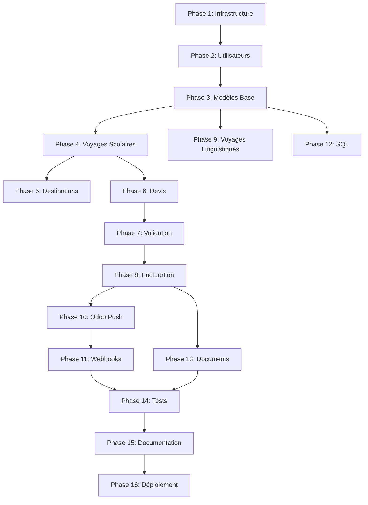

# Plan Gantt Complet - Projet Système de Gestion Intégré

## Vue d'Ensemble

Ce document présente le plan temporel complet (diagramme Gantt) pour l'ensemble du projet de développement du système de gestion intégré, de la phase initiale jusqu'au déploiement en production.

**Durée totale** : 22 semaines (environ 5.5 mois)

## Diagramme Gantt Complet

```mermaid
gantt
    title Plan de Développement Complet - Système de Gestion Intégré
    dateFormat YYYY-MM-DD
    axisFormat %d/%m
    
    section Phase 1: Infrastructure Base
    Configuration projet (FastAPI + Vue.js)     :2025-01-01, 3d
    Configuration base de données MySQL         :2025-01-02, 2d
    Modèles authentification (User, Role)       :2025-01-04, 3d
    Système JWT + 2FA                           :2025-01-07, 4d
    Système permissions granulaires              :2025-01-09, 3d
    Interface login/2FA frontend                 :2025-01-11, 3d
    
    section Phase 2: Gestion Utilisateurs
    CRUD utilisateurs (admin)                   :2025-01-14, 3d
    CRUD rôles et permissions                    :2025-01-16, 3d
    Interface admin utilisateurs                 :2025-01-18, 3d
    Middleware vérification permissions          :2025-01-20, 2d
    
    section Phase 3: Modèles Métier Base
    Modèles Teacher, Travel, Destination         :2025-01-22, 4d
    Modèles Activity, ProgramTemplate            :2025-01-24, 3d
    Relations et contraintes BDD                 :2025-01-26, 2d
    Migrations Alembic                           :2025-01-27, 2d
    API endpoints CRUD base                      :2025-01-28, 3d
    Interfaces frontend listes/formulaires       :2025-01-30, 4d
    
    section Phase 4: Workflow Voyages Scolaires
    Formulaire public professeur                 :2025-02-03, 4d
    Création automatique Teacher                 :2025-02-05, 2d
    Notification commerciaux                     :2025-02-06, 2d
    Validation formulaire                        :2025-02-07, 2d
    Génération planning préconstruit              :2025-02-10, 4d
    Interface édition planning                   :2025-02-12, 3d
    Validation planning                          :2025-02-14, 2d
    
    section Phase 5: Gestion Destinations/Activités
    CRUD destinations (commercial)               :2025-02-17, 3d
    CRUD activités par destination                :2025-02-19, 3d
    Interfaces de gestion                        :2025-02-21, 3d
    Validation et contraintes métier              :2025-02-23, 2d
    
    section Phase 6: Calculs Prix et Devis
    Modèle TransportPrice                        :2025-02-24, 2d
    Saisie prix transport                        :2025-02-25, 2d
    Fonctions SQL calculs prix                    :2025-02-26, 5d
    Service calcul coûts                         :2025-02-28, 3d
    Modèle Quote et QuoteLine                    :2025-03-03, 2d
    Génération devis automatique                  :2025-03-04, 4d
    Validation devis                              :2025-03-06, 2d
    Envoi devis par email                         :2025-03-07, 2d
    Interface gestion devis                       :2025-03-08, 3d
    
    section Phase 7: Validation et Suivi
    Workflow validation commande                 :2025-03-11, 3d
    Modèle ParentContact                         :2025-03-12, 2d
    Collecte contacts parents                    :2025-03-13, 3d
    Mise à jour nombres participants             :2025-03-14, 2d
    Modification devis transport                 :2025-03-15, 2d
    Validation dossier                           :2025-03-17, 2d
    Historique statuts                           :2025-03-18, 2d
    
    section Phase 8: Facturation
    Modèle Invoice et InvoiceLine                :2025-03-19, 2d
    Génération facture depuis devis               :2025-03-20, 3d
    Service e-invoice Factur-X                    :2025-03-21, 4d
    Validation facture                            :2025-03-24, 2d
    Envoi facture                                 :2025-03-25, 2d
    Stockage documents                            :2025-03-26, 2d
    Interface gestion factures                    :2025-03-27, 3d
    
    section Phase 9: Voyages Linguistiques
    Modèle LinguisticTravel                      :2025-03-31, 2d
    Catalogue public                              :2025-04-01, 3d
    Inscription en ligne                          :2025-04-02, 4d
    Intégration Stripe                            :2025-04-03, 5d
    Gestion réservations                          :2025-04-07, 3d
    Confirmations                                 :2025-04-09, 2d
    
    section Phase 10: Intégration Odoo (Push)
    Bibliothèque odoo-endpoints                    :2025-04-10, 5d
    Synchronisation contacts                      :2025-04-14, 4d
    Synchronisation factures                      :2025-04-17, 4d
    Synchronisation CRM (leads)                   :2025-04-20, 4d
    Service sync unifié                           :2025-04-23, 3d
    Gestion erreurs sync                          :2025-04-25, 2d
    
    section Phase 11: Webhooks Odoo → API
    Documentation webhooks                        :2025-04-28, 3d
    Module Odoo structure                        :2025-04-30, 2d
    Service webhook Odoo                          :2025-05-02, 3d
    Hooks sale.order                              :2025-05-04, 3d
    Hooks account.move                            :2025-05-06, 3d
    Hooks res.partner                             :2025-05-08, 2d
    Hooks crm.lead                                :2025-05-09, 2d
    Interface config Odoo                          :2025-05-10, 2d
    Endpoints API webhooks                        :2025-05-13, 4d
    Service traitement webhooks                   :2025-05-16, 3d
    Validation et sécurité                        :2025-05-18, 2d
    
    section Phase 12: Fonctions SQL Avancées
    Fonctions validation                          :2025-05-20, 4d
    Fonctions génération                          :2025-05-23, 3d
    Fonctions statistiques                        :2025-05-25, 3d
    Procédures stockées                           :2025-05-27, 4d
    Optimisation et index                         :2025-05-30, 3d
    
    section Phase 13: Gestion Documents
    Modèle TravelDocument                         :2025-06-02, 2d
    Upload/download documents                     :2025-06-03, 3d
    Interface admin CRUD                          :2025-06-05, 4d
    Édition AJAX temps réel                       :2025-06-07, 2d
    Filtres et recherche                          :2025-06-08, 2d
    
    section Phase 14: Tests et Qualité
    Tests unitaires backend                       :2025-06-10, 5d
    Tests unitaires frontend                      :2025-06-12, 4d
    Tests intégration                             :2025-06-16, 5d
    Tests end-to-end                              :2025-06-20, 4d
    Tests performance                             :2025-06-23, 3d
    Tests sécurité                                :2025-06-25, 2d
    
    section Phase 15: Documentation
    Documentation technique                       :2025-06-27, 4d
    Documentation API                            :2025-06-30, 3d
    Guides utilisateur                           :2025-07-02, 4d
    Documentation intégrations                    :2025-07-05, 3d
    
    section Phase 16: Déploiement
    Configuration production                     :2025-07-08, 3d
    Déploiement backend                          :2025-07-10, 2d
    Déploiement frontend                         :2025-07-11, 2d
    Configuration Odoo production                :2025-07-12, 2d
    Installation module webhooks                 :2025-07-13, 1d
    Monitoring et alertes                         :2025-07-14, 2d
    Tests production                              :2025-07-15, 2d
    Formation équipes                             :2025-07-16, 2d
```



## Dépendances Entre Phases



## Phases Détaillées

### Phase 1 : Infrastructure de Base (Semaines 1-2)
**Durée** : 2 semaines  
**Objectif** : Mettre en place l'infrastructure technique de base

**Livrables** :
- Configuration projet FastAPI + Vue.js
- Base de données MySQL configurée
- Système d'authentification JWT + 2FA
- Système de permissions

### Phase 2 : Gestion Utilisateurs (Semaine 2-3)
**Durée** : 1 semaine  
**Objectif** : Implémenter la gestion complète des utilisateurs et rôles

**Livrables** :
- CRUD utilisateurs
- CRUD rôles et permissions
- Interface admin

### Phase 3 : Modèles Métier de Base (Semaine 3-4)
**Durée** : 1.5 semaines  
**Objectif** : Créer les modèles de données principaux

**Livrables** :
- Modèles Teacher, Travel, Destination, Activity
- Migrations Alembic
- API CRUD de base

### Phase 4 : Workflow Voyages Scolaires (Semaines 4-6)
**Durée** : 2 semaines  
**Objectif** : Implémenter le workflow complet des voyages scolaires

**Livrables** :
- Formulaire public professeur
- Génération de planning
- Validation et suivi

### Phase 5 : Gestion Destinations/Activités (Semaine 6-7)
**Durée** : 1 semaine  
**Objectif** : Gérer le catalogue de destinations et activités

**Livrables** :
- CRUD destinations
- CRUD activités
- Interfaces de gestion

### Phase 6 : Calculs Prix et Devis (Semaines 7-9)
**Durée** : 2 semaines  
**Objectif** : Implémenter les calculs de prix et génération de devis

**Livrables** :
- Fonctions SQL de calcul
- Génération automatique de devis
- Interface gestion devis

### Phase 7 : Validation et Suivi (Semaine 9-10)
**Durée** : 1 semaine  
**Objectif** : Workflow de validation et collecte d'informations

**Livrables** :
- Collecte contacts parents
- Validation dossier
- Historique statuts

### Phase 8 : Facturation (Semaine 10-11)
**Durée** : 1.5 semaines  
**Objectif** : Système de facturation complet

**Livrables** :
- Génération factures
- Export Factur-X
- Interface gestion factures

### Phase 9 : Voyages Linguistiques (Semaines 11-12)
**Durée** : 1.5 semaines  
**Objectif** : Implémenter les voyages linguistiques avec paiement

**Livrables** :
- Catalogue public
- Inscription en ligne
- Intégration Stripe

### Phase 10 : Intégration Odoo Push (Semaines 12-14)
**Durée** : 2 semaines  
**Objectif** : Synchronisation vers Odoo

**Livrables** :
- Bibliothèque odoo-endpoints
- Synchronisation contacts, factures, leads
- Service sync unifié

### Phase 11 : Webhooks Odoo → API (Semaines 14-16)
**Durée** : 2 semaines  
**Objectif** : Implémenter les webhooks bidirectionnels

**Livrables** :
- Module Odoo webhooks
- Endpoints API récepteurs
- Traçabilité complète

### Phase 12 : Fonctions SQL Avancées (Semaines 16-17)
**Durée** : 1.5 semaines  
**Objectif** : Optimiser avec fonctions SQL

**Livrables** :
- Fonctions validation
- Fonctions génération
- Procédures stockées

### Phase 13 : Gestion Documents (Semaine 17-18)
**Durée** : 1 semaine  
**Objectif** : Gestion complète des documents

**Livrables** :
- Upload/download
- Interface admin CRUD
- Recherche et filtres

### Phase 14 : Tests et Qualité (Semaines 18-20)
**Durée** : 2 semaines  
**Objectif** : Assurer la qualité du code

**Livrables** :
- Tests unitaires
- Tests intégration
- Tests performance

### Phase 15 : Documentation (Semaines 20-21)
**Durée** : 1.5 semaines  
**Objectif** : Documenter le système

**Livrables** :
- Documentation technique
- Guides utilisateur
- Documentation API

### Phase 16 : Déploiement (Semaine 21-22)
**Durée** : 1.5 semaines  
**Objectif** : Mise en production

**Livrables** :
- Déploiement production
- Configuration Odoo
- Monitoring
- Formation

## Points de Démarrage Recommandés

### Démarrage Immédiat (Priorité 1)
1. **Phase 1** : Infrastructure de base (fondation du projet)
2. **Phase 2** : Gestion utilisateurs (nécessaire pour tout le reste)

### Parallélisation Possible

Les phases suivantes peuvent être développées en parallèle après la Phase 3 :
- **Phase 4** (Voyages scolaires) et **Phase 9** (Voyages linguistiques)
- **Phase 10** (Odoo Push) et **Phase 11** (Webhooks Odoo → API)
- **Phase 12** (Fonctions SQL) peut être fait en continu pendant les autres phases

## Format d'Export

Le diagramme Gantt Mermaid peut être exporté en différents formats :

### 1. Markdown (Format Actuel)
- Intégré directement dans la documentation
- Rendu automatique sur GitHub/GitLab
- Visualisable dans VS Code avec extension Mermaid

### 2. PNG/SVG (Images)
```bash
# Via Mermaid CLI
npm install -g @mermaid-js/mermaid-cli
mmdc -i plan_gantt_projet.md -o gantt.png

# Ou via https://mermaid.live/
# Copier le code Mermaid et exporter en PNG/SVG
```

### 3. PDF
```bash
# Via Pandoc
pandoc plan_gantt_projet.md -o gantt.pdf

# Ou via Mermaid CLI puis conversion
mmdc -i plan_gantt_projet.md -o gantt.png
# Convertir PNG en PDF avec un outil externe
```

### 4. CSV (Pour Excel/Project)
```python
# Script de conversion Python
import csv
from datetime import datetime, timedelta

phases = [
    {"phase": "Phase 1", "task": "Configuration projet", "start": "2025-01-01", "duration": 3},
    # ... autres tâches
]

with open('gantt.csv', 'w', newline='') as f:
    writer = csv.writer(f)
    writer.writerow(['Phase', 'Tâche', 'Début', 'Durée (jours)', 'Fin'])
    for p in phases:
        start = datetime.strptime(p['start'], '%Y-%m-%d')
        end = start + timedelta(days=p['duration'])
        writer.writerow([
            p['phase'],
            p['task'],
            p['start'],
            p['duration'],
            end.strftime('%Y-%m-%d')
        ])
```

### 5. JSON (Pour Outils de Gestion de Projet)
```python
# Script de conversion Python
import json
from datetime import datetime, timedelta

phases = [
    {
        "id": 1,
        "name": "Phase 1: Infrastructure Base",
        "tasks": [
            {
                "id": 1,
                "name": "Configuration projet (FastAPI + Vue.js)",
                "start": "2025-01-01",
                "duration": 3,
                "dependencies": []
            },
            # ... autres tâches
        ]
    },
    # ... autres phases
]

with open('gantt.json', 'w') as f:
    json.dump(phases, f, indent=2)
```

### 6. Microsoft Project (.mpp)
- Exporter en CSV puis importer dans MS Project
- Ou utiliser un outil de conversion CSV → MPP

### 7. Jira / Trello / Asana
- Exporter en CSV/JSON
- Importer via les fonctionnalités d'import de ces outils

## Utilisation

### Visualisation

#### VS Code
1. Installer l'extension "Markdown Preview Mermaid Support"
2. Ouvrir le fichier `.md`
3. Prévisualiser avec `Ctrl+Shift+V`

#### GitHub/GitLab
- Les diagrammes Mermaid sont rendus automatiquement dans les fichiers Markdown
- Aucune configuration nécessaire

#### En Ligne
- Aller sur https://mermaid.live/
- Copier le code du diagramme Gantt
- Visualiser et exporter

### Export via Mermaid CLI

```bash
# Installation
npm install -g @mermaid-js/mermaid-cli

# Export PNG
mmdc -i documentation/09_documentation_technique/03_plan_gantt_projet.md -o gantt.png

# Export SVG
mmdc -i documentation/09_documentation_technique/03_plan_gantt_projet.md -o gantt.svg -b transparent

# Export PDF (via conversion)
mmdc -i documentation/09_documentation_technique/03_plan_gantt_projet.md -o gantt.png
# Puis convertir PNG en PDF avec un outil externe
```

## Ressources Nécessaires

### Équipe Recommandée

- **1-2 Développeurs Backend** (Python/FastAPI)
  - Développement API REST
  - Intégration Odoo
  - Fonctions SQL
  - Services métier

- **1 Développeur Frontend** (Vue.js)
  - Interfaces utilisateur
  - Composants réutilisables
  - Gestion d'état (Pinia)
  - Intégration API

- **1 Développeur Odoo** (pour le module webhooks)
  - Module Odoo personnalisé
  - Configuration webhooks
  - Tests Odoo

- **1 DevOps** (déploiement et infrastructure)
  - Configuration serveurs
  - CI/CD
  - Monitoring
  - Backup/Restore

### Outils

- **IDE** : VS Code avec extensions Python, Vue, Markdown
- **Base de données** : MySQL 8.0+ avec outils de gestion (MySQL Workbench, DBeaver)
- **Versioning** : Git (GitHub/GitLab)
- **CI/CD** : GitHub Actions / GitLab CI
- **Monitoring** : Prometheus / Grafana (optionnel)
- **Documentation** : Markdown, Mermaid, PlantUML

## Risques et Mitigation

### Risques Identifiés

1. **Complexité intégration Odoo**
   - **Risque** : Difficultés de synchronisation bidirectionnelle
   - **Mitigation** : Développement progressif, tests fréquents, documentation détaillée

2. **Performance calculs prix**
   - **Risque** : Calculs complexes avec beaucoup de données
   - **Mitigation** : Fonctions SQL optimisées, cache des résultats, index appropriés

3. **Synchronisation données**
   - **Risque** : Conflits entre Odoo et l'API
   - **Mitigation** : Webhooks bidirectionnels, stratégie de résolution de conflits claire

4. **Conformité Factur-X**
   - **Risque** : Normes de facturation électronique 2027
   - **Mitigation** : Validation précoce, tests de conformité, documentation réglementaire

5. **Délais de développement**
   - **Risque** : Retards sur certaines phases
   - **Mitigation** : Planification réaliste, buffers de temps, priorités claires

## Suivi et Reporting

### Métriques à Suivre

- **Progression par phase** : % de complétion
- **Tâches complétées** : Nombre vs total
- **Bugs identifiés** : Nombre et sévérité
- **Bugs résolus** : Taux de résolution
- **Temps réel vs estimé** : Écart par phase
- **Couverture de tests** : % de code testé

### Points de Contrôle

- **Fin de chaque phase** : Validation des livrables
- **Milestone majeur** : Toutes les 4 semaines
- **Revue avant déploiement** : Validation complète
- **Revue post-déploiement** : Retours d'expérience

### Reporting

- **Hebdomadaire** : État d'avancement, blocages, prochaines étapes
- **Mensuel** : Vue d'ensemble, métriques, ajustements
- **Fin de projet** : Rapport final, leçons apprises
