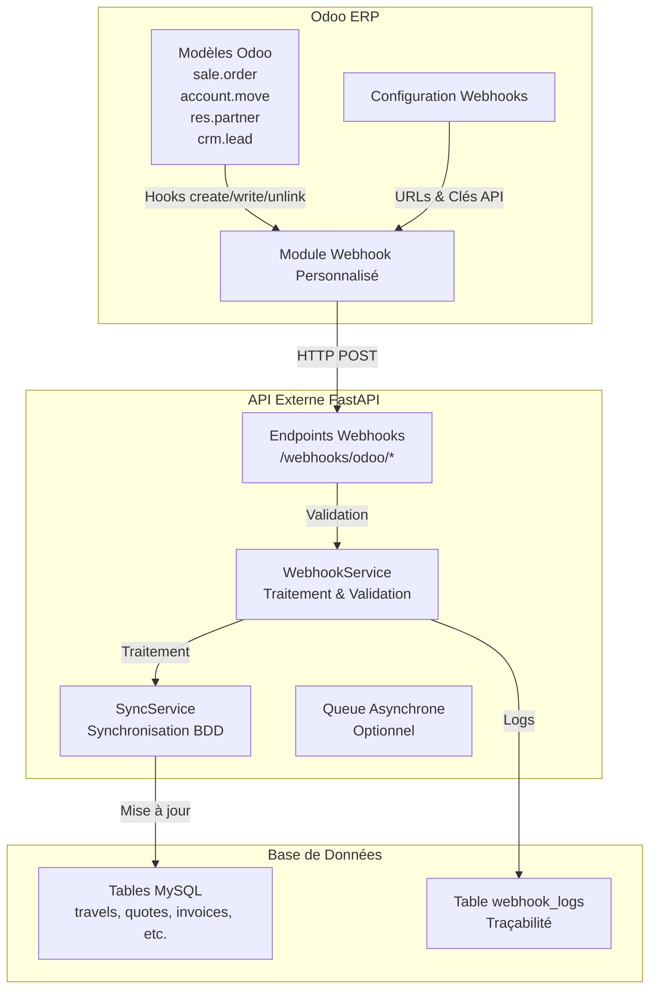

# Intégration Odoo → API (Webhooks)

## Vue d'Ensemble

Ce guide explique comment configurer Odoo pour envoyer automatiquement des webhooks vers votre API externe lorsqu'un événement se produit dans Odoo (ex: modification d'une vente, création d'une facture, modification d'un contact).

Cette intégration permet une **synchronisation bidirectionnelle** complète :
- **API → Odoo** : Synchronisation classique (contacts, factures, leads)
- **Odoo → API** : Webhooks en temps réel (tous les événements de la base de données)

## Architecture



## Événements Tracés

### Modèles Odoo → Événements

#### 1. sale.order (Ventes)
- `sale.order.created` : Création d'une vente
- `sale.order.updated` : Modification d'une vente
- `sale.order.state.changed` : Changement de statut
- `sale.order.deleted` : Suppression

#### 2. account.move (Factures)
- `account.move.created` : Création d'une facture
- `account.move.validated` : Validation (action_post)
- `account.move.updated` : Modification
- `account.move.cancelled` : Annulation

#### 3. res.partner (Contacts)
- `res.partner.created` : Création d'un contact
- `res.partner.updated` : Modification
- `res.partner.deleted` : Suppression

#### 4. crm.lead (Leads CRM)
- `crm.lead.created` : Création d'un lead
- `crm.lead.updated` : Modification
- `crm.lead.converted` : Conversion en opportunité
- `crm.lead.won` : Lead gagné

## Format des Payloads

### Exemple : sale.order.updated

```json
{
  "event": "sale.order.updated",
  "timestamp": "2025-01-22T10:30:00Z",
  "data": {
    "id": 123,
    "name": "SO001",
    "state": "sale",
    "partner_id": 45,
    "partner_name": "École Primaire",
    "amount_total": 5000.00,
    "amount_untaxed": 4166.67,
    "amount_tax": 833.33,
    "date_order": "2025-01-22T10:00:00Z",
    "user_id": 12,
    "old_values": {
      "state": "draft",
      "amount_total": 4500.00
    },
    "order_lines": [
      {
        "product_id": 1,
        "product_name": "Voyage Scolaire",
        "quantity": 30,
        "price_unit": 150.00,
        "price_subtotal": 4500.00
      }
    ]
  }
}
```

### Exemple : account.move.validated

```json
{
  "event": "account.move.validated",
  "timestamp": "2025-01-22T11:00:00Z",
  "data": {
    "id": 456,
    "name": "FAC-2025-0001",
    "move_type": "out_invoice",
    "state": "posted",
    "partner_id": 45,
    "partner_name": "École Primaire",
    "amount_total": 6000.00,
    "amount_untaxed": 5000.00,
    "amount_tax": 1000.00,
    "invoice_date": "2025-01-22",
    "invoice_date_due": "2025-02-22",
    "invoice_line_ids": [
      {
        "product_id": 1,
        "product_name": "Voyage Scolaire",
        "quantity": 30,
        "price_unit": 200.00,
        "price_subtotal": 6000.00
      }
    ]
  }
}
```

## Module Odoo Personnalisé

### Structure du Module

```
odoo_webhook_external_api/
├── __manifest__.py
├── __init__.py
├── models/
│   ├── __init__.py
│   ├── webhook_config.py      # Configuration des webhooks
│   ├── sale_order.py          # Hook sur les ventes
│   ├── account_move.py         # Hook sur les factures
│   ├── res_partner.py         # Hook sur les contacts
│   └── crm_lead.py            # Hook sur les leads
├── services/
│   ├── __init__.py
│   └── webhook_service.py     # Service d'envoi
├── views/
│   └── webhook_config_views.xml
└── security/
    └── ir.model.access.csv
```

### Installation

1. Copier le module dans le répertoire `addons` d'Odoo
2. Activer le mode développeur dans Odoo
3. Aller dans **Apps** → **Mettre à jour la liste des applications**
4. Rechercher "Webhooks vers API Externe"
5. Cliquer sur **Installer**

### Configuration

1. Aller dans **Paramètres** → **Webhooks**
2. Créer une nouvelle configuration :
   - **Nom** : "API Externe - Ventes"
   - **Modèle** : Vente
   - **URL du Webhook** : `https://votre-api.com/webhooks/odoo/sale-order`
   - **Clé API** : (optionnel) votre clé API
   - **Actif** : ✓

## Endpoints API

### POST /webhooks/odoo/sale-order

Reçoit les webhooks de modification de vente depuis Odoo.

**Headers** :
```
Content-Type: application/json
Authorization: Bearer <api_key>
```

**Body** :
```json
{
  "event": "sale.order.updated",
  "data": { ... },
  "timestamp": "2025-01-22T10:30:00Z"
}
```

**Response** :
```json
{
  "status": "success",
  "message": "Webhook traité"
}
```

### POST /webhooks/odoo/invoice

Reçoit les webhooks de validation de facture depuis Odoo.

### POST /webhooks/odoo/partner

Reçoit les webhooks de modification de contact depuis Odoo.

### POST /webhooks/odoo/lead

Reçoit les webhooks de modification de lead depuis Odoo.

## Sécurité

### Authentification

1. **Clé API** : Utiliser une clé API dans les headers
   ```
   Authorization: Bearer <api_key>
   ```

2. **HTTPS** : Toujours utiliser HTTPS pour les webhooks en production

3. **Validation** : Valider les données reçues dans votre API

### Validation HMAC (Optionnel)

Pour une sécurité renforcée, vous pouvez utiliser une signature HMAC :

```python
import hmac
import hashlib

def validate_webhook_signature(payload: dict, signature: str, secret: str):
    """Valide la signature HMAC du webhook"""
    payload_str = json.dumps(payload, sort_keys=True)
    expected_signature = hmac.new(
        secret.encode(),
        payload_str.encode(),
        hashlib.sha256
    ).hexdigest()
    return hmac.compare_digest(expected_signature, signature)
```

## Gestion des Erreurs

### Retry avec Backoff Exponentiel

Le service webhook inclut un mécanisme de retry avec backoff exponentiel :
- Tentative 1 : Immédiate
- Tentative 2 : Après 2 secondes
- Tentative 3 : Après 4 secondes

### Logs

Tous les événements sont loggés :
- **Succès** : `INFO`
- **Échecs temporaires** : `WARNING`
- **Échecs définitifs** : `ERROR`

### Table webhook_logs

Tous les webhooks reçus sont enregistrés dans la table `webhook_logs` :

```sql
CREATE TABLE webhook_logs (
    id INT AUTO_INCREMENT PRIMARY KEY,
    event_type VARCHAR(100) NOT NULL,
    event_data JSON,
    status ENUM('success', 'error', 'pending') DEFAULT 'pending',
    error_message TEXT,
    received_at TIMESTAMP DEFAULT CURRENT_TIMESTAMP,
    processed_at TIMESTAMP NULL,
    INDEX idx_event_type (event_type),
    INDEX idx_status (status),
    INDEX idx_received_at (received_at)
) ENGINE=InnoDB DEFAULT CHARSET=utf8mb4;
```

## Performance

### Queue Asynchrone (Optionnel)

Pour améliorer les performances, vous pouvez utiliser une queue asynchrone avec Celery :

```python
from celery import Celery

celery_app = Celery('webhooks')

@celery_app.task
def process_webhook_async(event_type: str, data: dict):
    """Traite le webhook de manière asynchrone"""
    # Votre logique de traitement
    pass
```

## Monitoring

### Dashboard

Créer un dashboard pour monitorer les webhooks :
- Nombre de webhooks envoyés/reçus
- Taux de succès/échec
- Temps de réponse moyen
- Erreurs par type

### Métriques

- **Taux de succès** : % de webhooks traités avec succès
- **Temps de traitement** : Temps moyen de traitement
- **Volume** : Nombre de webhooks par jour/heure

## Tests

### Test Manuel

1. Créer une vente dans Odoo
2. Vérifier les logs Odoo pour voir le webhook envoyé
3. Vérifier les logs de votre API pour voir le webhook reçu
4. Modifier la vente et vérifier que le webhook est envoyé

### Test Automatisé

```python
# Dans Odoo
def test_webhook_sale_order(self):
    """Test l'envoi de webhook lors de la création d'une vente"""
    # Créer une vente
    order = self.env['sale.order'].create({
        'partner_id': self.partner.id,
        'order_line': [(0, 0, {
            'product_id': self.product.id,
            'product_uom_qty': 1,
            'price_unit': 100.0,
        })],
    })
    
    # Vérifier que le webhook a été envoyé
    # (vérifier les logs ou mocker le service)
```

## Exemple d'Implémentation

### Module Odoo - Hook sur les Ventes

```python
from odoo import models, fields, api
import requests
import logging

_logger = logging.getLogger(__name__)

class SaleOrder(models.Model):
    _inherit = 'sale.order'
    
    def write(self, vals):
        """Override pour envoyer un webhook lors de la modification"""
        # Récupérer les valeurs avant modification
        old_values = {}
        for record in self:
            old_values[record.id] = {
                'state': record.state,
                'amount_total': record.amount_total,
            }
        
        # Effectuer la modification
        result = super(SaleOrder, self).write(vals)
        
        # Envoyer le webhook après modification
        for record in self:
            self._send_webhook(record, 'sale.order.updated', old_values.get(record.id, {}))
        
        return result
    
    @api.model
    def create(self, vals):
        """Override pour envoyer un webhook lors de la création"""
        order = super(SaleOrder, self).create(vals)
        self._send_webhook(order, 'sale.order.created')
        return order
    
    def _send_webhook(self, order, event_type, old_values=None):
        """Envoie un webhook vers votre API externe"""
        webhook_config = self.env['webhook.config'].search([
            ('model', '=', 'sale.order'),
            ('active', '=', True)
        ], limit=1)
        
        if not webhook_config or not webhook_config.webhook_url:
            return
        
        # Préparer les données
        data = {
            'id': order.id,
            'name': order.name,
            'state': order.state,
            'partner_id': order.partner_id.id if order.partner_id else None,
            'amount_total': order.amount_total,
            'date_order': order.date_order.isoformat() if order.date_order else None,
        }
        
        if old_values:
            data['old_values'] = old_values
        
        payload = {
            'event': event_type,
            'data': data,
            'timestamp': fields.Datetime.now().isoformat(),
        }
        
        # Envoyer le webhook
        try:
            headers = {'Content-Type': 'application/json'}
            if webhook_config.api_key:
                headers['Authorization'] = f'Bearer {webhook_config.api_key}'
            
            response = requests.post(
                webhook_config.webhook_url,
                json=payload,
                headers=headers,
                timeout=10
            )
            
            if response.status_code in [200, 201]:
                _logger.info(f"Webhook envoyé: {event_type} - Order {order.id}")
            else:
                _logger.warning(f"Webhook échoué: {response.status_code}")
        except Exception as e:
            _logger.error(f"Erreur webhook: {str(e)}")
```

### API FastAPI - Endpoint Récepteur

```python
from fastapi import APIRouter, Header, HTTPException
from pydantic import BaseModel
from typing import Optional
import logging

router = APIRouter(prefix="/webhooks/odoo", tags=["webhooks"])

logger = logging.getLogger(__name__)

class SaleOrderWebhook(BaseModel):
    event: str
    data: dict
    timestamp: str

@router.post("/sale-order")
async def receive_sale_order_webhook(
    webhook: SaleOrderWebhook,
    authorization: Optional[str] = Header(None)
):
    """
    Reçoit les webhooks de modification de vente depuis Odoo
    """
    # Vérifier l'authentification
    # if authorization != f"Bearer {API_KEY}":
    #     raise HTTPException(status_code=401, detail="Unauthorized")
    
    try:
        event_type = webhook.event
        data = webhook.data
        
        logger.info(f"Webhook reçu: {event_type} - Order ID: {data.get('id')}")
        
        # Traiter le webhook
        if event_type == 'sale.order.created':
            await create_sale_order(data)
        elif event_type == 'sale.order.updated':
            await update_sale_order(data)
        
        # Logger dans webhook_logs
        await log_webhook(event_type, data, 'success')
        
        return {"status": "success", "message": "Webhook traité"}
        
    except Exception as e:
        logger.error(f"Erreur lors du traitement du webhook: {str(e)}")
        await log_webhook(webhook.event, webhook.data, 'error', str(e))
        raise HTTPException(status_code=500, detail=str(e))

async def create_sale_order(data: dict):
    """Crée une nouvelle vente dans votre système"""
    # Votre logique ici
    pass

async def update_sale_order(data: dict):
    """Met à jour une vente existante"""
    # Votre logique ici
    pass

async def log_webhook(event_type: str, data: dict, status: str, error: str = None):
    """Enregistre le webhook dans webhook_logs"""
    # Votre logique d'enregistrement
    pass
```

## Troubleshooting

### Webhook non reçu

1. Vérifier que le module Odoo est installé et actif
2. Vérifier la configuration du webhook (URL, clé API)
3. Vérifier les logs Odoo pour les erreurs
4. Vérifier que l'API est accessible depuis Odoo

### Erreur d'authentification

1. Vérifier que la clé API est correcte
2. Vérifier le format du header Authorization
3. Vérifier que l'API accepte les requêtes depuis Odoo

### Webhook reçu mais non traité

1. Vérifier les logs de l'API
2. Vérifier la table `webhook_logs`
3. Vérifier que le service de traitement fonctionne

---

**Version** : 1.0  
**Date** : 2025-01-22
