# Architecture des Fonctions SQL - Système Intégré de Gestion

## Vue d'Ensemble

Ce document présente l'architecture complète des fonctions SQL stockées et procédures stockées, leur organisation par domaine, les flux d'appels entre fonctions, et leur intégration avec la couche applicative.

## Architecture Globale

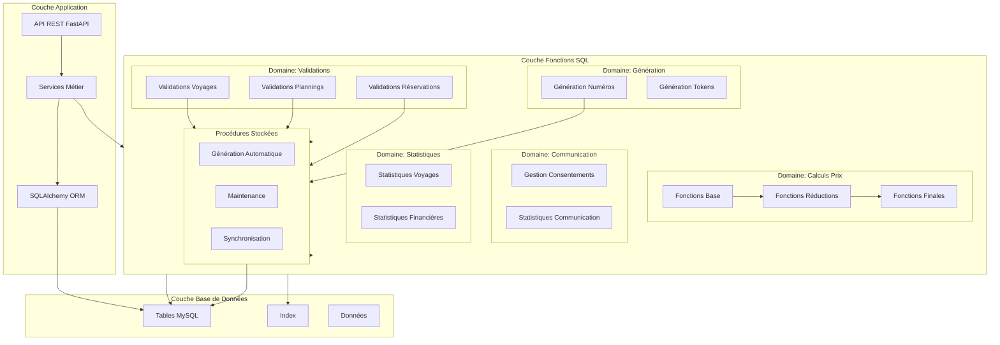

## Organisation par Domaine

### Domaine 1 : Calculs de Prix

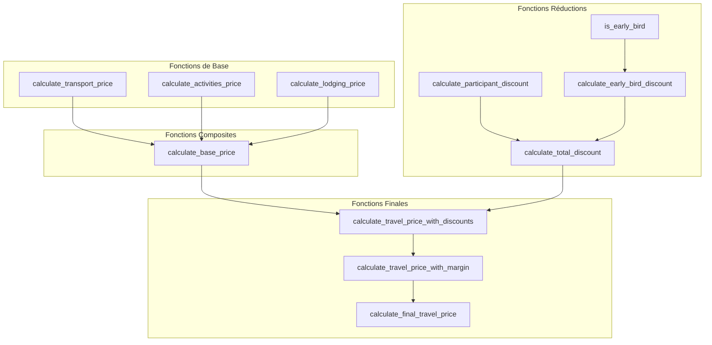

**Hiérarchie d'appels** :
1. **Niveau 1** : `calculate_transport_price()`, `calculate_activities_price()`, `calculate_lodging_price()`
2. **Niveau 2** : `calculate_base_price()` (appelle niveau 1)
3. **Niveau 3** : `calculate_participant_discount()`, `is_early_bird()` (calculs indépendants)
4. **Niveau 4** : `calculate_total_discount()` (combine niveau 3)
5. **Niveau 5** : `calculate_travel_price_with_discounts()` (niveau 2 + niveau 4)
6. **Niveau 6** : `calculate_travel_price_with_margin()` (niveau 5 + marge)
7. **Niveau 7** : `calculate_final_travel_price()` (niveau 6, fonction principale)

### Domaine 2 : Validations Métier

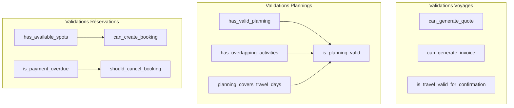

**Relations** :
- `is_planning_valid()` combine `has_valid_planning()`, `has_overlapping_activities()`, et `planning_covers_travel_days()`
- `can_create_booking()` utilise `has_available_spots()`
- `should_cancel_booking()` utilise `is_payment_overdue()`

### Domaine 3 : Génération de Numéros

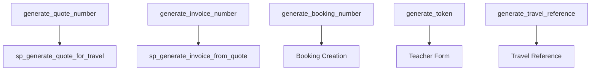

**Utilisation** :
- Les fonctions de génération sont appelées par les procédures stockées ou directement par les services
- Chaque fonction génère un numéro unique selon un format spécifique

### Domaine 4 : Communication

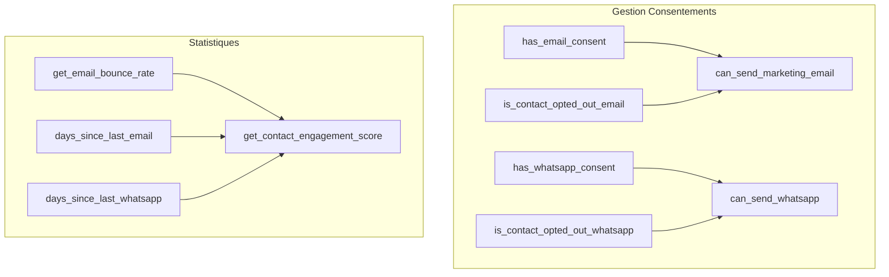

## Flux d'Appels entre Fonctions

### Flux : Génération de Devis

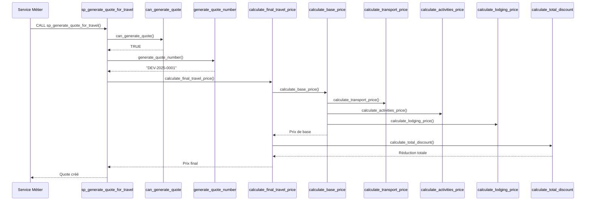

### Flux : Validation et Génération Facture

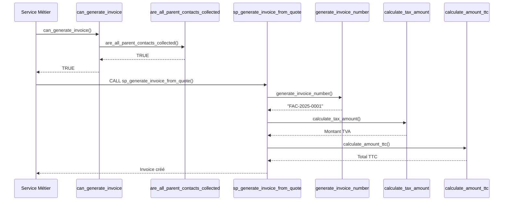

## Hiérarchie des Fonctions

### Niveau 1 : Fonctions Atomiques (Pas de dépendances)

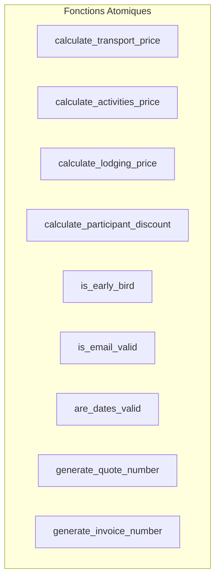

**Caractéristiques** :
- Pas de dépendances vers d'autres fonctions SQL
- Calculs simples ou validations basiques
- Peuvent être utilisées indépendamment

### Niveau 2 : Fonctions Composites (Dépendent du Niveau 1)

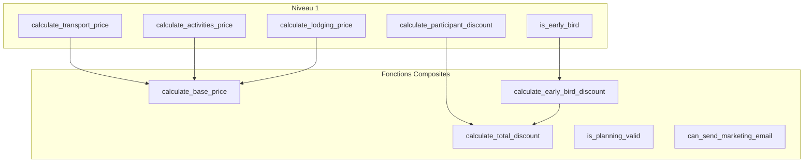

### Niveau 3 : Fonctions Métier (Dépendent des Niveaux 1-2)

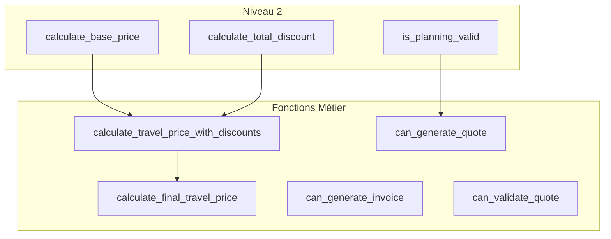

### Niveau 4 : Procédures Stockées (Orchestrent tous les niveaux)

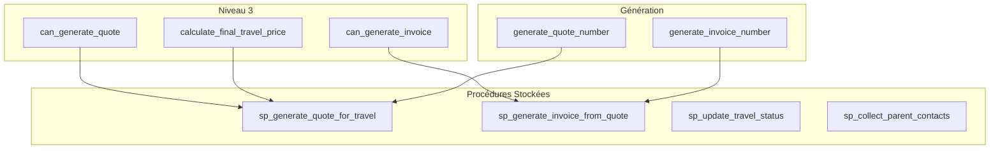

## Intégration avec la Couche Applicative

### Architecture en Couches

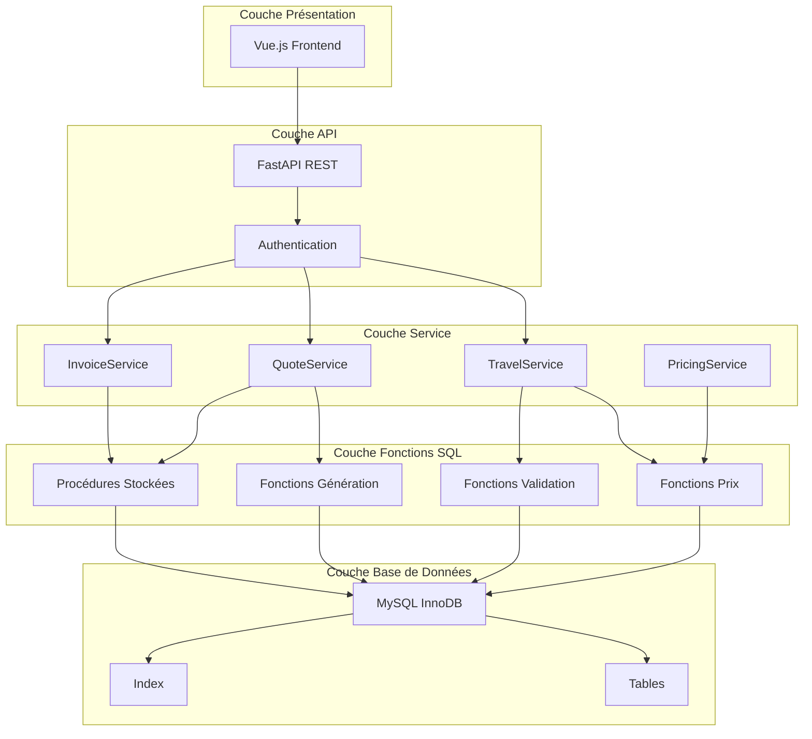

### Points d'Intégration

#### 1. Services → Fonctions SQL

```python
# Exemple : TravelService utilise les fonctions SQL
class TravelService:
    def calculate_price(self, travel_id: int) -> Decimal:
        # Appel direct à la fonction SQL
        result = db.execute(
            text("SELECT calculate_final_travel_price(:travel_id)"),
            {"travel_id": travel_id}
        ).scalar()
        return result
    
    def can_generate_quote(self, travel_id: int) -> bool:
        # Appel à la fonction de validation
        result = db.execute(
            text("SELECT can_generate_quote(:travel_id)"),
            {"travel_id": travel_id}
        ).scalar()
        return result
```

#### 2. Services → Procédures Stockées

```python
# Exemple : QuoteService utilise les procédures
class QuoteService:
    def generate_quote(self, travel_id: int) -> Quote:
        # Appel à la procédure stockée
        db.execute(
            text("CALL sp_generate_quote_for_travel(:travel_id, @quote_id)"),
            {"travel_id": travel_id}
        )
        quote_id = db.execute(text("SELECT @quote_id")).scalar()
        return self.get_quote(quote_id)
```

## Performance et Optimisation

### Stratégie d'Appel

1. **Fonctions atomiques** : Appelées directement, résultats mis en cache si possible
2. **Fonctions composites** : Appelées une fois, réutilisent les résultats des fonctions atomiques
3. **Procédures stockées** : Orchestrent plusieurs fonctions en une seule transaction

### Cache des Résultats

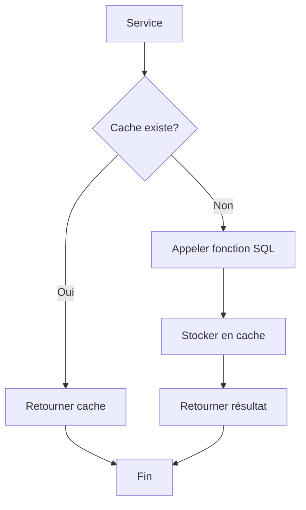

### Index Utilisés

Chaque fonction utilise des index spécifiques pour optimiser ses performances :

- **Fonctions de calcul** : Index sur clés étrangères et dates
- **Fonctions de validation** : Index sur statuts et flags
- **Fonctions statistiques** : Index composites sur dates et statuts

## Maintenance et Évolution

### Gestion des Versions

Les fonctions sont versionnées et peuvent être mises à jour indépendamment :

```sql
-- Version 1.0
CREATE FUNCTION calculate_final_travel_price(...)

-- Version 1.1 (avec nouvelles réductions)
DROP FUNCTION IF EXISTS calculate_final_travel_price;
CREATE FUNCTION calculate_final_travel_price(...)
```

### Impact des Modifications

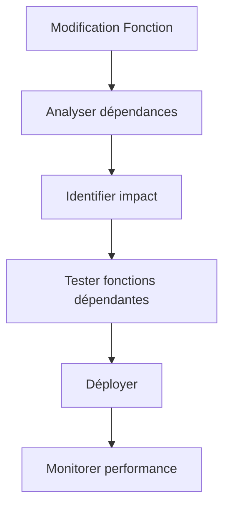

---

**Version** : 1.0  
**Date** : 2025-01-20  
**Architecture** : Fonctions SQL organisées par domaine et hiérarchie
