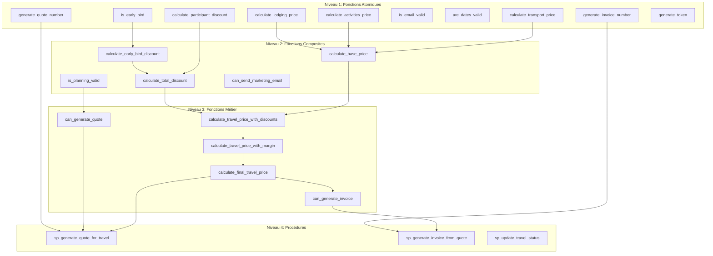
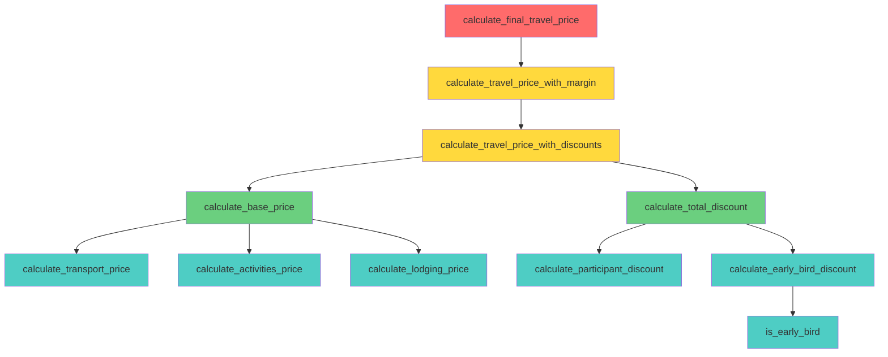
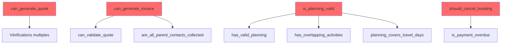

# Dépendances des Fonctions SQL - Système Intégré de Gestion

## Vue d'Ensemble

Ce document présente les dépendances entre les fonctions SQL stockées, identifie les fonctions critiques, recommande un ordre d'exécution, et analyse l'impact des modifications.

## Graphique de Dépendances Global



## Dépendances Détaillées par Domaine

### Domaine : Calculs de Prix



**Légende** :
- 🔴 **Rouge** : Fonction principale (niveau le plus haut)
- 🟡 **Jaune** : Fonctions intermédiaires
- 🟢 **Vert** : Fonctions composites
- 🔵 **Bleu** : Fonctions atomiques (niveau le plus bas)

### Domaine : Validations



## Fonctions Critiques

### Fonctions avec le Plus d'Impact

#### 1. `calculate_final_travel_price(travel_id)`

**Dépendances** :
- Appelée par : `sp_generate_quote_for_travel()`, services de pricing
- Appelle : 8 fonctions différentes
- Impact : **CRITIQUE** - Utilisée dans tout le calcul de prix

**Fonctions dépendantes** :
- `calculate_base_price()`
- `calculate_transport_price()`
- `calculate_activities_price()`
- `calculate_lodging_price()`
- `calculate_total_discount()`
- `calculate_participant_discount()`
- `is_early_bird()`
- `calculate_early_bird_discount()`

**Impact d'une modification** :
- ⚠️ **Élevé** : Affecte tous les calculs de prix
- ⚠️ **Élevé** : Affecte la génération de devis
- ⚠️ **Moyen** : Affecte les statistiques financières

---

#### 2. `can_generate_quote(travel_id)`

**Dépendances** :
- Appelée par : `sp_generate_quote_for_travel()`, services de validation
- Appelle : Vérifications sur plusieurs tables
- Impact : **CRITIQUE** - Validation principale avant génération devis

**Impact d'une modification** :
- ⚠️ **Élevé** : Affecte la génération de devis
- ⚠️ **Moyen** : Affecte le workflow commercial

---

#### 3. `can_generate_invoice(travel_id)`

**Dépendances** :
- Appelée par : `sp_generate_invoice_from_quote()`, services de facturation
- Appelle : `are_all_parent_contacts_collected()`
- Impact : **CRITIQUE** - Validation principale avant génération facture

**Impact d'une modification** :
- ⚠️ **Élevé** : Affecte la génération de factures
- ⚠️ **Élevé** : Affecte le workflow de facturation

---

#### 4. `sp_generate_quote_for_travel()`

**Dépendances** :
- Appelle : 5+ fonctions différentes
- Appelée par : Services de génération de devis
- Impact : **CRITIQUE** - Procédure principale de génération

**Fonctions appelées** :
- `can_generate_quote()`
- `generate_quote_number()`
- `calculate_final_travel_price()`
- (et toutes ses dépendances)

**Impact d'une modification** :
- ⚠️ **Très élevé** : Affecte tout le processus de génération de devis

---

#### 5. `sp_generate_invoice_from_quote()`

**Dépendances** :
- Appelle : 4+ fonctions différentes
- Appelée par : Services de génération de factures
- Impact : **CRITIQUE** - Procédure principale de génération facture

**Fonctions appelées** :
- `can_create_invoice_from_quote()`
- `can_generate_invoice()`
- `generate_invoice_number()`
- `calculate_tax_amount()`
- `get_quote_total()`

**Impact d'une modification** :
- ⚠️ **Très élevé** : Affecte tout le processus de génération de factures

---

## Ordre d'Exécution Recommandé

### Ordre de Création des Fonctions

Les fonctions doivent être créées dans l'ordre suivant pour respecter les dépendances :

#### Phase 1 : Fonctions Atomiques (Pas de dépendances)

```sql
-- 1.1 Calculs de base
CREATE FUNCTION calculate_transport_price(...)
CREATE FUNCTION calculate_activities_price(...)
CREATE FUNCTION calculate_lodging_price(...)
CREATE FUNCTION calculate_participant_discount(...)

-- 1.2 Validations de base
CREATE FUNCTION is_early_bird(...)
CREATE FUNCTION is_email_valid(...)
CREATE FUNCTION are_dates_valid(...)

-- 1.3 Génération
CREATE FUNCTION generate_quote_number()
CREATE FUNCTION generate_invoice_number()
CREATE FUNCTION generate_token()
```

#### Phase 2 : Fonctions Composites (Dépendent de Phase 1)

```sql
-- 2.1 Calculs composites
CREATE FUNCTION calculate_base_price(...)  -- Utilise Phase 1.1
CREATE FUNCTION calculate_early_bird_discount(...)  -- Utilise Phase 1.2
CREATE FUNCTION calculate_total_discount(...)  -- Utilise Phase 1.1 et 2.1

-- 2.2 Validations composites
CREATE FUNCTION has_valid_planning(...)
CREATE FUNCTION has_overlapping_activities(...)
CREATE FUNCTION planning_covers_travel_days(...)
CREATE FUNCTION is_planning_valid(...)  -- Utilise les 3 précédentes

-- 2.3 Communication
CREATE FUNCTION can_send_marketing_email(...)
CREATE FUNCTION can_send_whatsapp(...)
```

#### Phase 3 : Fonctions Métier (Dépendent de Phase 1-2)

```sql
-- 3.1 Calculs finaux
CREATE FUNCTION calculate_travel_price_with_discounts(...)  -- Utilise Phase 2.1
CREATE FUNCTION calculate_travel_price_with_margin(...)  -- Utilise Phase 3.1
CREATE FUNCTION calculate_final_travel_price(...)  -- Utilise Phase 3.2

-- 3.2 Validations métier
CREATE FUNCTION can_generate_quote(...)  -- Utilise validations Phase 2
CREATE FUNCTION can_validate_quote(...)
CREATE FUNCTION can_generate_invoice(...)  -- Utilise Phase 3.2
CREATE FUNCTION can_validate_invoice(...)
```

#### Phase 4 : Procédures Stockées (Dépendent de toutes les phases)

```sql
-- 4.1 Génération automatique
CREATE PROCEDURE sp_generate_quote_for_travel(...)  -- Utilise Phase 3
CREATE PROCEDURE sp_generate_invoice_from_quote(...)  -- Utilise Phase 3

-- 4.2 Maintenance
CREATE PROCEDURE sp_update_travel_status(...)
CREATE PROCEDURE sp_collect_parent_contacts(...)
CREATE PROCEDURE sp_cancel_overdue_bookings()
```

### Script de Création par Phases

```sql
-- Phase 1 : Fonctions atomiques
SOURCE 04_fonctions_sql_phase1_atomic.sql;

-- Phase 2 : Fonctions composites
SOURCE 04_fonctions_sql_phase2_composite.sql;

-- Phase 3 : Fonctions métier
SOURCE 04_fonctions_sql_phase3_business.sql;

-- Phase 4 : Procédures stockées
SOURCE 04_fonctions_sql_phase4_procedures.sql;
```

## Impact des Modifications

### Matrice d'Impact

| Fonction Modifiée | Fonctions Affectées | Procédures Affectées | Services Affectés | Impact |
|-------------------|---------------------|----------------------|-------------------|--------|
| `calculate_transport_price()` | `calculate_base_price()`, `calculate_final_travel_price()` | `sp_generate_quote_for_travel()` | `PricingService`, `QuoteService` | 🔴 Élevé |
| `calculate_participant_discount()` | `calculate_total_discount()`, `calculate_final_travel_price()` | `sp_generate_quote_for_travel()` | `PricingService` | 🟡 Moyen |
| `can_generate_quote()` | Aucune | `sp_generate_quote_for_travel()` | `QuoteService` | 🔴 Élevé |
| `generate_quote_number()` | Aucune | `sp_generate_quote_for_travel()` | `QuoteService` | 🟢 Faible |
| `is_early_bird()` | `calculate_early_bird_discount()`, `calculate_total_discount()` | Aucune | `PricingService` | 🟡 Moyen |
| `calculate_final_travel_price()` | Aucune | `sp_generate_quote_for_travel()` | `PricingService`, `QuoteService` | 🔴 **CRITIQUE** |
| `sp_generate_quote_for_travel()` | Aucune | Aucune | `QuoteService` | 🔴 **CRITIQUE** |

### Analyse d'Impact Détaillée

#### Scénario 1 : Modification de `calculate_participant_discount()`

**Impact direct** :
- ✅ `calculate_total_discount()` : Doit être testée
- ✅ `calculate_travel_price_with_discounts()` : Doit être testée
- ✅ `calculate_final_travel_price()` : Doit être testée

**Impact indirect** :
- ✅ `sp_generate_quote_for_travel()` : Doit être testée
- ✅ Tous les devis générés : Doivent être recalculés si nécessaire

**Actions requises** :
1. Tester toutes les fonctions dépendantes
2. Vérifier les calculs sur des données de test
3. Mettre à jour la documentation
4. Déployer avec rollback possible

---

#### Scénario 2 : Modification de `can_generate_quote()`

**Impact direct** :
- ✅ `sp_generate_quote_for_travel()` : Doit être testée

**Impact indirect** :
- ✅ `QuoteService.generate_quote()` : Doit être testé
- ✅ Interface commerciale : Doit être testée

**Actions requises** :
1. Tester la procédure stockée
2. Tester le service applicatif
3. Tester l'interface utilisateur
4. Vérifier les messages d'erreur

---

#### Scénario 3 : Ajout d'une Nouvelle Réduction

**Nouvelle fonction** : `calculate_group_discount(travel_id)`

**Impact** :
- ✅ `calculate_total_discount()` : Doit être modifiée pour inclure la nouvelle réduction
- ✅ `calculate_final_travel_price()` : Automatiquement affectée
- ✅ `sp_generate_quote_for_travel()` : Automatiquement affectée

**Actions requises** :
1. Créer la nouvelle fonction
2. Modifier `calculate_total_discount()`
3. Tester tous les calculs de prix
4. Mettre à jour la documentation

## Identification des Fonctions Critiques

### Critères de Criticité

1. **Nombre de dépendances** : Plus une fonction est appelée, plus elle est critique
2. **Impact métier** : Fonctions utilisées dans les processus métier principaux
3. **Fréquence d'utilisation** : Fonctions appelées très souvent
4. **Complexité** : Fonctions complexes difficiles à modifier

### Top 10 Fonctions Critiques

| Rang | Fonction | Criticité | Raison |
|------|----------|-----------|--------|
| 1 | `calculate_final_travel_price()` | 🔴 **CRITIQUE** | Utilisée dans tous les calculs de prix |
| 2 | `sp_generate_quote_for_travel()` | 🔴 **CRITIQUE** | Procédure principale génération devis |
| 3 | `sp_generate_invoice_from_quote()` | 🔴 **CRITIQUE** | Procédure principale génération facture |
| 4 | `can_generate_quote()` | 🔴 **CRITIQUE** | Validation principale avant devis |
| 5 | `can_generate_invoice()` | 🔴 **CRITIQUE** | Validation principale avant facture |
| 6 | `calculate_base_price()` | 🟡 **ÉLEVÉE** | Utilisée par calculate_final_travel_price |
| 7 | `calculate_total_discount()` | 🟡 **ÉLEVÉE** | Utilisée par calculate_final_travel_price |
| 8 | `are_all_parent_contacts_collected()` | 🟡 **ÉLEVÉE** | Validation critique pour facture |
| 9 | `sp_update_travel_status()` | 🟡 **ÉLEVÉE** | Utilisée pour tous changements de statut |
| 10 | `generate_quote_number()` | 🟢 **MOYENNE** | Génération numéros uniques |

## Recommandations

### Avant de Modifier une Fonction

1. **Analyser les dépendances** : Identifier toutes les fonctions qui l'utilisent
2. **Tester les dépendances** : Créer des tests pour les fonctions affectées
3. **Documenter les changements** : Mettre à jour la documentation
4. **Prévoir un rollback** : Avoir un plan de retour en arrière

### Bonnes Pratiques

1. **Modifications incrémentales** : Modifier une fonction à la fois
2. **Tests complets** : Tester toutes les fonctions dépendantes
3. **Versioning** : Suivre les versions des fonctions
4. **Monitoring** : Surveiller les performances après modification

### Ordre de Déploiement

1. **Développement** : Tester en environnement de dev
2. **Staging** : Tester en environnement de staging
3. **Production** : Déployer avec monitoring renforcé
4. **Validation** : Vérifier les résultats en production

---

**Version** : 1.0  
**Date** : 2025-01-20  
**Analyse** : Dépendances et impact des fonctions SQL
