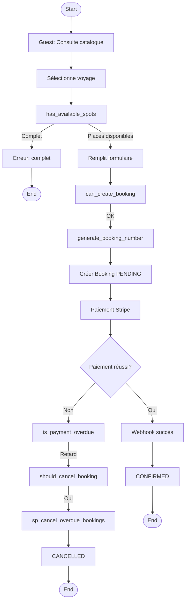
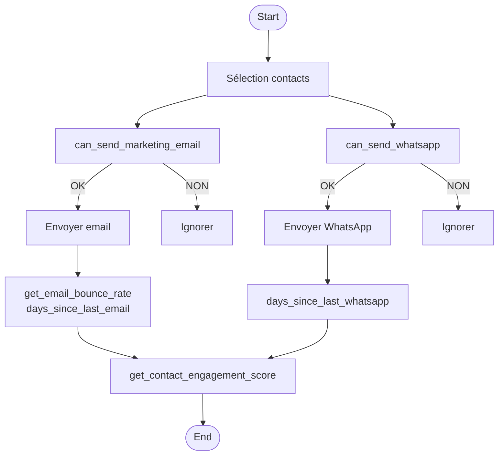
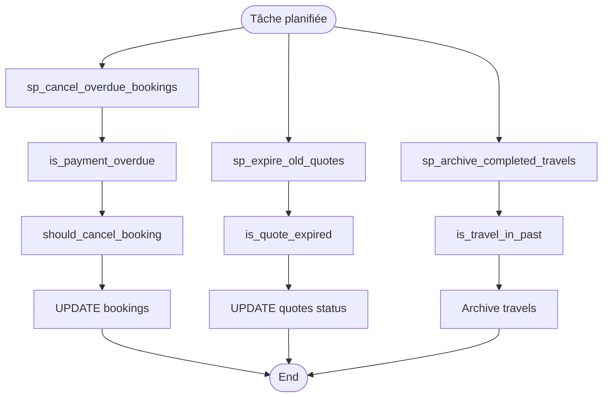
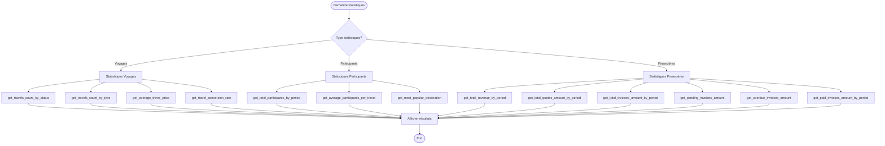

```mermaid
flowchart TD
    Start([Start]) --> FillForm[Professeur: Formulaire]
    FillForm --> Val1[is_email_valid<br/>are_dates_valid]
    Val1 --> GenToken[generate_token]
    GenToken --> Create[Créer Travel DRAFT]
    
    Create --> GeneratePlanning[Commercial: Génère planning]
    GeneratePlanning --> ValPlanning[is_planning_valid<br/>has_valid_planning<br/>has_overlapping_activities]
    ValPlanning --> ValidatePlanning[Planning validé]
    
    ValidatePlanning --> EnterTransport[Saisit prix transport]
    EnterTransport --> GenQuote[Génère devis]
    
    GenQuote --> ValGen[can_generate_quote]
    ValGen -->|OK| CallProc[sp_generate_quote_for_travel]
    CallProc --> CalcPrice[calculate_final_travel_price<br/>- calculate_transport_price<br/>- calculate_activities_price<br/>- calculate_lodging_price<br/>- calculate_participant_discount<br/>- is_early_bird<br/>- calculate_total_discount]
    CallProc --> GenNum[generate_quote_number]
    CalcPrice --> CreateQuote[Créer Quote]
    GenNum --> CreateQuote
    
    CreateQuote --> SendQuote[Envoie devis]
    SendQuote --> Status1[QUOTE_SENT]
    
    Status1 --> ValidateQuote[Valide devis]
    ValidateQuote --> ValQuote[can_validate_quote<br/>is_quote_expired]
    ValQuote -->|OK| UpdateStatus[sp_update_travel_status]
    UpdateStatus --> Status2[QUOTE_VALIDATED]
    
    Status2 --> SendContacts[Professeur: Contacts parents]
    SendContacts --> CheckContacts[are_all_parent_contacts_collected<br/>get_parent_contacts_count]
    CheckContacts -->|OK| CollectProc[sp_collect_parent_contacts]
    CollectProc --> DossierValidated[dossier_validated = TRUE]
    
    DossierValidated --> GenInvoice[Génère facture]
    GenInvoice --> ValInvoice[can_generate_invoice]
    ValInvoice -->|OK| CallProcInv[sp_generate_invoice_from_quote]
    CallProcInv --> GenInvNum[generate_invoice_number]
    CallProcInv --> CalcTax[calculate_tax_amount<br/>calculate_amount_ttc]
    GenInvNum --> CreateInvoice[Créer Invoice]
    CalcTax --> CreateInvoice
    
    CreateInvoice --> ValidateInv[Valide facture]
    ValidateInv --> ValInv[can_validate_invoice]
    ValInv -->|OK| Status3[CONFIRMED]
    Status3 --> End([End])
```

# Fonctions SQL par Workflow - Système Intégré de Gestion

## Vue d'Ensemble

Ce document présente le mapping entre les workflows métier et les fonctions SQL utilisées dans chaque étape. Il permet d'identifier rapidement quelles fonctions sont nécessaires pour chaque processus.

## Matrice d'Utilisation Globale

| Workflow | Étape | Fonction SQL | Type | Priorité |
|----------|-------|--------------|------|----------|
| **Voyage Scolaire** | Création demande | `generate_token()` | Génération | Moyenne |
| | Validation données | `is_email_valid()` | Validation | Faible |
| | Validation données | `are_dates_valid()` | Validation | Faible |
| | Génération planning | `is_planning_valid()` | Validation | Élevée |
| | Génération devis | `can_generate_quote()` | Validation | **CRITIQUE** |
| | Génération devis | `sp_generate_quote_for_travel()` | Procédure | **CRITIQUE** |
| | Génération devis | `calculate_final_travel_price()` | Calcul | **CRITIQUE** |
| | Génération devis | `generate_quote_number()` | Génération | Élevée |
| | Validation devis | `can_validate_quote()` | Validation | Élevée |
| | Validation devis | `is_quote_expired()` | Validation | Moyenne |
| | Collecte contacts | `are_all_parent_contacts_collected()` | Validation | **CRITIQUE** |
| | Collecte contacts | `sp_collect_parent_contacts()` | Procédure | Élevée |
| | Génération facture | `can_generate_invoice()` | Validation | **CRITIQUE** |
| | Génération facture | `sp_generate_invoice_from_quote()` | Procédure | **CRITIQUE** |
| | Génération facture | `generate_invoice_number()` | Génération | Élevée |
| | Génération facture | `calculate_tax_amount()` | Calcul | Élevée |
| | Validation facture | `can_validate_invoice()` | Validation | Élevée |
| **Voyage Linguistique** | Vérification places | `has_available_spots()` | Validation | Élevée |
| | Création réservation | `can_create_booking()` | Validation | Élevée |
| | Génération numéro | `generate_booking_number()` | Génération | Moyenne |
| | Vérification paiement | `is_payment_overdue()` | Validation | Moyenne |
| | Annulation auto | `should_cancel_booking()` | Validation | Moyenne |
| | Annulation auto | `sp_cancel_overdue_bookings()` | Procédure | Moyenne |
| **Communication** | Envoi email | `can_send_marketing_email()` | Validation | Élevée |
| | Envoi WhatsApp | `can_send_whatsapp()` | Validation | Élevée |
| | Statistiques | `get_email_bounce_rate()` | Statistique | Faible |
| **Statistiques** | Rapports | `get_total_revenue_by_period()` | Statistique | Moyenne |
| | Rapports | `get_travel_conversion_rate()` | Statistique | Moyenne |

## Workflow 1 : Voyage Scolaire Complet

### Diagramme avec Fonctions SQL



### Mapping Détaillé par Étape

#### Étape 1 : Création Demande (Professeur)

**Fonctions utilisées** :
- `generate_token()` : Génération token unique pour le formulaire
- `is_email_valid()` : Validation format email
- `are_dates_valid()` : Validation dates (futur, cohérence)

**Workflow** :
```
Formulaire → Validation → Génération token → Création Travel
```

---

#### Étape 2 : Génération Planning (Commercial)

**Fonctions utilisées** :
- `is_planning_valid(travel_id)` : Validation complète du planning
- `has_valid_planning(travel_id)` : Vérifie présence d'activités
- `has_overlapping_activities(travel_id)` : Vérifie chevauchements
- `planning_covers_travel_days(travel_id)` : Vérifie couverture

**Workflow** :
```
Génération planning → Validation → Planning validé
```

---

#### Étape 3 : Génération Devis (Commercial)

**Fonctions utilisées** :
- `can_generate_quote(travel_id)` : **CRITIQUE** - Validation préalable
- `sp_generate_quote_for_travel(travel_id, @quote_id)` : **CRITIQUE** - Procédure principale
- `generate_quote_number()` : Génération numéro unique
- `calculate_final_travel_price(travel_id)` : **CRITIQUE** - Calcul prix complet
  - `calculate_transport_price()` : Calcul transport
  - `calculate_activities_price()` : Calcul activités
  - `calculate_lodging_price()` : Calcul hébergement
  - `calculate_base_price()` : Somme des composants
  - `calculate_participant_discount()` : Réduction participants
  - `is_early_bird()` : Vérification early bird
  - `calculate_early_bird_discount()` : Réduction early bird
  - `calculate_total_discount()` : Réduction totale
  - `calculate_travel_price_with_discounts()` : Prix avec réductions
  - `calculate_travel_price_with_margin()` : Prix avec marge

**Workflow** :
```
Validation → Génération numéro → Calcul prix → Création Quote → Mise à jour Travel
```

---

#### Étape 4 : Validation Devis (Professeur/Commercial)

**Fonctions utilisées** :
- `can_validate_quote(quote_id)` : Validation préalable
- `is_quote_expired(quote_id)` : Vérification expiration
- `days_until_quote_expiry(quote_id)` : Jours restants
- `sp_update_travel_status(travel_id, new_status, user_id)` : Mise à jour avec historique

**Workflow** :
```
Vérification expiration → Validation → Mise à jour statut → Historique
```

---

#### Étape 5 : Collecte Contacts Parents (Professeur)

**Fonctions utilisées** :
- `are_all_parent_contacts_collected(travel_id)` : **CRITIQUE** - Vérification complétude
- `get_parent_contacts_count(travel_id)` : Nombre collecté
- `get_expected_parent_contacts_count(travel_id)` : Nombre attendu
- `get_missing_parent_contacts_count(travel_id)` : Nombre manquant
- `sp_collect_parent_contacts(travel_id)` : Procédure de collecte

**Workflow** :
```
Saisie contacts → Vérification complétude → Marquer comme collecté
```

---

#### Étape 6 : Génération Facture (Commercial)

**Fonctions utilisées** :
- `can_generate_invoice(travel_id)` : **CRITIQUE** - Validation préalable
- `sp_generate_invoice_from_quote(quote_id, @invoice_id)` : **CRITIQUE** - Procédure principale
- `generate_invoice_number()` : Génération numéro unique
- `get_quote_total(quote_id)` : Total du devis
- `calculate_tax_amount(amount_ht, tax_rate)` : Calcul TVA
- `calculate_amount_ttc(amount_ht, tax_rate)` : Calcul TTC
- `get_quote_for_invoice(invoice_id)` : Récupération devis source

**Workflow** :
```
Validation → Génération numéro → Calcul TVA → Création Invoice → Copie lignes
```

---

#### Étape 7 : Validation Facture (Commercial/Comptable)

**Fonctions utilisées** :
- `can_validate_invoice(invoice_id)` : Validation préalable
- `get_invoice_total_ht(invoice_id)` : Total HT
- `get_invoice_total_ttc(invoice_id)` : Total TTC
- `get_invoice_tax_amount(invoice_id)` : Montant TVA
- `is_invoice_overdue(invoice_id)` : Vérification retard
- `days_until_invoice_due(invoice_id)` : Jours avant échéance

**Workflow** :
```
Validation → Export Factur-X → Synchronisation Odoo → Envoi
```

---

## Workflow 2 : Voyage Linguistique

### Diagramme avec Fonctions SQL



### Mapping Détaillé par Étape

#### Étape 1 : Consultation et Vérification (Guest)

**Fonctions utilisées** :
- `has_available_spots(linguistic_travel_id)` : Vérification places disponibles
- `can_create_booking(linguistic_travel_id)` : Validation création réservation

**Workflow** :
```
Consultation → Vérification places → Validation création
```

---

#### Étape 2 : Création Réservation (Système)

**Fonctions utilisées** :
- `generate_booking_number()` : Génération numéro réservation

**Workflow** :
```
Formulaire → Génération numéro → Création Booking
```

---

#### Étape 3 : Gestion Paiement (Système)

**Fonctions utilisées** :
- `is_payment_overdue(booking_id)` : Vérification retard paiement
- `should_cancel_booking(booking_id)` : Détermine si annulation nécessaire
- `sp_cancel_overdue_bookings()` : Procédure d'annulation automatique

**Workflow** :
```
Paiement → Vérification → Succès ou Annulation
```

---

## Workflow 3 : Communication Marketing

### Diagramme avec Fonctions SQL



### Mapping Détaillé

#### Étape 1 : Vérification Consentements

**Fonctions utilisées** :
- `can_send_marketing_email(contact_id)` : Validation email
- `can_send_whatsapp(contact_id)` : Validation WhatsApp
- `has_email_consent(contact_id)` : Vérification consentement email
- `has_whatsapp_consent(contact_id)` : Vérification consentement WhatsApp
- `is_contact_opted_out_email(contact_id)` : Vérification opt-out email
- `is_contact_opted_out_whatsapp(contact_id)` : Vérification opt-out WhatsApp

#### Étape 2 : Statistiques

**Fonctions utilisées** :
- `get_email_bounce_rate(contact_id)` : Taux de bounce
- `days_since_last_email(contact_id)` : Jours depuis dernier email
- `days_since_last_whatsapp(contact_id)` : Jours depuis dernier WhatsApp
- `get_contact_engagement_score(contact_id)` : Score d'engagement

---

## Workflow 4 : Maintenance Automatique

### Diagramme avec Fonctions SQL



### Mapping Détaillé

#### Tâche 1 : Annulation Réservations en Retard

**Fonctions utilisées** :
- `sp_cancel_overdue_bookings()` : Procédure principale
- `is_payment_overdue(booking_id)` : Vérification retard
- `should_cancel_booking(booking_id)` : Détermine annulation

**Fréquence** : Quotidienne

---

#### Tâche 2 : Expiration Devis

**Fonctions utilisées** :
- `sp_expire_old_quotes()` : Procédure principale
- `is_quote_expired(quote_id)` : Vérification expiration
- `days_until_quote_expiry(quote_id)` : Jours restants

**Fréquence** : Quotidienne

---

#### Tâche 3 : Archive Voyages Terminés

**Fonctions utilisées** :
- `sp_archive_completed_travels()` : Procédure principale
- `is_travel_in_past(travel_id)` : Vérification voyage terminé

**Fréquence** : Mensuelle

---

## Workflow 5 : Statistiques et Rapports

### Diagramme avec Fonctions SQL



### Mapping Détaillé

#### Statistiques Voyages

**Fonctions utilisées** :
- `get_travels_count_by_status(status)` : Nombre par statut
- `get_travels_count_by_type(travel_type)` : Nombre par type
- `get_average_travel_price(travel_type)` : Prix moyen
- `get_travel_conversion_rate()` : Taux de conversion

#### Statistiques Participants

**Fonctions utilisées** :
- `get_total_participants_by_period(start_date, end_date)` : Total participants
- `get_average_participants_per_travel()` : Moyenne par voyage
- `get_most_popular_destination()` : Destination populaire

#### Statistiques Financières

**Fonctions utilisées** :
- `get_total_revenue_by_period(start_date, end_date)` : Chiffre d'affaires
- `get_total_quotes_amount_by_period(start_date, end_date)` : Montant devis
- `get_total_invoices_amount_by_period(start_date, end_date)` : Montant factures
- `get_pending_invoices_amount()` : Factures en attente
- `get_overdue_invoices_amount()` : Factures en retard
- `get_paid_invoices_amount_by_period(start_date, end_date)` : Factures payées

---

## Matrice d'Utilisation Complète

### Workflow Voyage Scolaire

| Étape | Fonction SQL | Domaine | Fréquence |
|-------|--------------|---------|-----------|
| 1. Création demande | `generate_token()` | Génération | À chaque demande |
| 1. Création demande | `is_email_valid()` | Validation | À chaque demande |
| 1. Création demande | `are_dates_valid()` | Validation | À chaque demande |
| 2. Validation planning | `is_planning_valid()` | Validation | À chaque validation |
| 3. Génération devis | `can_generate_quote()` | Validation | **CRITIQUE** - À chaque génération |
| 3. Génération devis | `sp_generate_quote_for_travel()` | Procédure | **CRITIQUE** - À chaque génération |
| 3. Génération devis | `calculate_final_travel_price()` | Calcul | **CRITIQUE** - À chaque génération |
| 4. Validation devis | `can_validate_quote()` | Validation | À chaque validation |
| 5. Collecte contacts | `are_all_parent_contacts_collected()` | Validation | **CRITIQUE** - Vérification continue |
| 6. Génération facture | `can_generate_invoice()` | Validation | **CRITIQUE** - À chaque génération |
| 6. Génération facture | `sp_generate_invoice_from_quote()` | Procédure | **CRITIQUE** - À chaque génération |

### Workflow Voyage Linguistique

| Étape | Fonction SQL | Domaine | Fréquence |
|-------|--------------|---------|-----------|
| 1. Vérification places | `has_available_spots()` | Validation | À chaque consultation |
| 2. Création réservation | `can_create_booking()` | Validation | À chaque création |
| 3. Gestion paiement | `is_payment_overdue()` | Validation | Vérification continue |
| 3. Annulation auto | `sp_cancel_overdue_bookings()` | Procédure | Quotidienne (tâche planifiée) |

### Workflow Communication

| Étape | Fonction SQL | Domaine | Fréquence |
|-------|--------------|---------|-----------|
| 1. Vérification consentement | `can_send_marketing_email()` | Communication | À chaque envoi |
| 1. Vérification consentement | `can_send_whatsapp()` | Communication | À chaque envoi |
| 2. Statistiques | `get_email_bounce_rate()` | Communication | Sur demande |
| 2. Statistiques | `get_contact_engagement_score()` | Communication | Sur demande |

## Recommandations par Workflow

### Workflow Voyage Scolaire

**Fonctions critiques à monitorer** :
1. `calculate_final_travel_price()` : Performance des calculs
2. `sp_generate_quote_for_travel()` : Temps d'exécution
3. `can_generate_quote()` : Validation rapide
4. `can_generate_invoice()` : Validation rapide

**Optimisations recommandées** :
- Cache des résultats de `calculate_final_travel_price()` dans `travels.total_price`
- Index sur les champs utilisés par `can_generate_quote()`
- Pré-calcul des validations si possible

### Workflow Voyage Linguistique

**Fonctions critiques à monitorer** :
1. `has_available_spots()` : Performance des vérifications
2. `sp_cancel_overdue_bookings()` : Temps d'exécution (tâche planifiée)

**Optimisations recommandées** :
- Index sur `linguistic_travel_id` et `status` dans `linguistic_travel_registrations`
- Exécution de `sp_cancel_overdue_bookings()` en heures creuses

### Workflow Communication

**Fonctions critiques à monitorer** :
1. `can_send_marketing_email()` : Performance des vérifications (appelée fréquemment)
2. `can_send_whatsapp()` : Performance des vérifications

**Optimisations recommandées** :
- Index sur `email_marketing_consent` et `email_opt_out_date`
- Index sur `whatsapp_consent` et `whatsapp_opt_out_date`

---

**Version** : 1.0  
**Date** : 2025-01-20  
**Mapping** : Workflows ↔ Fonctions SQL
